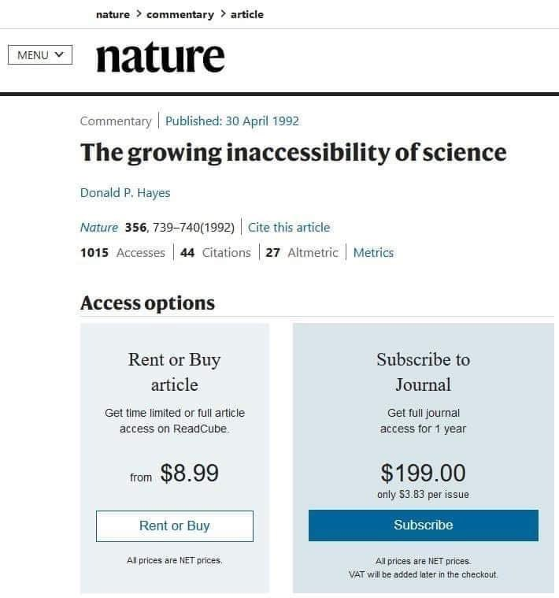

# Introduction {#intro}

This thesis looks at urban tree health in Portland, Oregon with the goal
of creating a model that predicts tree health rating from NDVI
(Normalized Difference Vegetation Index). Additionally, this thesis
examines the impact of differentiating by functional tree type or tree
species when modeling tree health, as well as the testing and analysis
of three different methods of NDVI pixel selection and tree crown
delineation.

## Urban Forests and Urbanization

An urban forest is the total population of trees in an urban area. Urban
forests are comprised of parks, street trees, landscaped boulevards,
green spaces, and any other location where trees can be found in urban
spaces. Urban forests are in close proximity to large or dense human
populations, have a relatively high diversity of species and forest
patch structures as well as both public and private ownership, and their
management is often geared toward sustaining tree health and maximizing
the potential benefits that trees provide [@assessin2016]. In 2011,
urban forests in the United States contained around 74.4 billion trees,
which is about a quarter of the total tree population
[@usdaforestservice2011]. The US Census bureau reports that, in 2010,
nearly 81% of Americans lived in urban areas, up from 79% 10 years
earlier. The United Nations predicts that, by 2050, 68% of the world
population will live in urban areas [@unitednations2018]. As
urbanization continues, it becomes increasingly important for both those
working to manage urban forests and residents of urban areas to
understand the dynamics and health of urban forests in order to retain
and protect the numerous benefits they provide.

## The Benefits of Urban Forests

Urban forests and urban trees have numerous benefits, which range from
environmental to economic. The environmental benefits of urban trees
include numerous forms of pollution removal from both water and air. In
undeveloped areas, most of the precipitated water is absorbed into the
earth. However, due to the high amount of impervious surfaces such as
sidewalks, streets, and parking lots in urban areas, rain and snowmelt
are unable to soak back into the earth and become stormwater runoff
instead. This runoff flows over developed impervious surfaces and picks
up trash, yard waste, dirt, and many other potentially harmful chemicals
and pollutants. It is then deposited in streams, rivers, wetlands, and
other bodies of water that are damaged by polluted runoff. Green
infrastructure like urban trees help in reducing the volume and rate of
runoff by allowing more precipitation to be soaked into the earth.
Research has shown that the presence of street trees also has a positive
impact in reducing stormwater runoff volume [@usepa2020]. A 2021 study
conducted in Fond du Lac, Wisconsin, showed that the removal of street
trees increased the volume of stormwater runoff by 4% [@selbig2021]. The
study calculated that on a per-tree basis for each square meter of
canopy that was removed, 66 liters of rainfall could have been
intercepted and stored by the street trees. This results in an annual
runoff volume reduction estimated at 6,376 liters per tree. In addition
to benefiting the land, urban trees can also provide benefits to the
atmosphere.

Urban trees also remove pollutants from the air. Numerous studies have
shown that trees can remove many different pollutants (O$_3$, PM$_{10}$,
NO$_2$, SO$_2$, CO) by uptake via leaf stomata. Pollutant particles can
also be collected and stored on a tree's surface. Urban trees provide a
total annual air pollution removal of 711,000 tons, which is valued at
\$3.8 billion [@nowak2006]. Cities with higher levels of tree canopy
cover have higher rates of pollution removal by trees, and longer
on-leaf growing periods of trees lead to more pollution removal as well.
While the removal of air pollution by urban trees results in the
improvement of air quality, trees also help mitigate climate change,
improve atmospheric conditions and air quality through carbon
sequestration.

The increase of atmospheric carbon dioxide from human sources is one of
the primary drivers of global climate change. In 2019, U.S. greenhouse
gas emissions totaled 6,558 million metric tons of carbon dioxide
equivalents. In the same year, the city of Portland's carbon emissions
totaled around 55,000 metric tons of carbon dioxide equivalents
[@cityofportland]. Rural and urban forests, as well as other natural and
nature based carbon sinks have been suggested as a method of mitigating
greenhouse gas emissions of cities in order to reduce the impacts of
global climate change [@lazarus2013]. These natural carbon sinks capture
atmospheric carbon dioxide during photosynthesis and store the carbon as
biomass, releasing oxygen back into the atmosphere. Multiple scholars
estimate that urban trees in the United States currently store over 708
million tons of carbon, and capture another 28.2 million tons of carbon
per year, which is approximately 0.05% of annual carbon dioxide
emissions in the United States [@nowak2002; @nowak2013; @safford2013].
The current carbon storage of urban trees is valued at more than \$50
billion, with carbon sequestration valued at an additional \$2 billion
per year [@nowak2013]. The environmental benefits of urban trees can
result in economic advantages under future carbon trading schemas, but
there are other unique economic and social benefits that urban trees
provide.

Residents of urban areas experience the benefits of urban trees most
immediately through the beauty and visual stimulation they provide.
Aesthetics alone are a large driver in the plantings of urban trees.
Studies have found that trees are one of the main contributors to
positive visual aesthetic quality of residential areas, and that large
trees contribute more to perceived beauty than smaller trees
[@schroeder1983; @schroeder2011; @schroeder1987]. The positive impacts
of urban trees goes far beyond their visual contributions.

Numerous studies have shown that people living near urban forests live
longer, experience better mental health, and self-rate their overall
health higher than people who do not live near urban forests
[@james2015]. Residents of two different towns in Germany visited urban
forests and green spaces more frequently after the beginning of the
COVID-19 pandemic, which contributed significantly to the residents'
well-being [@beckmann-wübbelt2021]. Research into the psychological
benefits of urban trees shows that teenage girls who spend more time
around trees and other sources of nature and vegetation have higher
levels of self-discipline, and children with diagnosed attention deficit
disorder show improved focus and ability to learn after spending time
outside [@taylor2001; @taylor2002].

Additionally, urban trees provide numerous economic benefits on both a
nation wide and an individual scale. Urban tree canopy cover positively
impacts residential property values. In Athens, Georgia, landscaping
with trees results in a 3.5%--4.5% increase in home sale price
[@anderson1988]. In Ramsey and Dakota Counties, Minnesota, researchers
found that a 10% increase in tree cover within 100m of a house increases
the average home price by 0.5% [@sander2010]. Both summer cooling and
winter heating demands can be reduced through shading and wind speed
reduction by urban trees which lowers energy costs [@nowak2010]. A 2009
study of 460 single-family homes in Sacramento, California showed that
tree cover on the south and west sides of houses reduced summer
electricity use by 5.2%, whereas trees on the north side of a house
increased electricity use by 1.5% [@donovan2009]. A more recent study
conducted in the city of Thessaloniki in northern Greece found that the
cooling potential of street trees is directly related to the foliage
density and the shade provided can lower temperatures up to 5 degrees C,
leading to energy savings of up to 54% [@tsoka2021]. All of these
benefits are dependent on the health of the tree and trees in poor
health will be unable to provide the same level and quality of benefits
that a healthy tree can.

## Environmental Challenges for Urban Trees

Human activities have impacted and altered the Earth's climate and land
surface at a fundamental level. Some outcomes of these fundamental
changes include elevated temperatures and prolonged droughts
[@huang2019]. These extreme droughts can trigger extensive forest
die-off as well as increased tree and shrub mortality rates, which has
impacted forests and woodlands on all vegetated continents. Remote
sensing research on the impacts of droughts has shown that the impacts
of a drought can produce a suppression of forest canopy greenness, which
relates to a failing of plant ecophysiological processes and a reduction
of chlorophyll. Droughts are predicted to occur more frequently and have
higher intensities as climate change continues to progress.

The impacts of climate change and the environmental challenges that all
trees will face is even more extreme in urban areas. The multiple
economic, environmental and quality of life, health benefits that are
provided by urban trees are dependent on tree health. Urban trees are
generally more stressed than those in rural areas due to the adverse
growing conditions they face. This includes higher temperatures,
additional soil compaction, root zone restrictions, and extreme
variations in environmental conditions such as wind speed and sunlight
level [@flint1985; @ward2007]. Many mature trees, even those from the
pre-industrial era, had to endure more than 100 years of stressful
health conditions while stuck in the same place. These stressors include
drought and temperature stress events, effects of herbivory and disease,
among numerous other impacts. Monitoring and tracking tree health over
time is an essential component for the ability to model and predict the
future changes that will occur. Research into the remote sensing of
health indicators of forest die-off has shown that vegetation greenness
metrics, such as NDVI, reflect the changes that occur with tree die-off
[@breshears2005; @byer2017]. In order to work towards understanding
these changes and how to mitigate the impacts of forest die-off, it is
extremely important to understand the current health dynamics of urban
forests at a city-wide level, and carefully track changes in urban
forest health over time. While biotic and abiotic factors that
negatively impact tree heath are not a good thing, in a strange way they
are somewhat beneficial from a scientific point of view. Urbanization
and urban areas present an unintentional model of global climate change
and the impacts it can have on trees and other vegetation. Urban areas
have experienced increases in temperature as well as carbon dioxide
concentrations which will be seen in even more areas as global climate
change continues. By studying urban trees, we can begin to understand
how different species of trees will react to these conditions, and
create a model for predictions of urban tree health outcomes in the
future [@lahr2018].

## Urban Forestry in Portland, Oregon

Portland is one of many cities to create tree inventories in the last 25
years, with the goal of better understanding the urban forest. Over a
period of 9 years, 2,000 volunteers along with members of Portland's
Urban Forestry team inventoried Portland's 245,000 park and street trees
[@disalvo2017; @portlandurbanforestry2019]. In addition to basic
physical and environmental variables such as tree height, diameter, and
location, volunteers also visually assessed the health condition of each
tree, and categorized it as good, fair, poor, or dead. Portland
inventoried the 218,602 street trees between 2010 and 2016, and 25,740
park trees between 2017 and 2019. Portland Urban Forestry estimates that
Portland's parks contain upwards of 1.2 million trees, but the tree
inventory project only inventoried trees in developed portions of parks.
Portland Urban Forestry estimates that Portland's street trees produce
an estimated \$28.6 million annually in environmental and aesthetic
benefits, with a full replacement value of \$753 million [@disalvo2017].
Portland's inventoried park trees have an estimated worth of \$128
million [@portlandurbanforestry2019].

While Portland's tree inventories are spectacular resources which help
shed light on the urban tree population in Portland and the benefits it
can provide, there are limitations to the information available through
the inventories. One drawback of the inventories is that volunteers were
only able to inventory trees on public land, which excluded any trees
growing in yards or other privately owned areas. Since only developed
portions of parks were inventoried, roughly 98% of Portland's park
trees, which are in natural and "undeveloped areas", were not
inventoried . Additionally, since the inventories were collected over a
9 year period, the collected health assessments for many trees are no
longer reliable or representative of present day conditions. They
represent data from a range of 9 years and in the 11 years since
inventory collection began much has changed.

Measuring urban tree health through field surveys can be extremely time
and labor intensive. It requires the collection of detailed data on
numerous environmental variables, as well as extensive groundwork to
conduct the field surveys. To collect Portland's tree inventories, more
than 2,000 volunteers collectively spend upwards of 25,000 hours in the
field. Additionally, in order to get a good picture of changes in tree
health over time, trees need to be revisited numerous times over the
study period. Remote sensing data from satellite imagery can be used to
locate and map trees in both urban and rural areas, as well as monitor
tree health.

## Remote Sensing in Urban Landscapes

While the term "remote sensing" was first used in the 1960s, the first
aerial images were taken in the 1850s from hot air balloons. Later,
small cameras were attached to kites and even pigeons to capture aerial
images. With the development of airplanes in the early 20th century,
images were able to be taken from higher altitudes, providing aerial
views of larger surface areas [@moore1979]. Aerial images taken from
planes provided essential military reconnaissance during both World War
I and II. The first environmental applications of aerial imagery began
in the 1930s, when the Agriculture Department began to use aerial
photography to map and catalog farmland in the United States. Soon
after, aerial imagery became a tool for conservation and land planning
purposes. Capturing aerial images from planes was the primary method of
capturing images of the earth's surface until the early 1960s. Since the
first satellite was launched in 1957, the technical capabilities of
satellites has greatly increased, along with the types and applications
of satellite-collected data [@khorram2012]. Within the field of forestry
and ecology, remote sensing has numerous applications, from measuring
the cover and structure of vegetation, to examining biodiversity and
soil characteristics of specific areas. Additionally, remote sensing
measurements can be used to calculate and monitor changes in forest
density, which is critical for determining the fuel load and forest
health in regards to fire risk.

One of the most commonly used remote sensing metrics used to measure
forest health is the Normalized Difference Vegetation Index (NDVI),
which is calculated from the red and near infrared (NIR) bands from
remote sensing imagery (Section \@ref(ndvi-calc-methods)). Vegetation
that is photosynthetically active absorbs most of the red light and
reflects much of the near infrared light. Conversely, vegetation that is
dead or stressed reflects more red light and absorbs more near infrared
light. Biologically, NDVI can be interpreted as the fraction of absorbed
photosynthetically active radiation. A value closer to 1 indicates
vegetation that is more photo-synthetically active and greener, which
can be used as a proxy for vegetation health. NDVI is not a diagnostic
tool of vegetation health, but can be used as an indicator of health for
further analysis. NDVI has been shown to be effective as a vegetation
index to determine total photosynthetic activity, even in moderately to
sparsely vegetated areas [@myneni1995]. Studies have shown that NDVI is
highly correlated with chlorophyll content and vegetation
characteristics that are directly related to the chlorophyll content,
such as amount of green biomass and leaf water content [@tucker1979;
@glenn2008]. Leaf chlorophyll content and changes in content are
indicators of nutrient deficiencies. These nutrient deficiencies may be
the result of environmental conditions including increased pollution
concentrations or other health related stresses [@talebzadeh2022].

Especially when the goal is monitoring tree health changes over time,
remote sensing data eliminates the need for repeated sampling over long
time periods, since satellite images are taken at regular intervals as
the satellites continually orbit the earth. With the availability and
accuracy of aerial imagery increasing as these technologies continue to
advance, remote sensing is becoming an important and effective method
for mapping, monitoring, and analyzing tree health on an individual tree
scale [@xiao2005].

## Previous work

This thesis was inspired by the work of two previous studies, @xiao2005
and @fang2020. Both of these studies use NDVI from multispectral remote
sensing data paired with field collected tree data to examine urban tree
health. I have based the backbone of my methodology off these studies,
but have applied the methods to urban trees in Portland, OR.
Additionally, there are a few areas that I believe have some room for
improvement that I aim to add to.

@xiao2005 used multispectral remote sensing data paired with field
collected tree health data with the goal of mapping tree health on the
University of California Davis campus. Field data on 81 campus trees was
collected in the summer of 2004, and the health of the trees was
classified as "healthy" or "unhealthy." Additionally, a second dataset
of 1,186 trees was collected which included randomly selected trees to
check the accuracy of the resulting tree health mapping. With high
resolution multispectral remote sensing data collected in the summers of
2003 and 2004, NDVI was calculated and used to classify each pixel as
vegetation or non-vegetation. The pixels representing trees and shrubs
were manually selected and extracted, resulting in NDVI data just for
trees and shrubs. The remaining data was split into 5 separate layers
based on physiognomic/functional tree type (broadleaf deciduous,
broadleaf evergreen, conifer, palm, and mixed). Tree health was
evaluated at both a pixel scale and a tree scale, with the pixels or
trees being mapped as either healthy or unhealthy. Different NDVI
thresholds for healthy and unhealthy trees were used for each functional
tree type. A tree was labeled as unhealthy if 30% or more of the pixels
within the manually delineated tree crown were mapped as unhealthy, and
if the average NDVI of the pixels were less than the NDVI threshold for
healthy trees. The accuracy of the tree health assessment was checked
against the validation dataset of 1,186 trees. The field health
assessment agreed with the remotely sensed health classification for 88%
of the trees. While @xiao2005 evaluated tree health at both an
individual pixel scale and a whole tree scale, this study served as the
basis of my inspiration for the single point method.

@fang2020 used a similar approach to evaluate the health of street trees
in Washington D.C. using multispectral remote sensing data and D.C.'s
street tree inventory. The tree inventory contained 18,434 trees, each
with a tree health classification of excellent, good, fair, poor, or
dead. While the inventory also contained over 95 unique tree species,
the researchers limited their focus to the five most common tree species
in the area: American elm, pin oak, red maple, red oak, and willow oak.
The researchers purchased remote sensing images for June 11, July 30,
and August 30, 2017, to compare the sensitivity of tree health at
different points in the trees' on-leaf period. To extract pixels
belonging to tree crowns, a radial buffer based on tree crown diameter
was used, and pixels with low NDVI values were masked. This paper tested
5 different vegetation indices (VIs), which included three different
variations of NDVI. The different VIs were calculated for each pixel and
averaged for each tree. They found that the VI values of trees in good,
fair, and poor health conditions were highly statistically different,
and traditional NDVI was the most sensitive VI for detecting tree health
conditions. Additionally, it was determined that remote sensing imagery
taken in the middle of the on-leaf period had the best potential to
assess the health condition of trees. Their findings state that NDVI is
the best all-purpose vegetation index for showing the statistical
differences between tree health condition classes, it does vary by
species [@fang2020].

These two studies form the basis of the approach and methods for this
thesis, but there are two main places where I believe I can add new
insights and improve methodology. First, a frustrating drawback of both
@fang2020 and @xiao2005 is that a true replication of their process is
inaccessible due to the sources of their data. @xiao2005 used
multispectral data that was specially collected just for the UC Davis
campus, and @fang2020 purchased the high resolution multispectral data
that was used in their study. Second, there is little consistency in the
methods used to select image pixels for NDVI evaluation. @xiao2005
manually detected and delineated tree crowns for health assessment, and
any trees with overlapping crowns were removed from the analysis. Manual
crown delineation is extremely time intensive and is an unrealistic
method for large sample sizes. In @fang2020, a standardized radius based
on the average DBH of all trees was used to select the tree crown area.
However, this method will only use the center pixels of large trees
eliminating the edges, and it is unclear how overlapping tree crowns
were dealt with. The impact of these different methods on health
analysis is unknown. LiDAR delineation is another method of pixel
selection and crown delineation that is often used in forestry, but is
not often combined with NDVI health assessments. While vegetation
indices are not often included, @gulcin2021 assessed above ground carbon
storage or urban trees with LiDAR data. While the specific methods of
this study were out of the scope of this thesis, it presents a
fascinating picture of the different methods of LiDAR tree detection and
crown segmentation as well as the various metrics that can be predicted
using LiDAR data.

## The Accessibility of Science

On July 16, 2020, twitter user @reviewer2grumpyreviewer22020 shared a
screenshot of Nature's posting of an article titled "The growing
inaccessibility of science." This article, ironically, was behind a pay
wall (Figure \@ref(fig:twitter-pic)). While this example is ironic and
humorous, it highlights a much larger and more serious issue: people are
becoming increasingly disconnected from science. This denial or
rejection of scientific findings can be seen in the 139 members of the
117th Congress who deny the reality of global climate change [@climate].
Beyond the elected officials, many members of the American public are
skeptical of the scientific claims regarding climate change because in
some cases, they are not impacted first hand [@markman]. People
conceptualize things that are psychologically distant from them (in
time, space, or social distance) more abstractly than things that are
psychologically close [@trope2010]. Given the relevance of this theory
to climate change and the public's disconnect with science, it is
important to increase the applicability and accessibility of science and
scientific findings. If research remains unattainable for members of the
general public, it cannot be expected of them to seek out scientific
information and findings. Additionally, if the science that is being
done is not relevant to their everyday lives, it may be difficult to
give them a reason to care. There is nothing more close to home than
one's own backyard, or directly in front of their house. An aspect of
science that city residents interact with every day, consciously or not,
is the urban forest. By promoting research on urban forests, making the
research accessible and relevant, as well as emphasizing the importance
of urban forests and urban trees to those who it most directly impacts,
we have the opportunity to conduct necessary and beneficial research on
urban tree health as well as work to close the psychological gap between
people and science.

```{r twitter-pic, echo = F, out.width = "75%", fig.align='center', fig.scap = "The growing inaccessibility of science", fig.cap = "The growing inaccessibility of science. Screenshot of Nature website posted on twitter by user @grumpyreviewer on July 16, 2020"}

```

## This Thesis

Based on the assumptions that tree health can be approximated using
satellite spectral data, specifically NDVI, this thesis aims to build on
the process and research of @fang2020 and @xiao2005. I will investigate
the effectiveness of predicting tree health solely based on NDVI, in
contrast to NDVI and functional tree type or NDVI and tree species. I
predict that models using tree species as a predictor variable will be
more effective than models using functional tree type, and models with
functional tree type will be more effective than models without any
model specification. I will also test three different methods of tree
crown delineation and pixel selection: using a single point for pixel
selection, variable circle buffers based on tree crown radius, and tree
crowns delineated with LiDAR data. I predict that increasing the
specificity of the model, with both predictor specification and pixel
selection, will improve the results of the model. The least effective
model will be with point method data and just NDVI, and the most
effective model will be with LiDAR delineated crowns and species
specificity. However, depending on the goals of future modeling, I
believe that choosing one method of increasing precision in the model
will improve the results when another method of increasing precision is
unavailable. Finally, this thesis only uses data sources, tools, and
processes that are either publicly accessible or free, in order to keep
this type of research accessible to all.
