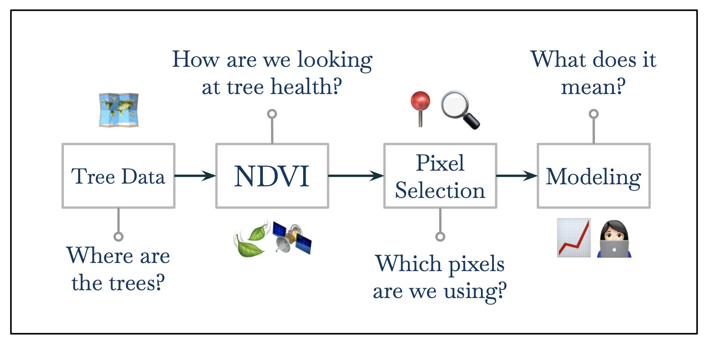
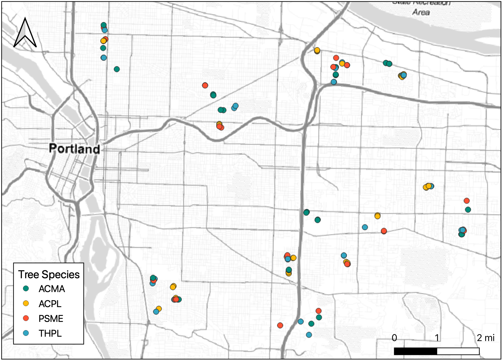
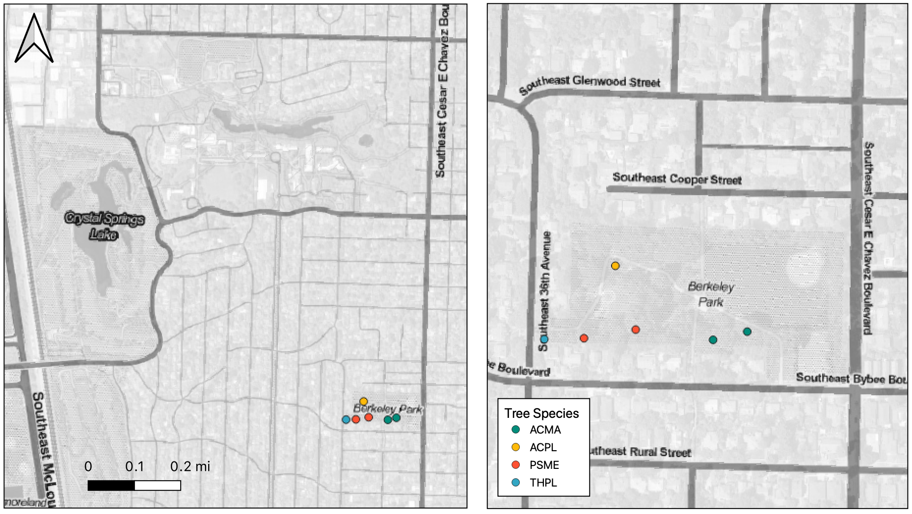
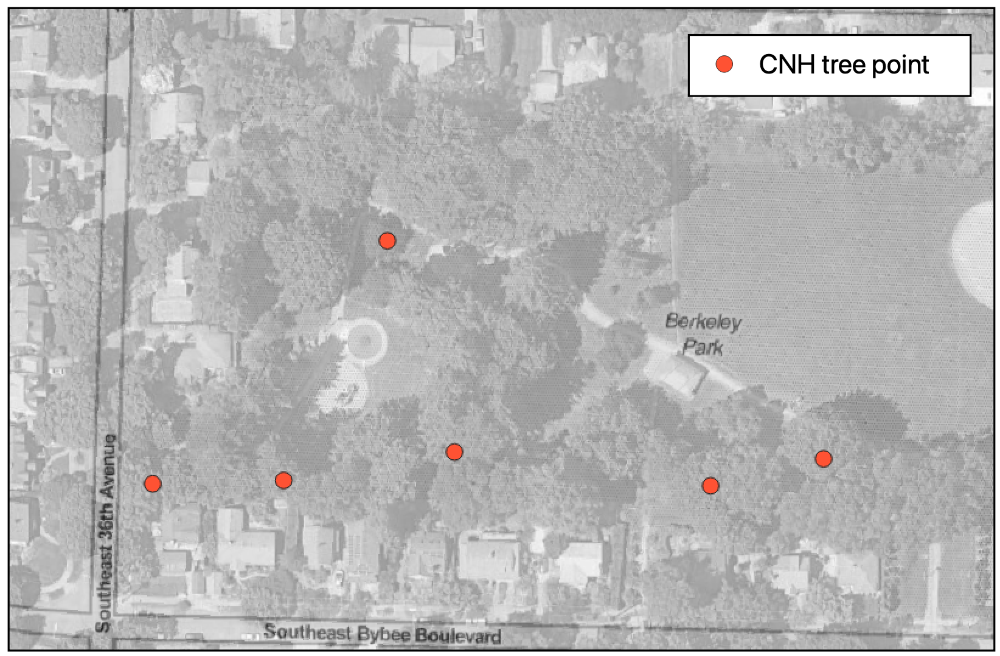
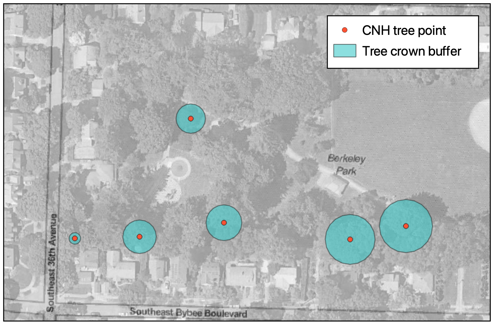
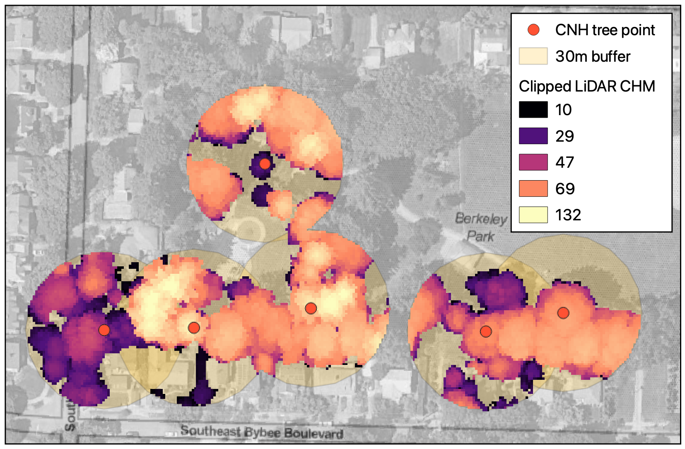
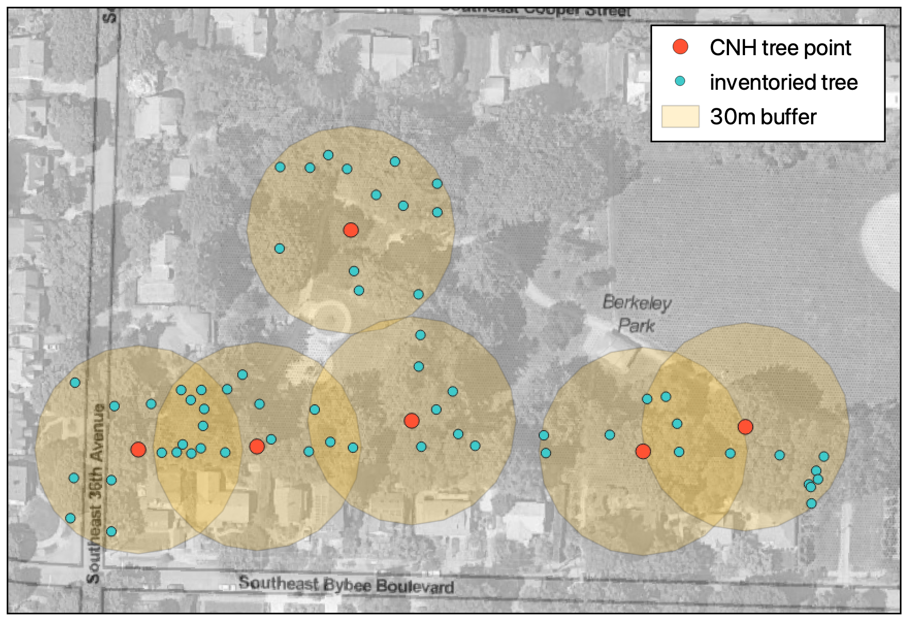
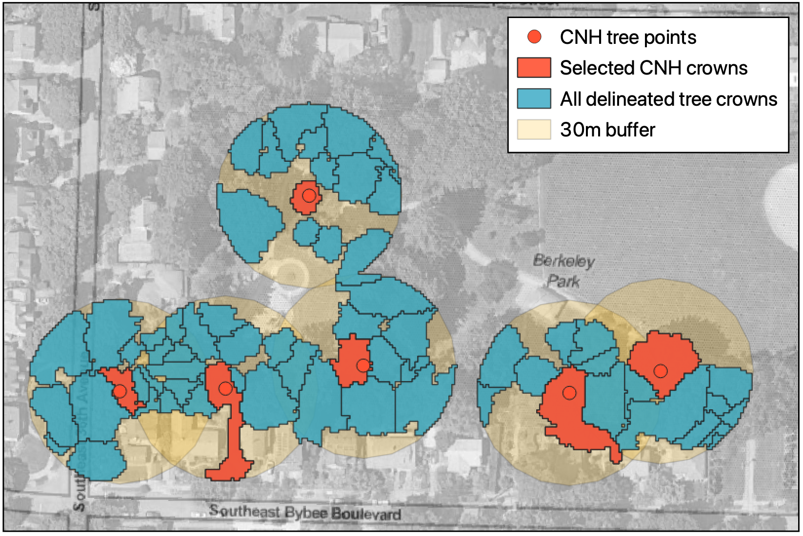
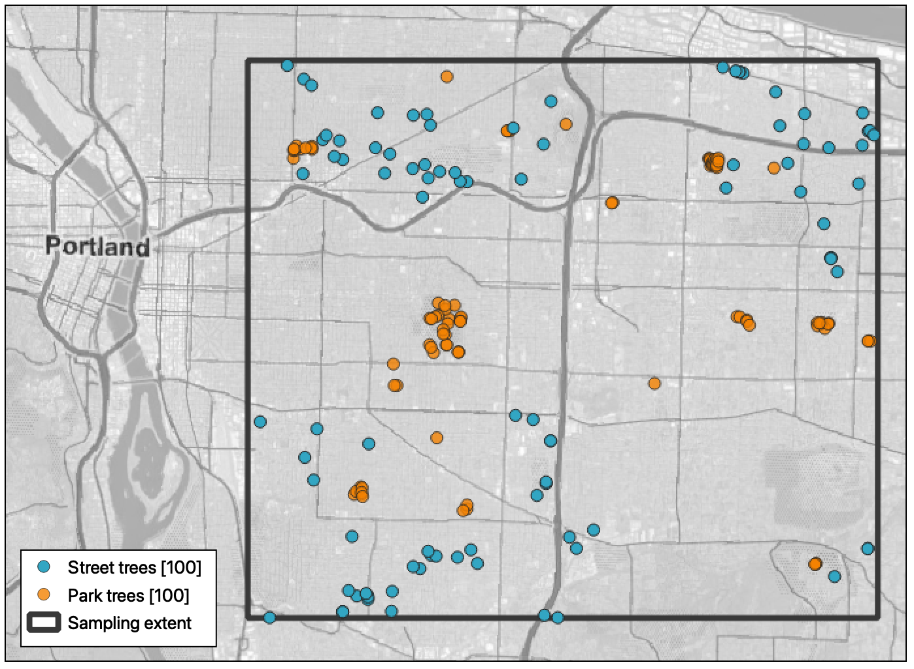

# Data Resources and Methods {#data-methods}

```{=html}
<script type="text/x-mathjax-config">
MathJax.Hub.Config({
  TeX: { equationNumbers: { autoNumber: "AMS" } }
});
</script>
```
```{r setup-1, include=FALSE}
knitr::opts_chunk$set(message = F, warning = F, fig.align='center')
```

```{r packages, include = F}
library(pdxTrees)
library(lubridate)
library(tidyverse)
```

<!--# I’m not sure what the Reed standard is for this stuff, but this section reads a little informal in tone to me. I’d probably take most of it out of first person. In the previous section you say “this thesis” and I think that sounds right. I’d also add a bit more detail to the 2nd and 3rd data-type sections and make them separate paragraphs. -->

<!--# Remind us what CNH stands for. -->

For this thesis, the data resources and processing components can be
split into four main sections (Figure \@ref(fig:methods-overview-fig)).
First, there is the tree data which is used to answer the question
"Where are the trees?" This includes the Portland park and street tree
databases, and the subset of those trees that were selected for health
data collection and assessment as part of the larger CNH2 project in the
summer of 2021. In this thesis, the tree data is used for tree location
points as well as basic tree metrics such as species, height, and crown
width. In general, I will refer to these data sources as park trees (the
Portland park tree dataset), street trees (the Portland street tree
dataset), and CNH trees, which are the trees we collected data on in the
summer of 2021. A majority of the processing with the tree points
involved tidying and wrangling the data as well as sub-setting it and
transforming it into usable data products. Due to the inconsistency in
the types of variables measured for each tree data product, I created a
model to predict tree crown width and tree height based on DBH and
species.

The second aspect of my data and processing is the retrieval and
processing of Planetscope satellite imagery products to produce usable
NDVI data files, which was done in Python. Third, are the different tree
delineation methods I examine in this thesis, which include point value,
radius, and LiDAR methods. This involved the processing of LiDAR and
tree crown radius data, as well as obtaining and computing associated
NDVI values. Lastly, with the combined data from the previous three
parts, I created a predictive model for predicting tree health rating
based on NDVI values.

```{r methods-overview-fig, echo = F, fig.cap = "Overview of methods and data process", out.width = "95%"}

```

## Previously Collected Field Data

<!-- You should probably also include the common names of the species when you introduce them. I also have some basic analysis on the abundance of those species in the inventories, if you want to include some summary stats let me know and I’ll dig them up.  -->

<!-- Just a general comment–you go back and forth between “park and street trees” in some places, and just “street trees” in others. I’d anticipate some questions from your committee about this distinction. I haven’t written it up yet, but my discussion would be something about how we initially stratified the study by park & street trees, to investigate weather that might impact health (due to either proximity to cars/pavement or different maintenance regimes…). But our results showed no significant differences in health between park & street trees, so they were batched together for further analysis.  -->

<!--# Perhaps specify who “we” means here. -->

We collected data tree health during the summer of 2021 as part of a
larger collaborative interdisciplinary project examining the
relationship between various socioeconomic variables and urban tree
health. For the purposes of the larger project, we selected trees from
eight different neighborhoods in Portland, with four different
categorizations of historic and current investment or disinvestment. The
four chosen species are *Pseudotsuga menziesii, Pinaceae* (PSME), *Thuja
plicata, Cupressaceae* (THPL), *Acer macrophyllum, Sapindaceae* (ACMA),
and *Acer platanoides, Sapindaceae* (ACPL). They are some of the most
abundant tree species in Portland, and make up a large proportion of
Portland's urban forest. PSME, THPL, and ACMA are all native to the
area, whereas Norway Maple is a nonnative tree species that was
frequently planted in residential areas, and is now the most common
street tree in Portland.

Individual trees for sampling were selected from the Portland tree
inventories, with the goal of sampling an equal proportion of street
trees and park trees of each species in each neighborhood. Sampling was
also focused on mature trees, so the inventories were filtered to only
include individuals above 25 feet in height. 4 trees of each species
were randomly selected per neighborhood, with an attempt to maintain
equal proportions of park and street trees. However, due to varying
field conditions, some trees were not able to be sampled, so the nearest
tree of the same species that met all criteria was substituted. In
total, 128 trees were surveyed. Fieldwork was conducted between July 7
and August 19, 2021 (Figure \@ref(fig:cnh-trees)). Each tree was sampled
in a single visit between 10am and 3pm. Biotic and abiotic variables
were measured, as well as health attributes and physiology of the trees
(Table \@ref(tab:var-type-table)). For each tree, a GPS point was
collected to mark its location using ArcGIS Explorer on IOS. Due to the
uncertainty of the GPS points, during post-processing, each collected
tree was matched with the tree location point in the Portland Park and
Street Tree inventories. Any sampled tree points that did not match up
with an inventoried tree point in a margin of 20 feet, it was removed
from further analysis. Any tree individual that did not contain a health
categorization was also removed. The final CNH dataset for my analysis
contained 112 trees (Table \@ref(tab:cnh-tree-counts)).

```{r cnh-tree-counts, include = F}
scientific_names <- c("*Acer macrophyllum*","*Acer platanoides*","*Pseudotsuga menziesii*", "*Thuja plicata*")
common_names <- c("Bigleaf Maple", "Norway Maple", "Douglas Fir", "Western Redcedar")

cnh_counts <- read_csv("data/cnh_point.csv") %>%
  filter(!is.na(health_rat)) %>%
  count(species) %>%
  bind_cols(sci = scientific_names) %>%
  bind_cols(com = common_names) %>%
  dplyr::select(4, 3, 1, 2)
```

```{r, echo = F, results = 'asis'}
knitr::kable(
  cnh_counts, booktabs = TRUE, 
  col.names = c("Common name", "Scientific name","Species code", "Number collected"),
  caption = 'Counts of species for final CNH tree dataset',
  caption.short = 'Final CNH Tree counts'
)
```

```{r cnh-trees, out.width = '100%', warnings=FALSE, messages=FALSE, fig.show="hold", fig.cap="Sampled CNH Trees", fig.align='center', echo = FALSE}

```

## Portland Tree Inventory

<!-- “I filtered the street and park tree inventories to trees that were sampled in 2016 and 2019, respectively.” I’m not sure what this is in reference to, only the data in those tables? Or did you only look at trees that had both data from our summer work and also inventory data from those years? Or did you do that year filtering just for developing the width/height model? -->

The Portland Tree Inventory Project, managed by the City of Portland's
Parks & Recreation Urban Forestry Department, cataloged nearly 245,000
street and park trees in Portland between 2010 to 2019. The street tree
inventory, which was collected from 2010 to 2016, contains information
on 216,750 street trees of 145 genera. The park tree inventory,
collected from 2017 to 2019, contains data on 25,740 park trees of 116
genera. While many of the collected variables differ between the two
inventories, they both include data on location, tree identification,
tree diameter at breast height (DBH), and a visual assessment of the
trees health which was rated as **good**, **fair**, **poor**, or dead
(Table \@ref(tab:var-type-table)).

To reduce the variability in data due to the time span of data
collection, I filtered the street and park tree inventories to trees
that were sampled in 2016 and 2019, respectively. For each dataset, the
selected year was the year with the highest count of trees sampled
(Tables \@ref(tab:streettable) and \@ref(tab:parktable)) [@R-pdxTrees].

```{r counttables, include=FALSE, tidy = TRUE}
street_counts<-get_pdxTrees_streets() %>%
  filter(Species %in% c("ACMA", "ACPL", "PSME", "THPL")) %>%
  mutate(year = year(Inventory_Date)) %>%
  dplyr::select(Species, year) %>%
  add_count(Species, year) %>%
  distinct() %>%
  group_by(Species) %>%
  mutate(Total = sum(n)) %>%
  rename(Count_2016 = n) %>%
  filter(year == 2016) %>%
  dplyr::select(-year)

park_counts <-get_pdxTrees_parks() %>%
  filter(Species %in% c("ACMA", "ACPL", "PSME", "THPL")) %>%
  mutate(year = year(Inventory_Date)) %>%
  dplyr::select(Species, year) %>%
  add_count(Species, year) %>%
  distinct() %>%
  group_by(Species) %>%
  mutate(Total = sum(n)) %>%
  rename(Count_2019 = n) %>%
  filter(year == 2019) %>%
  dplyr::select(-year)
```

```{r streettable, results='asis', echo = FALSE}
knitr::kable(
  street_counts, booktabs = TRUE, 
  col.names = c("Species code", "Collected in 2016", "Total in inventory"),
  caption = 'Species counts in the Portland Street Trees Database',
  caption.short = 'Species counts in Street Trees Database'
)
```

```{r parktable, results='asis', echo = FALSE}
knitr::kable(
  park_counts, booktabs = TRUE, 
  col.names = c("Species code",  "Collected in 2019", "Total in inventory"),
  caption = 'Species counts in the Portland Park Trees Database',
  caption.short = 'Species counts in Park Trees Database'
)
```

The Portland park and street tree inventories include a health
categorization variable of **good**, **fair**, **poor**, or Dead. A
drawback that can come with qualitative health ratings such as this one
is that if a tree does not appear close to death, or perfectly healthy,
it is very easy to categorize its health as **fair**, which is what we
see in both the street and park tree databases. The proportion of trees
rated **fair** is extremely high, especially in the park trees inventory
(Figure \@ref(fig:rating-ratios)).

```{r, echo = F, message = F, warning = F, tidy = TRUE}
species_pal <- c("#219EBC", "#023047", "#FFB703", "#FB8500", "#586f7c")

street_health <- get_pdxTrees_streets() %>%
  dplyr::select(Species, Condition) %>%
  filter(Species %in% c("ACMA", "ACPL", "PSME", "THPL")) %>%
  mutate(Condition = fct_relevel(Condition, levels = c("Poor", "Fair", "Good"))) %>%
  ggplot(aes(fill = Species, x = Condition))+
  geom_bar(position = "dodge")+
  scale_fill_manual(values = species_pal)+
  labs(x = "Health rating", fill = "Species", y = "Count", title = "Street trees")+
  guides(fill = "none")

park_health <- get_pdxTrees_parks() %>%
  dplyr::select(Species, Condition) %>%
  filter(Species %in% c("ACMA", "ACPL", "PSME", "THPL")) %>%
  mutate(Condition = fct_relevel(Condition, levels = c("Poor", "Fair", "Good"))) %>%
  ggplot(aes(fill = Species, x = Condition))+
  geom_bar(position = "dodge")+
  scale_fill_manual(values = species_pal)+
  labs(x = "Health rating", fill = "Species", y = "Count", title = "Park trees")
```

```{r rating-ratios, echo = F, fig.cap="Distribution of Health Ratings in the Portland Tree Inventories"}
street_health + park_health
```

### Canopy width and tree height model

<!--# The statistical model needs to be described here. I think you have some figures that illustrate this? (though they might be in the results section). SUGGESTION: can this be a sub-subsection underneath 2.3? -->

The park tree dataset contains measurements for tree height, canopy
width, and DBH, but the street tree dataset only contains measurements
for DBH. Canopy width and tree height are both important factors for
tree selection and canopy delineation. Using RStudio, I created a
statistical model to predict tree height and crown width based on tree
DBH and species, in order to be able to use the same pixel selection
methods for both the park and street tree inventories (Section
\@ref(canopy-model-results)).

## Satellite Imagery

The multispectral satellite imagery used in this thesis was accessed
through Planet Labs Education and Research Program, which provides
limited non-commercial access to PlanetScope satellite imagery for those
with a college or university email address. The available imagery had a
pixel resolution of 3 meters, and a 4-band product (RGB-NIR). The bands
in a satellite product refer to the reflectance wavelength that is
picked up by the satellite. For a 4-band satellite product, the
wavelengths are split into red, green, blue, and near-infrared (NIR)
bands (Table \@ref(tab:wavelength)). In the raw PlanetScope product,
these 4 bands come compressed in one `.tif` image.

```{r, echo = F}
wavelengths <- tibble("band" = c("Blue", "Green", "Red", "NIR"),
                      "wavelength" = c("455 - 515 nm", "500 - 590 nm", "590 - 670 nm", "780 - 860 nm"))
```

```{r wavelength, results='asis', echo = FALSE}
knitr::kable(
  wavelengths, booktabs = TRUE, longtable = TRUE,
  col.names = c("Band name", "Wavelength range"),
  caption = 'Wavelength ranges for 4-band Planetscope satellite bands',
  caption.short = '4-band satellite wavelength ranges'
)
```

PlanetScope satellite imagery (Planet Labs, 3m resolution, 4-band
RGB-NIR) was used for vegetation index calculation. PlanetScope, also
known as the Flock, is a constellation of approximately 130 satellites .
The first 28 PlanetScope satellites were launched in July 2014, and the
newest batch of satellites were launched in January 2022. PlanetScope,
operated by Planet, is a constellation of approximately 130 satellites,
able to image the entire land surface of the Earth every day (a daily
collection capacity of 200 million km$^2$/day). PlanetScope images are
approximately 3 meters per pixel resolution [@planetlabs2022]. A
downloaded satellite product for an area of interest is comprised of
multiple scene products. Each scene product is an individual image of a
swath of land that is at least partially contained within the area of
interest. (Figures \@ref(fig:2016-swath), \@ref(fig:2019-swath),
\@ref(fig:2021-swath)).

I downloaded satellite images corresponding to the summers of when the
data was collected (2016, 2019, and 2021). Images were first filtered
for those captured in July of each year, since images taken during the
middle of the on-leaf period have been shown to be most sensitive in
detecting a statistical difference in tree health measured by NDVI
[@fang2020]. The remaining images were then filtered for minimal cloud
cover and maximum coverage of the area of study. The final selected
images were taken between 6:30 and 7pm on 6 July 2016, 31 July 2019, and
26 July 2021 (Table \@ref(tab:sat-products)).

```{r, echo = FALSE}
products <- tibble("date" = c("2016-07-06", "2019-07-31", "2021-07-26"),
                   "time" = c("18:55", "18:42", "18:40"),
                   "count" = c(5, 4, 4),
                   "id" = c("0c22", "0f42", "1003"))
```

```{r sat-products, results='asis', echo = FALSE}
knitr::kable(
  products, booktabs = TRUE, longtable = TRUE,
  col.names = c("Collection date", "Collection time", "Number of scene products", "Satellite ID"),
  caption = 'Satellite product specifications for PlanetScope multispectral satellite image products',
  caption.short = 'Satellite product specifications'
)
```

For each of the chosen dates, I downloaded the available analytic
product from Planet. The analytic multispectral imagery products are
orthorectified, calibrated, corrected for terrain distortions, and
transformed to Top of Atmosphere radiance to ensure accurate geolocation
and cartographic projection.

## NDVI calculation {#ndvi-calc-methods}

<!--# Modify the text and/or equation to be clear that you calculate this for each PIXEL.  -->

The NDVI calculations were done using Python in PyCharm. Besides minor
alterations, the processing code came from Planet's instructions on
calculating NDVI from 4-band PlanetScope data [@planetndvi]. NDVI is
calculated from the red and NIR satellite bands, as shown in Equation
\@ref(eq:ndvi-eq).

```{=tex}
\begin{equation}
  \mathrm{NDVI} = \frac{(NIR - Red)}{(NIR + Red)} 
  (\#eq:ndvi-eq)
\end{equation}
```
```{python ndvi-calc, include = FALSE, eval = FALSE, tidy = TRUE}
import rasterio
import numpy

files = ["1", "2", "3", "4"] # unique file identifiers
folder = "ndvi_calc_thesis/files" # folder with the raw files
date = "20210726" # product date


for i in range(len(files)):
    filenum = files[i]
    image_file = folder+"/"+date+"_"+filenum+"_AnalyticMS.tif"


    metafile = folder+"/"+date+"_"+filenum+"_AnalyticMS_metadata.xml"
    print(image_file)
    print(metafile)

    # Load red and NIR bands - 
    # note all PlanetScope 4-band images have band order BGRN

    with rasterio.open(image_file) as src:
        band_red = src.read(3)

    with rasterio.open(image_file) as src:
        band_nir = src.read(4)

    from xml.dom import minidom

    xmldoc = minidom.parse(metafile)
    nodes = xmldoc.getElementsByTagName("ps:bandSpecificMetadata")

    # XML parser refers to bands by numbers 1-4
    coeffs = {}
    for node in nodes:
        bn = node.getElementsByTagName("ps:bandNumber")[0].firstChild.data
        if bn in ['1', '2', '3', '4']:
            i = int(bn)
            value = node.getElementsByTagName("ps:reflectanceCoefficient")[0].firstChild.data
            coeffs[i] = float(value)

    # Multiply by corresponding coefficients
    band_red = band_red * coeffs[3]
    band_nir = band_nir * coeffs[4]

    # Allow division by zero
    numpy.seterr(divide='ignore', invalid='ignore')

    # Calculate NDVI
    ndvi = (band_nir.astype(float) - band_red.astype(float)) / (band_nir + band_red)


    # Set spatial characteristics of the output object to mirror the input
    kwargs = src.meta
    kwargs.update(
        dtype=rasterio.float32,
        count=1)
    
    # Set name for new NDVI file
    newfile = folder + '/ndvi_' + date + "_" + filenum + '.tif'

    # Create the file
    with rasterio.open(newfile, 'w', **kwargs) as dst:
        dst.write_band(1, ndvi.astype(rasterio.float32))
```

```{r areafigs, out.width = '32%', warnings=FALSE, messages=FALSE, fig.show="hold", fig.cap="Product areas for 2016, 2019, and 2021 satellite scenes", fig.align='center', echo = FALSE}
knitr::include_graphics(c("figure/2016_ndvi.png", "figure/2019_ndvi.png", "figure/2021_ndvi.png"))
```

## Canopy Height Model {#chm}

A canopy height model for the Portland metro area was developed using
LiDAR and satellite spectral imagery collected in the summer of 2014
[@canopy2014]. The purpose of this data is to monitor natural areas in
the Portland metro area, specifically change over time analysis and the
examination of the potential loss of habitat in riparian areas. The
canopy was detected using both NDVI values and LiDAR feature heights.
Errors and noise in the data, such as electrical lines above tree tops,
were cleaned using geometric post-processing. The canopy height model
was clipped to remove anything below ten feet to eliminate any
understory shrubs or grasses that were included in the raw data
[@canopy2014].

## Tree Crown Delineation and Pixel Selection

The goal of tree crown delineation is to understand where the foliage of
a tree is located. This is extremely important because we want to ensure
that the satellite pixels used for health analysis have measurements
that belong to the given tree. Previous papers such as have used manual
tree crown delineation [@xiao2005], or chosen a standardized radius for
all trees in their sample [@fang2020]. Manual tree crown delineation
would be extremely time consuming, especially when trying to examine
data on a city-wide level. Additionally, with a standardized radius,
there will be many trees that have crowns either larger or smaller than
the standardized radius. If the true crown is smaller than that of the
radius, pixels that correspond to things like grass or pavement will be
included in the measurement analysis. Conversely, if the true crown is
larger than the chosen radius, the edges of the tree will be ignored,
and valuable data will be lost. With both of these methods, any
overlapping tree crowns were removed from the final analysis, even
further reducing the sample size.

In this thesis, I test three different methods of pixel selection for
NDVI analysis. First, I test a "point method" which uses the NDVI value
from a single pixel directly below an inventoried trees location point.
Second, I use crown width measurements and predictions to create a
variable radius method, and average the NDVI pixels within the created
circle. Lastly, I use a LiDAR created canopy height model for Portland's
urban canopy with `ForestTools` canopy delineation algorithm to create
canopy polygons for NDVI analysis [@R-ForestTools].

For the following examples, I use Berkeley Park, located in SE Portland,
to demonstrate the different delineation techniques. We sampled 6 CNH
trees in Berkeley Park: 2 Bigleaf Maple, 1 Norway Maple, 2 Douglas Fir,
and 1 Western Redcedar (Figure \@ref(fig:berkeley-park)).

```{r berkeley-park, out.width = '100%', warnings=FALSE, messages=FALSE, fig.show="hold", fig.cap="Berkeley Park and CNH trees", fig.align='center', echo = FALSE}

```

### Point method

Point Method: For the point method, I extracted the NDVI value from the
pixel directly underneath the tree location point. This is the simplest
of the three methods, since it obtains one NDVI value for one singular
pixel. The tree location points were sourced from the street and park
tree inventories and processed in QGIS (Figure \@ref(fig:point-method)).
The main source of potential error with this technique is with the tree
point location. If the point was placed incorrectly, the NDVI value will
not be representative of the tree's greenness, or health.

```{r point-method, out.width = '80%', warnings=FALSE, messages=FALSE, fig.show="hold", fig.cap="CNH trees sampled in Berkeley Park", fig.align='center', echo = FALSE}

```

### Radius method

The first method of tree crown delineation I used is based on the
individual crown width for each selected tree. In the Portland park tree
inventory, crown width is measured as an east to west diameter, and a
north to south diameter. To get the radius for the buffer, I took the
average of both measurements and divided it by 2. For the Portland
street tree inventory, crown width was not collected. I used the tree
height and crown width predictive model to create crown width
measurements. For each selected tree point, I created a buffer with the
radius of the measured or predicted tree canopy using QGIS (Figure
\@ref(fig:point-radius)). To get NDVI for each tree in this method, I
averaged the value of all pixels in the buffer circle for each tree
using QGIS.

With the radius method, it involves the same risk as the point method
that if the central point is incorrectly located, the values will not be
representative. Additionally, average NDVI ratings obtained with this
method for trees with overlapping crowns will contain NDVI pixels that
belong to other trees. Previous studies have removed all overlapping
tree crowns when using a radius technique, but that can severely limit
sample size of available data for analysis, since especially in urban
areas and on streets, most of the trees will have overlapping crowns.

```{r point-radius, out.width = '80%', warnings=FALSE, messages=FALSE, fig.show="hold", fig.cap="CNH trees with crown width buffer", fig.align='center', echo = FALSE}

```

### LiDAR method

The LiDAR method is the most complex and involved of the three tree
crown delineation methods but has the potential to be the most precise.

The `ForestTools` crown delineation algorithm is a modified watershed
delineation algorithm that takes a LiDAR file input, as well as treetop
location point file and outputs a polygon file with predicted tree
crowns. `ForestTools` also has the ability to predict treetop location
points based on LiDAR data, but that functionality introduced a lot of
error in my processing because it became difficult to re-associate
predicted treetop points with the actual tree location points that I was
analyzing.

The LiDAR canopy height model was clipped to a 30 meter buffer around
each selected tree point to reduce file size in the delineation
processing (Figure \@ref(fig:lidar-buffer)). A 30m buffer was chosen to
ensure that no part of the tree canopy would be omitted from the
processing, and to include any near neighboring trees that may have
canopy that overlaps with the tree of interest. In order for the
algorithm to delineate tree crowns, it needs both LiDAR canopy data and
location points for the potential trees for delineation. With a smaller
buffer radius, the locations of neighboring trees would be omitted and
the canopy delineation algorithm would compute a tree crown as much
bigger than it actually is.

With the 30m buffer, all other inventoried trees that are contained
within the buffer were selected for inclusion as treetop location points
in addition to the trees of interest (Figure \@ref(fig:buffer-points)).
A minimum tree height of 20 feet was included in the algorithm options
but since all sampled trees were already filtered for height
requirements, this may not be necessary.

```{r lidar-calc, eval = F, include = F, tidy = TRUE}
library(rgdal)
library(imager)
library(raster)
library(ForestTools)

options("rgdal_show_exportToProj4_warnings"="none")

## Loading raster data
EML_CHM <- raster("~Desktop/thesis_data/lidar_crown/clipped_lidar.tif")

## Loading tree points
all_ttops <- shapefile("~Desktop/thesis_data/lidar_crown/all_tree_points_for_delin.tif")

# delineate tree crowns
## inputs: my tree points, LiDAR data
crownsPoly <- mcws(treetops = all_ttops, CHM = EML_CHM, format = "polygons", minHeight = 20, verbose = TRUE)

# export file
writeOGR(crownsPoly, "~/Desktop/thesis_data/lidar_crown", "canopy_delin_polygons_poly", driver = "ESRI Shapefile")
```

```{r lidar-buffer, out.width = '80%', warnings=FALSE, messages=FALSE, fig.show="hold", fig.cap="LiDAR data clipped to 30m tree buffer", fig.align='center', echo = FALSE}

```

```{r buffer-points, out.width = '80%', warnings=FALSE, messages=FALSE, fig.show="hold", fig.cap="All inventoried trees within the 30m buffer", fig.align='center', echo = FALSE}

```

```{r, out.width = '80%', warnings=FALSE, messages=FALSE, fig.show="hold", fig.cap="LiDAR tree crown delineations with selected CNH crowns", fig.align='center', echo = FALSE}

```

```{r layered-outputs, out.width = "90%", fig.cap = "Point, Radius, and LiDAR pixel selection methods for Berkeley Park", fig.scap = "Pixel selection method comparison"}
include_graphics("figure/layered_outputs.png")

```

These three processes were repeated for random samples of 100 park trees
and 100 street trees, stratified for tree species. Due to restrictions
in file size for LiDAR processing, the sampling had to be constrained to
an area of East Portland (Figure \@ref(fig:clip-extent)). This extent
was chosen to align with the sampling region of the CNH data, though it
had to be shrunk slightly.

```{r clip-extent, out.width = '80%', warnings=FALSE, messages=FALSE, fig.show="hold", fig.cap="Geographic extent and random sampling", fig.align='center', echo = FALSE}

```

```{r, out.width = '80%', warnings=FALSE, messages=FALSE, fig.show="hold", fig.cap="LiDAR tree crown delineations with selected CNH crowns", fig.align='center', echo = FALSE}
knitr::include_graphics("figure/layered_outputs.png")
```

## Modeling Tree Health

To tie all of my smaller pieces of data analysis together, I created a
model to predict tree health categorization from NDVI values. I chose an
ordinal logistic regression, which is used to model and predict the
relationship between an ordinal categorical response variable and one or
more explanatory variables, which can be either categorical or
continuous. In order to use this type of model, I tested each model for
the Proportional Odds Assumption, and

<!--# Finish description of ordinal logistic regression here. -->

<!--# I actually think the choice of training/test is a RESULTS paragarph, not here. Here you want to write out the relevant equations and assessment measures. Save the actual application to real data for the results. (I think just this paragraph moves) -->

For each model, I created a confusion matrix to examine the validity of
the model. A confusion matrix is a calculated cross-tabulation of
observed and predicted classes, which in this case is health
categorization, along with associated statistics. The two main
statistics I use in my data analysis are overall accuracy and an
un-weighted Kappa statistic. "Accuracy" refers to the sensitivity

$$\textrm{Sensitivity}= \frac{\textrm{True positive}}{\textrm{True positive + False negative}}$$

and specificity

$$\textrm{Specificity}= \frac{\textrm{True negative}}{\textrm{True negative + False positive}}$$
of the prediction.

$$
\textrm{Accuracy}= \frac{\textrm{Sensitivity + Specificity}}{2}
$$

Kappa ($\kappa$) refers to Cohen's Kappa Statistic which is used to
measure inter and intra-rater reliability for categorical items.

<!--# Cite Cohen’s Kappa Statistic? -->

$$
\kappa = \frac{p_o - p_e}{1 - p_e} = \frac{1 - p_o}{1 - p_e}
$$ where $p_o$ is the relative observed agreement between the reference
and prediction, and $p_e$ is the hypothetical probability of agreement
by chance.

For $k$ categories, $N$ observations to categorize and $n_{ki}$ the
number of times rater $i$ predicted category $k$:

$$
p_e = \frac{1}{N^2}\sum{n_{k1}n_{k2}}
$$

$$
p_e = \sum_{k}\widehat{p_{k12}} = \sum_{k} \widehat{p_{k1}}\widehat{p_{k2}} = \sum_{k}\frac{n_{k1}}{N}\frac{n_{k2}}{N} = \frac{1}{N^2}\sum{n_{k1}n_{k2}}
$$

Where $\widehat{p_{k12}}$ is the estimated probability that both raters
1 and 2 will classify the same item as category $k$, while
$\widehat{p_{k1}}$ is the estimated probabilities that rater 1 will
classify an item as category $k$. This is based on the assumption that
the rating of the two raters are independent. $\widehat{p_{k1}}$ is
estimated from the number of items classified as category $k$ by rater 1
($n_{k1}$) divided by the total number of items for classification
($N$):$\widehat{p_{k1}}=\frac{n_{k2}}{N}$. These equations and
relationships are the same for rater 2.

If the two raters (in this case the reference and prediction
categorizations) are in complete agreement, then kappa = 1.

<!--# How does one calculate the probability by chance? Be prepared for Q’slike this. -->
