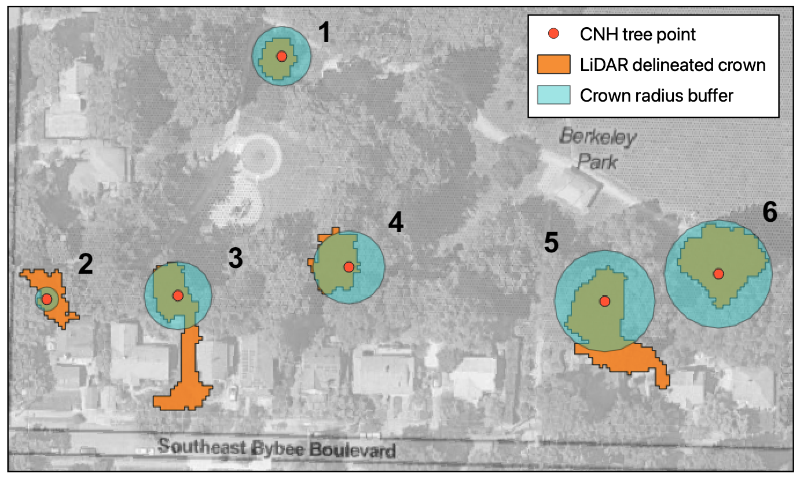

# Discussion {#discussion}

<!--# Start with an intro paragraph (before any subsection) summarizing the results.  -->

<!--# Move the sentences describing the results (first few sentences of each paragraph) up to the Results section. Then summarize them here in 1-2 sentences and make the connections across subsections here. (Effect of filtering trees <25 ft, crown width model vs. tree height model, etc.) -->

<!--# Perhaps have a section about "limitations of satellite imaging" rather than a subsection of the height model? -->

<!--# "Pixel Selection" should be renamed to something is more focused on the discussion point(s) - "Effect of tree delineation techniques"? -->

<!--# This is where you can put your work in context. Maybe a subsection on "other factors that determine tree health". -->

<!--# You will want a subsection on open source and accessibility here.  -->

## Limitations of Satellite Imaging

While the use of satellite imaging for urban ecology applications

## Effect of Tree Delineation and Pixel Selection Techniques

The three pixel selection methods (point, radius, and LiDAR) were used
to help answer the question "which pixels are we using?"

```{r layered-outputs-2, out.width = "90%", fig.cap = "Point, Radius, and LiDAR pixel selection methods for Berkeley Park with numbered trees", fig.scap = "Pixel selection method comparison with numbered trees"}


```

The point method is the simplest method, obtaining a single NDVI value
from the individual pixel that spatially contains an individual tree
location point. The statistically significant difference in the NDVI
values for trees categorized as **fair** and **good** seems to be
primarily driven by the THPL data.

Given that only one pixel value is used to represent the NDVI of an
entire tree in the point method, that single pixel likely misrepresents
the health of the tree. If the location point is incorrect, the NDVI
value may not belong to the tree of interest. The pixel method NDVI
values statistically significantly higher than the NDVI values obtained
through the other two pixel selection methods. This can be attributed to
the use of a single pixel rather than an average of pixel NDVI values.
The approximated center of the tree represented by the tree location
point will generally be greener than pixels on the edge because the NDVI
value for a pixel is the average NDVI for all data within that pixel,
and the central pixel likely contains mostly tree canopy, and ideally
little to no information on ground cover surrounding the tree. This is
emphasized in figure \@ref(fig:layered-outputs-2), which highlights the
large variance in pixel selection extent for the three methods and how
much data is missed by the point method. The radius method averages the
NDVI values of pixels within a buffered circle with the size defined by
the measured or predicted tree canopy width.

The radius method data had a statistically significant difference in
average NDVI values between **good** and **poor** categorized trees as
well as **good** and **fair** categorized trees. There is a larger
difference between **fair** and **good** than **fair** and **poor**,
which is also seen in the point method data.

## Evaluation of Tree Health Predictions

## Other Factors for Tree Health

While this thesis presents one picture of

## Open Source Data and Accessible Science

When beginning this thesis, a large goal of mine was to use only open
source and freely accessible data sources and programs. For the most
part, I was able to meet this goal. The satellite data I used was
accessed through PlanetScope's Education and Research Program, which
provided me with limited, non-commercial access to PlanetScope satellite
imagery. This is accessible after a short application, provided that the
applicant has a college or university email address. Both the street and
park tree inventories were publicly available through Portland's GIS
opendata site, and the LiDAR canopy height model was available through
Portland's Regional Land Information System (RLIS). The one processing
task I was not able to do on an open source software was the file
conversion of the LiDAR CHM. It is only available for download as a File
Geodatabase, which is a proprietary ArcGIS file type. In order to be
able to utilize it in QGIS, which is an opensource GIS software, I had
to open the CHM file in ArcGIS through Reed's institutional access, and
export it as a `.tif` file type. This is unfortunate, because it is very
possible for Portland's RLIS site to host the canopy height model in a
different format. While many of the data sources I used were openly
accessible, throughout this process it became apparent that the
processing techniques were not. I had to use three different platforms
(RStudio, QGIS, and Python) to conduct the work for this thesis.

While relative to many context, satellite imagery with a 3m pixel size
is relatively high resolution. Unfortunately, in the field of urban
ecology, it is

## Future Directions

## Conclusion
