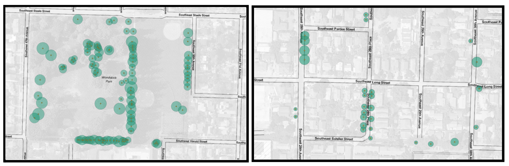

# Discussion {#discussion}

The primary goals of this thesis were to investigate the impact of
functional type or species specification in predictive health models, as
well as an investigation of the impacts and outcomes of three different
pixel selection and tree crown delineation models. In summary, the
predictive models with species specificity as well as the models that
used NDVI data obtained through the LiDAR tree crown delineation had the
best results. However, each method had limitations despite their
effectiveness which will be discussed in further detail below.

## Strengths and limitations of different delineation techniques

The three pixel selection methods (point, radius, and LiDAR) were used
to help answer the question *which pixels are we using?* This was a
necessary part of this thesis methodology because in order to utilize
NDVI as a health metric, it was essential to select specific NDVI pixels
from satellite imagery for analysis. Three different methods of pixel
selection and tree crown delineation were tested: a point method which
used the single NDVI value from directly below a tree location point; a
radius method which averaged the NDVI values of all pixels contained
within a buffer circle defined by the measured or predicted tree crown
width; and a LiDAR method which used a modified watershed delineation
algorithm in conjunction with LiDAR canopy height model data to
delineate tree crowns into predicted polygon shapes (Figure
\@ref(fig:layered-outputs-2)).

```{r layered-outputs-2, out.width = "90%", fig.cap = "Point, Radius, and LiDAR pixel selection methods for Berkeley Park with numbered trees", fig.scap = "Pixel selection method comparison with numbered trees", echo = F, fig.align='center'}
include_graphics("figure/layered_outputs_2.png")
```

The single pixel point method results in an NDVI value representative
for the center-most section of a tree crown which may be effective for
small trees, but overlooks much of the data from the tree crown as a
whole, leading to this method being a poor representation of NDVI and
tree health for trees with larger canopies. The point method is the
simplest method, obtaining a single NDVI value from the individual pixel
that spatially contains an individual tree location point. The
statistically significant difference in the NDVI values for trees
categorized as **fair** and **good** seems to be primarily driven by the
THPL data (\@ref(fig:point-species)). Given that only one pixel value is
used to represent the NDVI of an entire tree in the point method, that
single pixel likely misrepresents the health of the tree. If the
location point is incorrect, the NDVI value may not belong to the tree
of interest. The pixel method NDVI values statistically significantly
higher than the NDVI values obtained through the other two pixel
selection methods. This can be attributed to the use of a single pixel
rather than an average of pixel NDVI values. The approximated center of
the tree represented by the tree location point will generally be
greener than pixels on the edge because the NDVI value for a pixel is
the average NDVI for all data within that pixel, and the central pixel
likely contains mostly tree canopy, and ideally little to no information
on ground cover surrounding the tree. Because of this, the single pixel
point method is more likely to produce less "noise" within the data from
edge effects and non-canopy pixels. This is emphasized in figure
\@ref(fig:layered-outputs-2), which highlights the large variance in
pixel selection extent for the three methods and how much data is missed
by the point method. This model may be best for small trees or trees
that experience patterns of dieback positioned around their center and
trunk in contrast to the edges of the canopy. One of the main
limitations of the point method is the limited scope of data used in
analysis. However, this limitation does not exist for the radius method.

The radius method averages the NDVI values of pixels within a buffered
circle with the size defined by the measured or predicted tree canopy
width. This data had a statistically significant difference in average
NDVI values between **good** and **poor** categorized trees as well as
**good** and **fair** categorized trees (figure
\@ref(fig:radius-species)). There is a larger difference between
**fair** and **good** than **fair** and **poor**, which is also seen in
the point method data. Where the scope of the pixel data is too narrow
(only using the value of a singular pixel) the scope of the radius
method can be too broad and pixels belonging to other trees will be
included. A large issue that can arise with the radius method data is
the overlapping of tree crowns, and pixels being used in the NDVI
analysis for multiple trees (Figure \@ref(fig:overlap-crowns)).
Overlapping crowns is an issue that often arises with tree crown
delineation. To deal with this, @xiao2005 chose to exclude any trees
with overlapping crowns from the final analysis. @fang2020 used a
version of the radius method where they calculated an average canopy
width and used that standardized size (a radius of 4.55 m) to extract
their NDVI averages for each tree. The paper does not mention how they
dealt with overlapping tree crowns, but perhaps their trees were widely
distributed enough and the radius of interest was small enough that
their values did not experience overlap. Using LiDAR as a pixel
selection method has the benefit of additional pixel data like the
radius method, but no overlapping crowns.

```{r overlap-crowns, out.width = "100%", fig.scap = "Examples of overlapping park and street tree crowns.", fig.cap = "Examples of tree crown buffers from radius method data with overlapping crowns for park trees (left) and street trees (right). While the frequency of overlapping crowns is much higehr for the park example, it is still apparent in the street trees as well. Given that these figures only include trees of the canary species, the occurance of overlapping tree canopies is likely even higher than this.", echo = F, fig.align='center'}

```

The LiDAR tree crown delineation was by far the most intensive pixel
selection method tested in this thesis, but was the most effective for
modeling purposes. In some cases (such as trees 1, 4, and 6 in figure
\@ref(fig:layered-outputs-2)) the LiDAR delineation appears to be highly
effective in creating a polygon that is representative of a tree's
crown, without the inclusion of overlapping areas. However, there are
cases (such as trees 2, 3, and 5) where the canopy delineation algorithm
creates canopies for trees that are larger than reality. The LiDAR pixel
selection method also led to the most statistically significant
predictive models (\@ref(fig:lidar-species)). Using LiDAR for canopy
delineation is complicated, but it is also quite effective.

Given the overall results of the three methods, I believe that the
radius and LiDAR methods are both valid choices for tree crown
delineation and pixel selection, but can have different intended uses
that will maximize the benefits of each model. The radius method is
fairly easy when compared to the LiDAR processing. It does have more
overlapping crowns, but fewer non-canopy pixels. Especially if the data
already contains a crown width measurement, the radius method can be a
decently simple method of selecting pixels for NDVI assessment. The
LiDAR method will not produce overlapping crowns but may include more
non-canopy pixels. If the goal is maximizing the accuracy of the tree
crown delineations, the the LiDAR method may be the best approach. A
future approach may be to use the LiDAR method to delineate tree crowns,
then trim the polygons based on the radius buffer to eliminate both
overlapping tree crowns as well as a majority of non-canopy pixels.

## Evaluation of Tree Health Predictions

The final LiDAR model for predicting tree health based on NDVI and
species had promising results for the two maple species, especially
ACMA. The ACMA health predictions mirrored the pattern seen in the
measured health condition and LiDAR calculated NDVI. With ACPL, the
predictions showed effective separation of **fair** and **good**, but no
predictions of **poor** trees. A limitation for all of the models is
sample size. The models were only statistically significant when the
health rating groups were downsampled to equal sizes, and the accuracy
and kappa values varied depending on the sample of trees that was
included in the downsampled data (table \@ref(tab:model-test-table)).
Additionally, the distribution of species across health rating with the
downsampled data is uneven (Table \@ref(tab:species-counts-bleh)). Due
to data loss during the LiDAR canopy delineation, the final dataset used
for model training had no PSME individuals rated as **poor** health. In
the predictions, no PSME individuals were rated as **poor**, which in
context of the training dataset makes complete sense (Figure
\@ref(fig:preds-counts)). If there is no basis for a prediction of a
specific health rating, that health rating will not be predicted. For
all species, an overall larger sample size would likely improve the
predictions and the model as a whole. This is easier said than done,
since while collecting field data and health analyses, the species
sampled can be controlled by selection, but their health cannot be. In
order to create a predictive model that works for more than just ACMA,
it is necessary to increase the size of data for model training.

```{r, include = F}
test_data_lidar %>%
  ggplot(aes(x = health_rat, fill = species))+
  geom_bar()+
  scale_fill_manual(values = species_pal)

species_counts <- test_data_lidar %>%
  dplyr::select(species, health_rat) %>%
  count(species, health_rat) %>%
  pivot_wider(names_from = "health_rat", values_from = "n") %>%
  mutate(poor = gtools::na.replace(poor, 0))
```

```{r species-counts-bleh, results = 'asis', echo = F}
kable(species_counts,
      booktabs = TRUE, col.names = c("Species", "Count Poor", "Count Fair", "Count Good"),
  caption = "Count of Species and Ratings in final dataset used for LiDAR downsampled model training")
```

## Impact of Functional Tree Type and Species on Tree Health Assessments

In all models and data analysis, very different patterns were seen
between the broadleaf deciduous trees (ACMA and ACPL) and the coniferous
evergreen trees (PSME and THPL). This is at least partially due to the
functional tree type and how these trees respond to environmental
conditions and declining health. Deciduous trees lose their leaves every
fall, and grow new ones every spring. Since their vegetation has a
shorter lifespan of one growing season, it is much more sensitive to
sudden and extreme environmental impacts. Declining health can be seen
in broadleaf trees as leaf damage or scorching, discoloration in the
foliage, or a decrease in the number of leaves grown each year.
Conversely, coniferous evergreen trees retain their foliage after each
growing season, adding new growth on to the end of branches. Since
evergreen trees cannot regrow all their foliage after a year with harsh
environmental conditions, their response is often seen in the loss of
branches and a reduction in overall canopy cover. Because of these
variations in response types, the models including functional type as a
predictor variable had higher levels of accuracy than the method only
using NDVI.

For each of the three pixel selection method models, the model that
differentiated the predictions by species was the most accurate. Because
of the differences in functional type and other species-specific
characteristics, it makes sense that increasing the specificity of the
model to species would improve the predictions. This additional
separation of tree species also highlighted the utility of the final
predictive model for separating ACMA individuals into distinct health
categories based on NDVI, but this did not hold true for the ACPL
predictions.

Separating the predictions by species was consistently more effective
than separating by functional type. Like with the tree crown
delineations, the species differentiation was the most effective, but
functional type specificity can do in a pinch. For the purpose of
obtaining a rough understanding of NDVI across various functional types
of trees, then specifying functional type instead of species will paint
an adequate picture of tree health. However, to maximize accuracy of
health predictions, species separation

## Limitations of Satellite Imaging

While the use of satellite imaging for urban ecology applications is
becoming more frequent, there are still numerous avenues that need
additional research and improvement. The first of those is documentation
and access, which I will discuss further in the next section.

Another limitation of satellite imaging for tree health assessment is
seasonality. This limitation exists for field sampling as well, but must
be noted for remote sensing analysis. Especially with deciduous trees,
NDVI obtained outside of the peak growing season will not be able to get
anywhere close to an accurate health rating based on greenness. By
filtering for satellite images collected during the peak on-leaf period,
this variability can be limited. @fang2020 compared satellite images
from June, July, and August and found that the July image, which was
obtained for the peak on-leaf period for Washington D.C., was the most
accurate and effective when examining tree health.

Tree species also has a large impact on NDVI values due to the natural
variability in tree vegetation color. Coniferous trees are generally
much darker in color than deciduous trees. Between deciduous tree
species, there can be extensive variation in color as well. Some trees
have vegetation that naturally appears reddish or purple, so these
species would require a different type of vegetation index for health
modeling than species that are naturally quite green. Other vegetation
indices could be tested for their potential to better model the tree
health for coniferous trees.

While some of these limitations, such as seasonality, are inherent,
others that I experienced in this work were due to the type and
resolution of data that I was able to access. With higher resolution
satellite data, the NDVI values would be more specific to smaller areas
of the tree canopy, and could be used as part of the tree canopy
delineation as well. While there are numerous limitations of using
satellite imaging, the benefits do outweigh the limitations. The ability
to access and view data from past dates is invaluable. I hope that as
satellite data becomes more readily available to academics in the
future, it is also able to become more accessible to others in the
public sphere.

## Open Source Data and Accessible Science

When beginning this thesis, a large goal of mine was to use only open
source and freely accessible data sources and programs. For much of the
thesis process, I thought I was meeting this goal. The satellite data I
used was accessed through PlanetScope's Education and Research Program,
which provided me with limited, non-commercial access to PlanetScope
satellite imagery. This is accessible after a short application,
provided that the applicant has a college or university email address.
This raises the question, is this truly an accessible data source? It
was free for me to use for this thesis, but I am able to do this thesis
and access the data because of the tuition I am playing to Reed College.

Both the street and park tree inventories were publicly available
through Portland's GIS opendata site, and the LiDAR canopy height model
was available through Portland's Regional Land Information System
(RLIS). The one processing task I was not able to do on an open source
software was the file conversion of the LiDAR CHM (canopy height model).
It is only available for download as a File Geodatabase, which is a
proprietary ArcGIS file type. In order to be able to utilize it in QGIS,
which is an opensource GIS software, I had to open the CHM file in
ArcGIS through Reed's institutional access, and export it as a `.tif`
file type. This is unfortunate, because it is very possible for
Portland's RLIS site to host the canopy height model in a different
format. However, in some ways the CHM may be more "accessible" than the
satellite data because even though it requires a proprietary software to
be able to use it, it is publicly accessible and anyone can download it.
While many of the data sources I used were openly accessible, throughout
this process it became apparent that the processing techniques were not.
I had to use three different platforms (RStudio, QGIS, and Python) to
conduct the work for this thesis for data analysis, mapping, and NDVI
processing of satellite data.

Satellite imagery with a 3m pixel size is relatively high resolution,
but less so in the context of urban ecology. The satellite data used in
@fang2020 was eight multispectral bands with a resolution of 1.2m, and
one panchromatic band with a spatial resolution of 0.3m. Satellite
imagery with this resolution or higher is unavailable to the public or
even for research purposes without payment or subscription to a data
hosting site. When I was working with PlanetScope data in the summer of
2020, I reached out to Planet Labs about gaining access to their higher
resolution data products and the possibility of purchasing individual
access to the data if needed. I was told that Planet does minimum
purchase orders of \$10,000 USD. While the availability of the basic
satellite imagery through Planet Labs is an incredible resource, it is
frustrating that the high price tag severely limits the accessibility of
much of their data.

While my goal was to use only publicly accessible data and open source
software for this thesis, in retrospect I realize that I was not
accessible. Many of the data sources I used had limitations or
restrictions that prevented them from being fully accessible. However,
that was out of my hands. I needed to use data for my thesis, and I was
lucky enough to have access to the data and software I needed.

## Future Directions

For future work in modeling tree health, a combined pixel selection
using both the Radius and LiDAR methods could have promising results. By
calculating the areas of both the radius buffer circles and the LiDAR
canopies for each tree and using the smaller of the two areas, the
amount of overlapping tree crowns will be minimized along with the
overestimated LiDAR delineated crowns. Other studies have used an NDVI
threshold to exclude non-vegetation pixels, which was unrealistic to do
given the pixel size of the data I used. However, if this work could be
repeated with higher resolution NDVI data, masking of pixels based on an
NDVI threshold may be effective.

Additionally, altering the model to predict two conditions (**healthy**
vs **unhealthy**) may be more accurate, since all three pixel selection
methods had statistically significant differences between the **good**
and **fair** categories. This two condition model was used in @xiao2005.
Splitting the trees into two health categories instead of three would
increase the number of **unhealthy** trees predicted, since the trees
categorized as **fair** would be split between the **healthy** and
**unhealthy** ratings.

If I were able to continue this work, I would begin by conducting more
rigorous training and statistical testing on my predictive models. While
the polynomial models for tree height and crown width did have a
statistically better fit than the linear models, that was likely due to
over-fitting. I now believe that a linear model would have been a better
representation of the relationship seen in nature. A limitation of my
own work was the decision to train and test on the same dataset. While
the low sample size would still be an issue, bootstrapping or
cross-validation testing could be used to better fit the models without
over-fitting.

While there are many places that I know this thesis can be improved
upon, it still shows extremely promising results for the modeling of
urban maple species health in Portland, OR. While the species
specification and LiDAR delineation of may be time consuming and quite
involved, using the most specific method of tree specification and crown
delineation for pixel selection does provide the best results. The
ability to accurately predict health of urban trees from remotely sensed
data is an extremely important step towards understanding of urban
forest health dynamics so we can protect and maintain our urban forests.

<!-- You also might want to look at the good-fair-poor relationships within species in your post-hoc analysis. What's with the outliers in the ACPL-good category? It looks like you have them colored differently in your plots. Did you remove these from analysis? Why are you indicating them here. Do you know what's going on with those points? Why are they so low? -->
