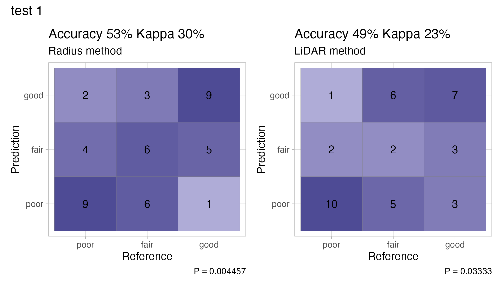
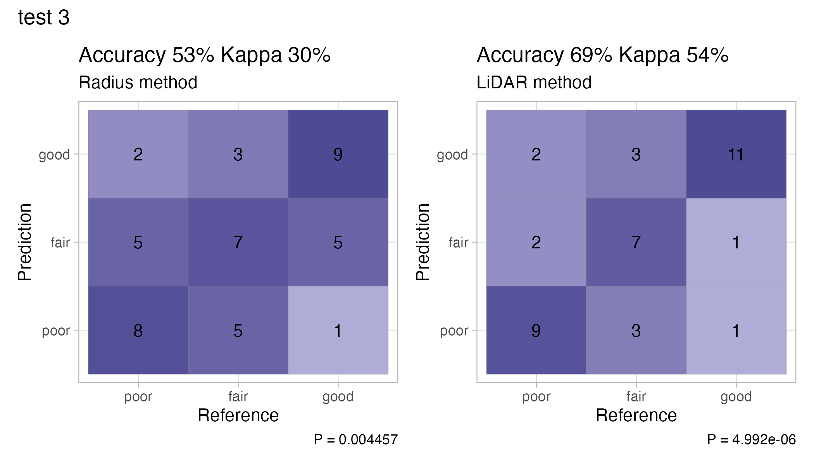
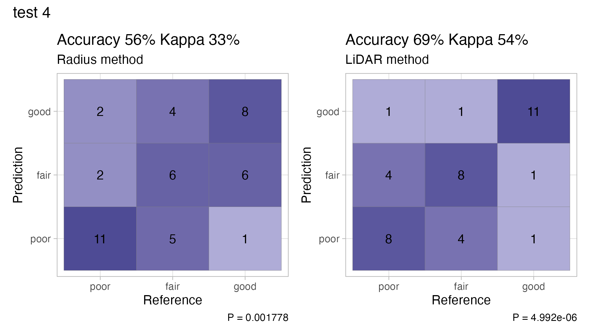
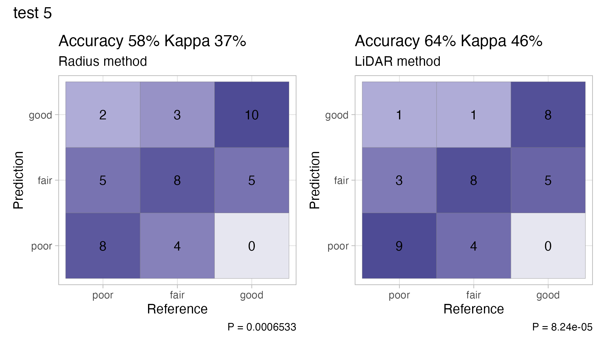
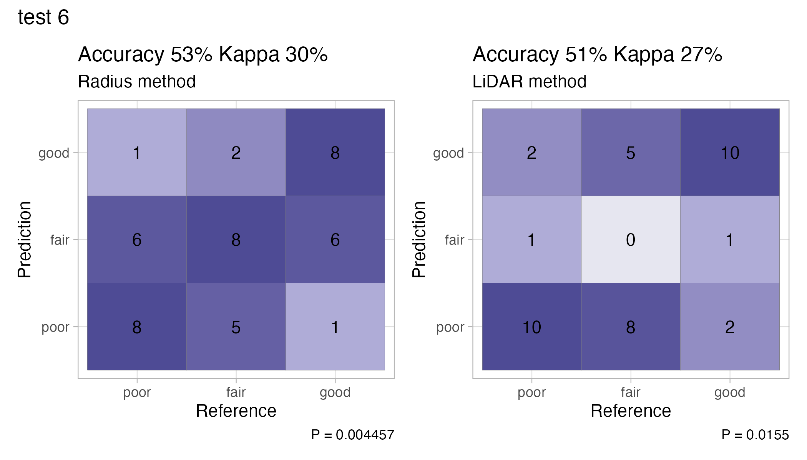

`r if(knitr:::is_latex_output()) '\\appendix'`
`r if(!knitr:::is_latex_output()) '# (APPENDIX) Appendix {-}'`

# Additional Data {#data}

## Tree Height and Crown Width Predictive Model Equations {#tree-model-eqs} 

\textbf{ACMA equations:} (\textit{x} = DBH) 
\begin{equation}
\textrm{Tree Height} = 8.977 + 3.617x -0.049x^{2} + 0.001x^{3}  \\
\end{equation}

\begin{equation}
\textrm{Crown Width} = 13.01 + 1.593x - 0.007x^{2} + 0.0004x^{3} \\
\end{equation}

\textbf{ACPL equations:} (\textit{x} = DBH) 
\begin{equation}
\textrm{Tree Height} = 10.955+ 2.67x -0.032x^2 + 0.001x^3  \\
\end{equation}

\begin{equation}
\textrm{Crown Width} = 6.445 + 2.29x - 0.009x^2 - 0.0002x^3 \\
\end{equation}

\textbf{PSME equations:} (\textit{x} = DBH) 
\begin{equation}
\textrm{Tree Height} = -4.497 + 7.516x - 0.146x^2 + 0.001x^3 \\
\end{equation}

\begin{equation}
\textrm{Crown Width} = 6.536 + 1.471x - 0.013x^2 + 0.0005x^3 \\
\end{equation}

\textbf{THPL equations:} (\textit{x} = DBH) 
\begin{equation}
\textrm{Tree Height} = 7.311 + 3.457x - 0.0473x^2 + 0.001x^3 \\
\end{equation}

\begin{equation}
\textrm{Crown Width} = 5.113 + 1.622x - 0.032x^2 + 0.0002x^3 \\
\end{equation}


```{r extra-graph-1, echo = F}
cnh_long %>%
  ggplot(aes(y = sample_ndvi, x = health_rat, color = method))+
  scale_color_manual(values = method_pal)+
  geom_boxplot()+
  facet_grid(rows = vars(tree_type), cols = vars(method))+
  labs(x = "Health categorization", y = "Sample NDVI")+
  guides(color = "none")
```

## extra modeling graphics {-}
```{r, echo = F}
p_all + 
    labs(subtitle = "Point method")+
  r_all + 
    labs(subtitle = "Radius method")+
  l_all +
    labs(subtitle = "LiDAR method")+
  plot_layout(ncol = 2) +
  plot_annotation(subtitle = "formula = health rating ~ NDVI")

p_type + 
    labs(subtitle = "Point method")+
  r_type + 
    labs(subtitle = "Radius method")+
  l_type +
    labs(subtitle = "LiDAR method")+
  plot_layout(ncol = 2) +
  plot_annotation(subtitle = "formula = health rating ~ NDVI * tree type")

p_species + 
    labs(subtitle = "Point method")+
  r_species + 
    labs(subtitle = "Radius method")+
  l_species +
    labs(subtitle = "LiDAR method")+
  plot_layout(ncol = 2) +
  plot_annotation(subtitle = "formula = health rating ~ NDVI * species")
```

## Radius and LiDAR model tests {-}

```{r, echo = F, out.width = "85%"}


knitr::include_graphics("figure/test2.png")








```


# Code {#code-chunks}


This second appendix includes all of the R chunks of code that were hidden throughout the document to help with readability and/or setup.

## **In Chapter** \@ref(data-methods)**:**

### Portland Tree Inventory counts and calculations {-}
\footnotesize
```{r ref.label='counttables', results='hide', echo = TRUE}
```
\normalsize

### Calculating NDVI from satellite imagery {-}

\footnotesize
```{r ref.label='ndvi-calc', results='hide', echo = TRUE, eval = F}
```
\normalsize

### LiDAR canopy delineation {-}
\footnotesize
```{r ref.label='lidar-calc', results='hide', echo = TRUE, eval = F}
```
\normalsize

## **In Chapter** \@ref(results)**:**

### Model for Tree Height and Canopy Width {-}
\footnotesize
```{r ref.label='tree-model', results='hide', echo = TRUE, eval = F}
```
\normalsize

### Point Method Modeling {-}
\footnotesize
```{r ref.label='point-modeling', results='hide', echo = TRUE, eval = F}
```
\normalsize

### Radius Method Modeling {-}
\footnotesize
```{r ref.label='radius-modeling', results='hide', echo = TRUE, eval = F}
```
\normalsize

### LiDAR Method Modeling {-}
\footnotesize
```{r ref.label='lidar-modeling', results='hide', echo = TRUE, eval = F}
```
\normalsize

### Radius and LiDAR Replications {-}
\footnotesize
```{r ref.label='downsample-test', results='hide', echo = TRUE, eval = F}
```
\normalsize

