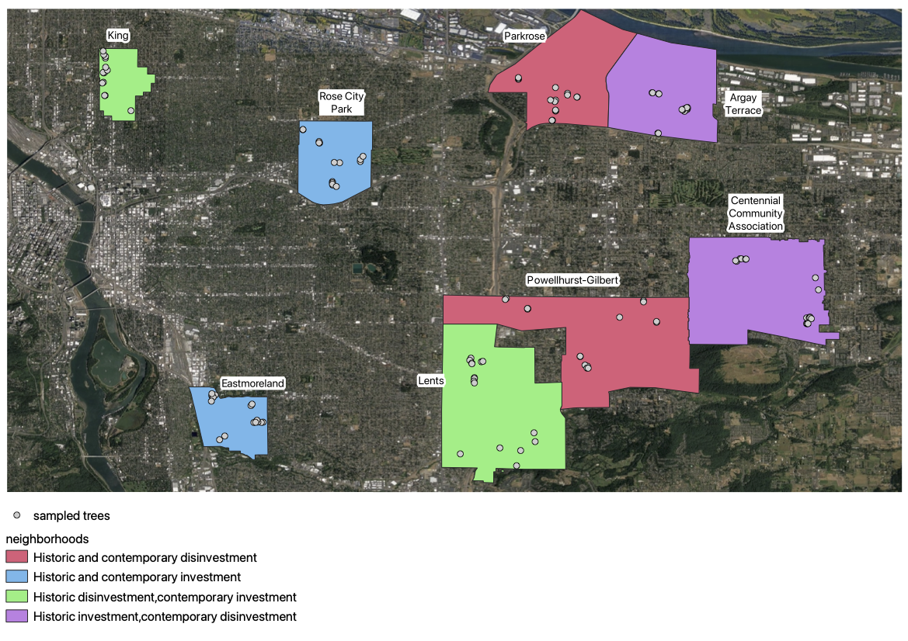

`r if(knitr:::is_latex_output()) '\\appendix'`

`r if(!knitr:::is_latex_output()) '# (APPENDIX) Appendix {-}'` 


# Supplementary Data {#data}

## Additional Figures

### CNH Project Neighborhoods and Classification {-}

```{r neighborhoods, echo = F, fig.cap = "CNH sampled neighborhoods with classification", out.width = "100%"}

```


### Scene products and satellite swaths {-}

```{r 2016-swath, out.width = "75%", fig.cap = "Satellite scene product swaths for 2016 PlanetScope data", echo = F}
include_graphics("figure/2016-bands.png")
```
```{r 2019-swath, out.width = "75%", fig.cap = "Satellite scene product swaths for 2019 PlanetScope data", echo = F}
include_graphics("figure/2019-bands.png")
```
```{r 2021-swath, out.width = "75%", fig.cap = "Satellite scene product swaths for 2021 PlanetScope data", echo = F}
include_graphics("figure/2021-bands.png")
```

### Model Tests {-}

```{r, echo = F, cache=TRUE, include = F}
# graphing
testmodel_h_1 <- my_park %>% 
  ggplot(aes(x = sqrt(DBH), y = Tree_Height, color = Species)) +
  geom_point(alpha = .1)+
  scale_color_manual(values = species_pal)+
  geom_smooth(method = "lm", se = F, formula = y ~ x)+
  labs(subtitle = "y ~ x", y = "Tree Height Measurement")+
  guides(color = "none")

testmodel_h_2 <- my_park %>% 
  ggplot(aes(x = sqrt(DBH), y = Tree_Height, color = Species)) +
  geom_point(alpha = .1)+
  scale_color_manual(values = species_pal)+
  geom_smooth(method = "lm", se = F, formula = y ~ poly(x, degree = 2, raw = T))+
  labs(subtitle = "y ~ poly(x, 2)", y = "Tree Height Measurement")+
  guides(color = "none")

testmodel_h_3 <- my_park %>% 
  ggplot(aes(x = sqrt(DBH), y = Tree_Height, color = Species)) +
  geom_point(alpha = .1)+
  scale_color_manual(values = species_pal)+
  geom_smooth(method = "lm", se = F, formula = y ~ poly(x, degree = 3, raw = T))+
  labs(subtitle = "y ~ poly(x, 3)", y = "Tree Height Measurement")

testmodel_w_1 <- my_park %>% 
  ggplot(aes(x = sqrt(DBH), y = crown_width, color = Species)) +
  geom_point(alpha = .1)+
  scale_color_manual(values = species_pal)+
  geom_smooth(method = "lm", se = F, formula = y ~ x)+
  labs(subtitle = "y ~ x", y = "Canopy Width Measurement")+
  guides(color = "none")

testmodel_w_2 <- my_park %>% 
  ggplot(aes(x = sqrt(DBH), y = crown_width, color = Species)) +
  geom_point(alpha = .1)+
  scale_color_manual(values = species_pal)+
  geom_smooth(method = "lm", se = F, formula = y ~ poly(x, degree = 2, raw = T))+
  labs(subtitle = "y ~ poly(x, 2)", y = "Canopy Width Measurement")+
  guides(color = "none")

testmodel_w_3 <- my_park %>% 
  ggplot(aes(x = sqrt(DBH), y = crown_width, color = Species)) +
  geom_point(alpha = .1)+
  scale_color_manual(values = species_pal)+
  geom_smooth(method = "lm", se = F, formula = y ~ poly(x, degree = 3, raw = T))+
  labs(subtitle = "y ~ poly(x, 3)", y = "Canopy Width Measurement")

```

```{r test-height-model, fig.cap = "Predicting tree height from tree species and DBH. A linear, second degree, and third degree polynomial were tested, and raw polynomials were used.", fig.scap = "Model tests for tree height predictions", echo = F}
testmodel_h_1 + testmodel_h_2 + testmodel_h_3 +
  plot_annotation(title = "Model testing for Tree Height predictions", caption = "x = DBH, y = tree height")
```
```{r test-width-model, fig.cap = "Predicting canopy width from tree species and DBH. A linear, second degree, and third degree polynomial were tested, and raw polynomials were used.", fig.scap = "Model tests for tree canopy width predictions", echo = F}
testmodel_w_1 + testmodel_w_2 + testmodel_w_3 +
  plot_annotation(title = "Model testing for Canopy Width predictions", caption = "x = DBH, y = canopy width")
```

### Height model results and predictions {-}

```{r height-model, echo = F, fig.scap="Tree height predictive model", out.width= "80%", fig.cap = "Predictive model for tree height from measured DBH. A second order polynomial regression was used in order to account for the variation between species. (Adjusted R-squared = 0.7834, P < 2.2e-16)"}
p_height_model + s_height_preds +
  plot_annotation(title = "Tree Height Model and Predictions")
```

### LiDAR model tests {-}

```{r lidar-model-test, echo = F, out.width = "100%", fig.cap = "Confusion matrixes for LiDAR predictive model tests"}
knitr::include_graphics("figure/test.png")
```

### Predicted Health Rating and Species Counts {-}

```{r preds-counts, echo = F, out.width = "90%", fig.cap = "Graph of species counts for LiDAR health predictions"}
ggplot(lidar_final_data_2, aes(x = preds, fill = species))+
  geom_bar(position = "dodge")+
  scale_fill_manual(values = species_pal)
```


## Additional tables

### Variable types for tree inventories {-}
```{r, include = F}
var_types <- read_csv("data/var-types.csv") %>%
  arrange(`Variable name`)
```

```{r var-type-table, echo = F}
kable(var_types,
      booktabs = TRUE, longtable = TRUE, caption = "Table of variables from the Portland park and street tree inventories, as well as sampled CNH variables.",
      caption.short = "Table of variables from tree inventory data")
```

### Additional Information on Health Predictive Model {-}

```{r, echo = F}
model_variations <- read_csv("data/model_variations.csv") %>%
    dplyr::select(-6, -7) %>%
    mutate(Predictors = fct_relevel(Predictors, levels = c("NDVI", "NDVI * tree type", "NDVI * species"))) %>%
    arrange(Predictors, by_group = TRUE)
```

```{r model-table, echo = F, results='asis'}
knitr::kable(model_variations,
             booktabs = TRUE, longtable = TRUE,
  col.names = c("NDVI pixel method", "Predictors", "Accuracy", "Kappa", "P-value"),
  caption = 'For each predictive model for tree health, this table contains the pixel selection method and predictors used, as well as the resulting accuracy, kappa, and p-value calculated in the confusion matrixes.',
  caption.short = 'Summary of results from various predictive models')
```

### LiDAR model tests {-}

```{r, include = F}
tests <- c("test 1", "test 2", "test 3", "test 4", "test 5", "test 6")
accuracy_vals <- c("56%", "54%", "64%", "54%", "67%", "64%")
kappa_vals <- c("35%", "31%", "46%", "31%", "50%", "46%")
pvals_tests <- c(0.002546, 0.006579, 0.0000824, 0.006579, 0.00002141, 0.0000824)

model_tests <- data_frame(tests, accuracy_vals, kappa_vals, pvals_tests)
```

```{r model-test-table, echo = F, results = 'asis'}
kable(model_tests,
      booktabs = TRUE,
      col.names = c("Test", "Accuracy", "Kappa", "P-Value"),
      caption = "Statistical values for LiDAR predictive model tests")
```

### Prediction Probability Output Example {-}

```{r preds-head, echo = F, results = 'asis'}
kable(head(as_tibble(round(predict(lidar_species, cnh_lidar, type = "p"), 3)), n = 5),
      booktabs = TRUE,
      caption = "Selection of rows for LiDAR prediction probabilities") %>%
  kableExtra::kable_styling(latex_options = "HOLD_position")
```

### Final LiDAR Model Species Counts {-}

```{r final-lidar-counts, echo = F, results = 'asis'}
kable(lidar_final_data %>% count(species),
             booktabs = TRUE, longtable = TRUE,
  col.names = c("Species", "Count"),
  caption = 'Counts of each species in stratified random sample of park and street trees after LiDAR processing and NDVI calculation.',
  caption.short = 'Species counts post LiDAR processing') %>%
  kableExtra::kable_styling(latex_options = "HOLD_position")
```


## Additional equations

### Tree Height and Crown Width Predictive Model Equations {-}

\textbf{ACMA equations:} (\textit{x} = DBH) 
\begin{equation}
\textrm{Tree Height} = 12.308 + 3.139x -0.032x^{2}  \\
(\#eq:a1)
\end{equation}

\begin{equation}
\textrm{Crown Width} = 12.117 + 1.721x - 0.0122x^{2} \\
(\#eq:a2)
\end{equation}

\textbf{ACPL equations:} (\textit{x} = DBH) 
\begin{equation}
\textrm{Tree Height} = -1.359 - 0.464x + 0.000203x^2 \\
(\#eq:a3)
\end{equation}

\begin{equation}
\textrm{Crown Width} = -7.155 + 0.894x - 0.0153x^2 \\
(\#eq:a4)
\end{equation}

\textbf{PSME equations:} (\textit{x} = DBH) 
\begin{equation}
\textrm{Tree Height} = 0.2448 + 1.916x - 0.0187x^2 \\
(\#eq:a5)
\end{equation}

\begin{equation}
\textrm{Crown Width} = -4.640583 - 0.3867x + 0.0046x^2 \\
(\#eq:a6)
\end{equation}

\textbf{THPL equations:} (\textit{x} = DBH) 
\begin{equation}
\textrm{Tree Height} = -3.5146 - 0.0388x + 0.00178x^2 \\
(\#eq:a7)
\end{equation}

\begin{equation}
\textrm{Crown Width} = -4.953 - 0.5939x + 0.00512x^2 \\
(\#eq:a8)
\end{equation}


# Code {#code-chunks}

This second appendix includes all of the R chunks of code that were
hidden throughout the document to help with readability and/or setup.

All code for this thesis can be found in my GitHub repository:
https://github.com/zolli22/thesis_zoll

## **In Chapter** \@ref(data-methods)**:** {-}

### Portland Tree Inventory counts and calculations {.unnumbered}

\footnotesize

```{r ref.label='counttables', results='hide', echo = TRUE, eval = F, tidy=TRUE, tidy.opts=list(width.cutoff=60)}
```

### Calculating NDVI from satellite imagery {.unnumbered}

\footnotesize

```{r ref.label='ndvi-calc', results='hide', echo = TRUE, eval = F, tidy=TRUE, tidy.opts=list(width.cutoff=60)}
```

### LiDAR canopy delineation {.unnumbered}

\footnotesize

```{r ref.label='lidar-calc', results='hide', echo = TRUE, eval = F, tidy=TRUE, tidy.opts=list(width.cutoff=60)}
```

## **In Chapter** \@ref(results)**:** {-}

### Model for Tree Height and Canopy Width {.unnumbered}

\footnotesize

```{r ref.label='tree-model', results='hide', echo = TRUE, eval = F, tidy=TRUE, tidy.opts=list(width.cutoff=60)}
```

### Point Method Modeling {.unnumbered}

\footnotesize

```{r ref.label='point-modeling', results='hide', echo = TRUE, eval = F, tidy=TRUE, tidy.opts=list(width.cutoff=60)}
```

### Radius Method Modeling {.unnumbered}

\footnotesize

```{r ref.label='radius-modeling', results='hide', echo = TRUE, eval = F, tidy=TRUE, tidy.opts=list(width.cutoff=60)}
```

### LiDAR Method Modeling {.unnumbered}

\footnotesize

```{r ref.label='lidar-modeling', results='hide', echo = TRUE, eval = F, tidy=TRUE, tidy.opts=list(width.cutoff=60)}
```

### Radius and LiDAR Replications {.unnumbered}

\footnotesize

```{r ref.label='downsample-test', results='hide', echo = TRUE, eval = F, tidy=TRUE, tidy.opts=list(width.cutoff=60)}
```
