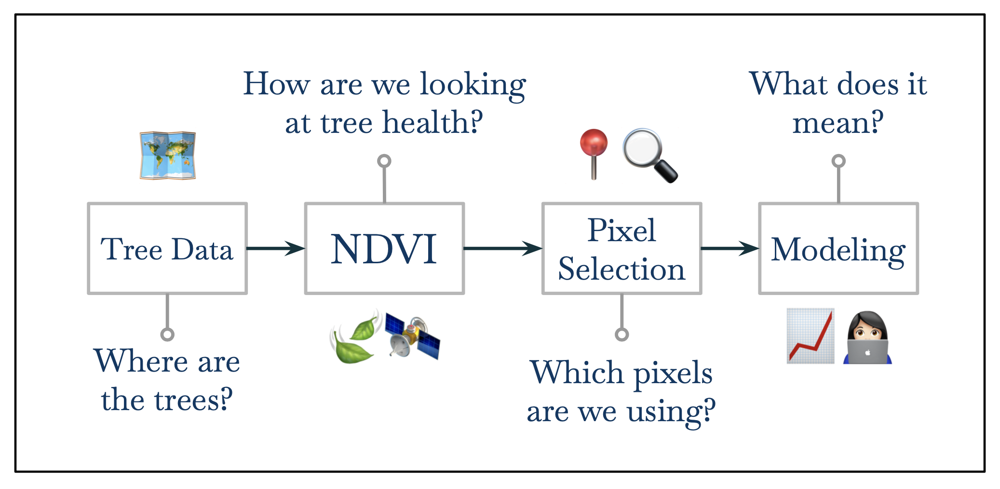
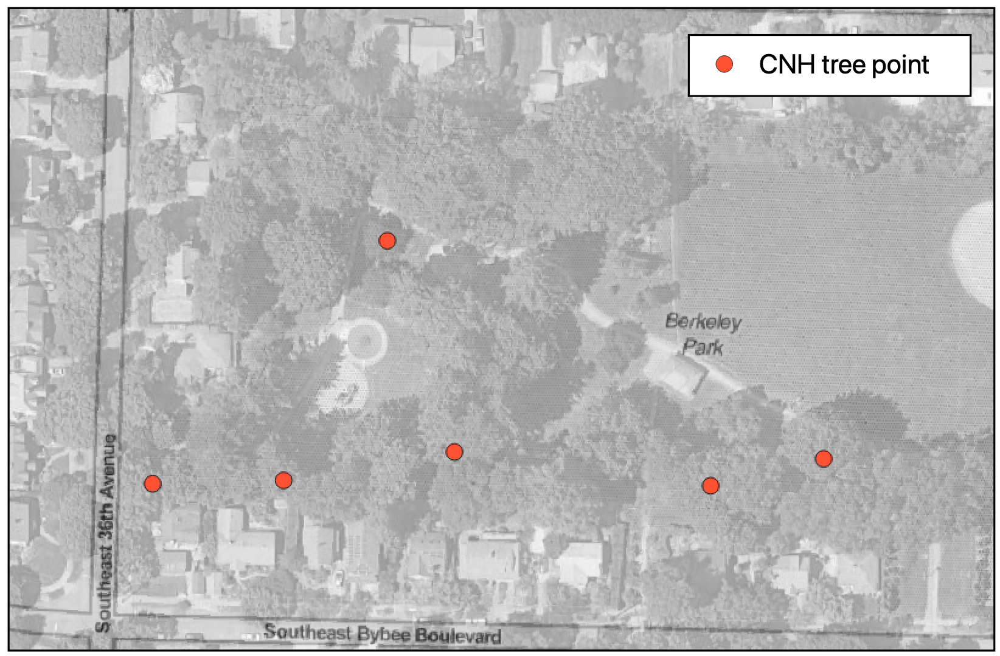
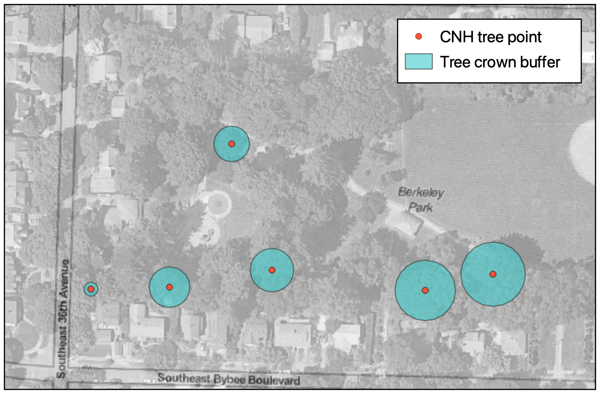
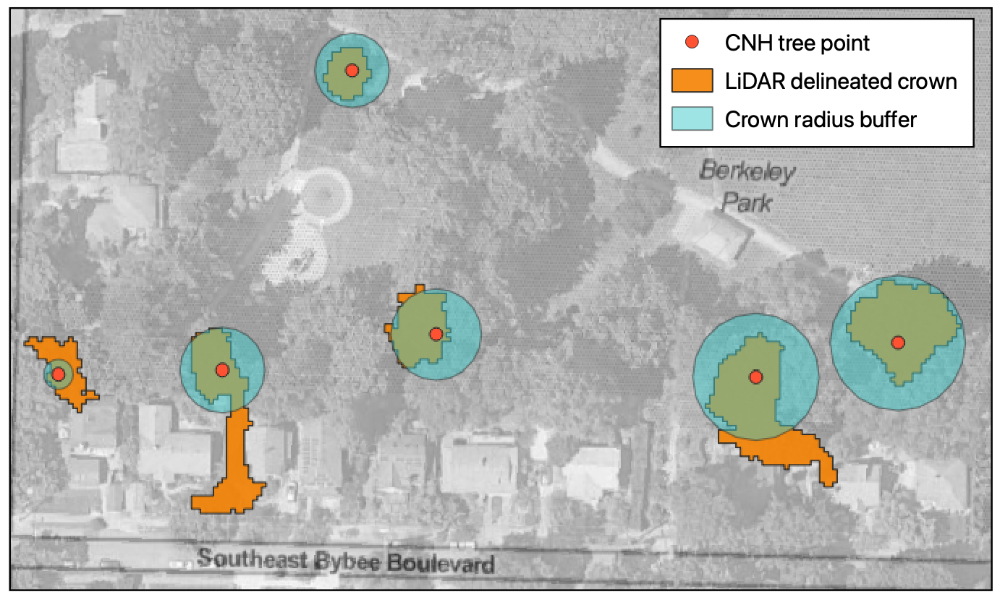
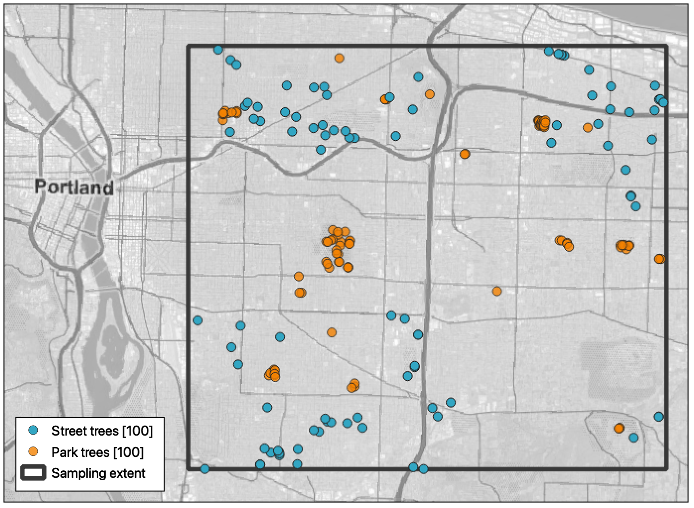

<!--
Above is the YAML (YAML Ain't Markup Language) header that includes a lot of 
metadata used to produce the document.  Be careful with spacing in this header!

If you'd prefer to not include a Dedication, for example, simply delete the section entirely, or silence them (add # before each line). 

If you have other LaTeX packages you would like to include, delete the # before header-includes and list the packages after hyphens on new lines.

If you'd like to include a comment that won't be produced in your resulting file enclose it in a block like this.

If you receive a duplicate label error after knitting, make sure to delete the index.Rmd file and then knit again.
-->

```{r include_packages, include=FALSE}
# This chunk ensures that the thesisdown package is
# installed and loaded. This thesisdown package includes
# the template files for the thesis.
if (!require(remotes)) {
  if (params$`Install needed packages for {thesisdown}`) {
    install.packages("remotes", repos = "https://cran.rstudio.com")
  } else {
    stop(
      paste('You need to run install.packages("remotes")",
            "first in the Console.')
    )
  }
}
if (!require(thesisdown)) {
  if (params$`Install needed packages for {thesisdown}`) {
    remotes::install_github("ismayc/thesisdown")
  } else {
    stop(
      paste(
        "You need to run",
        'remotes::install_github("ismayc/thesisdown")',
        "first in the Console."
      )
    )
  }
}

# general packages
library(thesisdown)
library(knitr)
library(tidyverse)

# wrangling packages
library(lubridate)
library(formatR)

# data packages
library(pdxTrees)

# processing and analysis packages
library(ForestTools)
library(MASS)
library(caret)
library(broom)

# visualization packages
library(scales)
library(patchwork)

# Set how wide the R output will go
options(width = 70)

theme_set(theme_light())

ggplotConfusionMatrix <- function(m){
  mytitle <- paste("Accuracy", percent_format()(m$overall[1]),
                   "Kappa", percent_format()(m$overall[2]))
  mypval <- paste("P =", format(digits = 4, (m$overall[6])))
  p <-
    ggplot(data = as.data.frame(m$table) ,
           aes(x = Reference, y = Prediction)) +
    geom_tile(aes(fill = log(Freq)), colour = "grey50") +
    scale_fill_gradient(low = "#AFACD7", high = "#4E4B95", na.value = "#E6E6F0",) +
    geom_text(aes(x = Reference, y = Prediction, label = Freq)) +
    theme(legend.position = "none") +
    labs(title = mytitle, caption = mypval)
  return(p)
}

knitr::opts_chunk$set(message = F, warning = F, tidy = T)
```


<!--chapter:end:index.Rmd-->

---
bibliography: references.bib
output: pdf_document
nocite: '@*'
---

# Introduction {#intro}

This thesis looks at ... 

<!--# Could start with a short paragraph (before the subsections) laying out the thesis. “This thesis looks at…” Something likey your first few slides of the sparkle talk. -->

## Urban Forests and Urbanization

<!--# Section seems a little sparse and choppy. Might also be worth including some brief summary discussion of Portland’s urban forest in particular. -->

An urban forest is the total population of trees in an urban area. Urban
forests are comprised of parks, street trees, landscaped boulevards,
green spaces, and any other location where trees can be found in urban
spaces. Urban forests are in close proximity to large or dense human
populations, have a relatively high diversity of species and forest
patch structures as well as both public and private ownership, and their
management is often geared toward sustaining tree health and maximizing
the potential benefits that trees provide [@assessin2016]. In 2011,
urban forests in the United States contained around 74.4 billion trees,
which is about a quarter of the total tree population
[@usdaforestservice2011]. The US Census bureau reports that, in 2010,
nearly 81% of Americans lived in urban areas, up from 79% 10 years
earlier. The United Nations predicts that, by 2050, 68% of the world
population will live in urban areas [@unitednations2018]. As
urbanization continues, it becomes increasingly important for both those
working to manage urban forests and residents of urban areas to
understand the dynamics and health of urban forests in order to retain
and protect the numerous benefits they provide.

## The Benefits of Urban Forests

<!--# Section on urban heat reducing effects of trees should be more prominent and developed. That’s one of most important ecosystem services, via impacts on both building energy use and human health.  -->

Urban forests and urban trees have numerous benefits, which range from
environmental to economic. The environmental benefits of urban trees
include numerous forms of pollution removal from both water and air. In
undeveloped areas, most of the precipitated water is absorbed into the
earth. However, due to the high amount of impervious surfaces such as
sidewalks, streets, and parking lots in urban areas, rain and snowmelt
are unable to soak back into the earth and become stormwater runoff
instead. This runoff flows over developed impervious surfaces and picks
up trash, yard waste, dirt, and many other potentially harmful chemicals
and pollutants. It is then deposited in streams, rivers, wetlands, and
other bodies of water that are damaged by polluted runoff. Green
infrastructure like urban trees help in reducing the volume and rate of
runoff by allowing more precipitation to be soaked into the earth.
Research has shown that the presence of street trees also has a positive
impact in reducing stormwater runoff volume [@usepa2020]. A 2021 study
conducted in Fond du Lac, Wisconsin, showed that the removal of street
trees increased the volume of stormwater runoff by 4% [@selbig2021]. The
study calculated that on a per-tree basis for each square meter of
canopy that was removed, 66 liters of rainfall could have been
intercepted and stored by the street trees. This results in an annual
runoff volume reduction estimated at 6,376 liters per tree. In addition
to benefiting the land, urban trees can also provide benefits to the
atmosphere.

Urban trees also remove pollutants from the air. Numerous studies have
shown that trees can remove many different pollutants (O3, PM10, NO2,
SO2, CO) by uptake via leaf stomata. Pollutant particles can also be
collected and stored on a tree's surface. Urban trees provide a total
annual air pollution removal of 711,000 tons, which is valued at \$3.8
billion [@nowak2006]. Cities with higher levels of tree canopy cover
have higher rates of pollution removal by trees, and longer on-leaf
growing periods of trees lead to more pollution removal as well. While
the removal of air pollution by urban trees results in the improvement
of air quality, trees also help mitigate climate change, improve
atmospheric conditions and air quality through carbon sequestration.

The increase of atmospheric carbon dioxide from human sources is one of
the primary drivers of global climate change. In 2019, U.S. greenhouse
gas emissions totaled 6,558 million metric tons of carbon dioxide
equivalents. In the same year, the city of Portland's carbon emissions
totaled around 55,000 metric tons of carbon dioxide equivalents
[@cityofportland]. Rural and urban forests, as well as other natural and
nature based carbon sinks have been suggested as a method of mitigating
greenhouse gas emissions of cities in order to reduce the impacts of
global climate change [@lazarus2013]. These natural carbon sinks capture
atmospheric carbon dioxide during photosynthesis and store the carbon as
biomass, releasing oxygen back into the atmosphere. Multiple scholars
estimate that urban trees in the United States currently store over 708
million tons of carbon, and capture another 28.2 million tons of carbon
per year, which is approximately 0.05% of annual carbon dioxide
emissions in the United States [@nowak2002; @nowak2013; @safford2013].
The current carbon storage of urban trees is valued at more than \$50
billion, with carbon sequestration valued at an additional \$2 billion
per year [@nowak2013]. The environmental benefits of urban trees can
result in economic advantages under future carbon trading schemas, but
there are other unique economic and social benefits that urban trees
provide.

Residents of urban areas experience the benefits of urban trees most
immediately through the beauty and visual stimulation they provide.
Aesthetics alone are a large driver in the plantings of urban trees.
Studies have found that trees are one of the main contributors to
positive visual aesthetic quality of residential areas, and that large
trees contribute more to perceived beauty than smaller trees
[@schroeder1983; @schroeder2011; @schroeder1987]. The positive impacts
of urban trees goes far beyond their visual contributions.

Numerous studies have shown that people living near urban forests live
longer, experience better mental health, and self-rate their overall
health higher than people who do not live near urban forests
[@james2015]. Residents of two different towns in Germany visited urban
forests and green spaces more frequently after the beginning of the
COVID-19 pandemic, which contributed significantly to the residents'
well-being [@beckmann-wübbelt2021]. Research into the psychological
benefits of urban trees shows that teenage girls who spend more time
around trees and other sources of nature and vegetation have higher
levels of self-discipline, and children with diagnosed attention deficit
disorder show improved focus and ability to learn after spending time
outside [@taylor2001; @taylor2002].

Additionally, urban trees provide numerous economic benefits on both a
nation wide and an individual scale. Urban tree canopy cover positively
impacts residential property values. In Athens, Georgia, landscaping
with trees results in a 3.5%--4.5% increase in home sale price
[@anderson1988]. In Ramsey and Dakota Counties, Minnesota, researchers
found that a 10% increase in tree cover within 100m of a house increases
the average home price by 0.5% [@sander2010]. Both summer cooling and
winter heating demands can be reduced through shading and wind speed
reduction by urban trees which lowers energy costs [@nowak2010]. A 2009
study of 460 single-family homes in Sacramento, California showed that
tree cover on the south and west sides of houses reduced summer
electricity use by 5.2%, whereas trees on the north side of a house
increased electricity use by 1.5% [@donovan2009]. A more recent study
conducted in the city of Thessaloniki in northern Greece found that the
cooling potential of street trees is directly related to the foliage
density and the shade provided can lower temperatures up to 5 degrees C,
leading to energy savings of up to 54% [@tsoka2021]. All of these
benefits are dependent on the health of the tree and trees in poor
health will be unable to provide the same level and quality of benefits
that a healthy tree can.

## Environmental Challenges for Urban Trees

<!--# The way I tend to frame this discussion is via the “long life, and stuck in one place” nature of trees–even in the pre-industrial era trees had to endure ~100 years of conditions, which would presumably include some some drought/temp stress events, herbivory, disease, etc. In the Anthropocene, trees also have to deal with a steadily changing climate, including increasing CO2 (which is directly relevant to their metabolism, not just air temp), changing weather patterns, etc. And then in cities trees are additionally exposed to a third level of stress, via land use change and point-source air toxics. Aaron describes this as “nested levels of stressors”, and I like that language.  -->

<!--# I think it’s also worth mentioning in this section that all these stressors are somewhat beneficial from a scientific point of view–in that they create natural experiments that mimic the conditions future wild trees will face. So, cities are good places to study tree health.  -->

Human activities have impacted and altered the Earth's climate and land
surface at a fundamental level. Some outcomes of these fundamental
changes include elevated temperatures and prolonged droughts
[@huang2019]. These extreme droughts can trigger extensive forest
die-off as well as increased tree and shrub mortality rates, which has
impacted forests and woodlands on all vegetated continents. Remote
sensing research on the impacts of droughts has shown that the impacts
of a drought can produce a suppression of forest canopy greenness, which
relates to a failing of plant ecophysiological processes and a reduction
of chlorophyll. Droughts are predicted to occur more frequently and have
higher intensities as climate change continues to progress.

The impacts of climate change and the environmental challenges that all
trees will face is even more extreme in urban areas. The multiple
economic, environmental and quality of life, health benefits that are
provided by urban trees are dependent on tree health. Urban trees are
generally more stressed than those in rural areas due to the adverse
growing conditions they face. This includes higher temperatures,
additional soil compaction, root zone restrictions, and extreme
variations in environmental conditions such as wind speed and sunlight
level [@flint1985; @ward2007]. Monitoring and tracking tree health over
time is an essential component for the ability to model and predict the
future changes that will occur. Research into the remote sensing of
health indicators of forest die-off has shown that vegetation greenness
metrics, such as NDVI, reflect the changes that occur with tree die-off
[@breshears2005; @byer2017]. In order to work towards understanding
these changes and how to mitigate the impacts of forest die-off, it is
extremely important to understand the current health dynamics of urban
forests at a city-wide level, and carefully track changes in urban
forest health over time.

## Urban Forestry in Portland, Oregon

<!--# “Portland’s inventoried park trees have an estimated worth of $128 million (Portland Urban Forestry, 2019).” I’m not sure what this means? Are you using the same terms as the previous sentence, and “worth” is “replacement value”, or is this about ecosystem services? -->

<!--# The transition to RS could be a little more developed–-just kinda pops up out of the blue. Maybe some transition about how the labor-intensive nature of surveys suggests the need for more efficient methods…  -->

Portland is one of many cities to create tree inventories in the last 25
years, with the goal of better understanding the urban forest. Over a
period of 9 years, 2,000 volunteers along with members of Portland's
Urban Forestry team inventoried Portland's 245,000 park and street trees
[@disalvo2017; @portlandurbanforestry2019]. In addition to basic
physical and environmental variables such as tree height, diameter, and
location, volunteers also visually assessed the health condition of each
tree, and categorized it as good, fair, poor, or dead. Portland
inventoried the 218,602 street trees between 2010 and 2016, and 25,740
park trees between 2017 and 2019. Portland Urban Forestry estimates that
Portland's parks contain upwards of 1.2 million trees, but the tree
inventory project only inventoried trees in developed portions of parks.
Portland Urban Forestry estimates that Portland's street trees produce
an estimated \$28.6 million annually in environmental and aesthetic
benefits, with a full replacement value of \$753 million [@disalvo2017].
Portland's inventoried park trees have an estimated worth of \$128
million [@portlandurbanforestry2019].

While Portland's tree inventories are spectacular resources which help
shed light on the urban tree population in Portland and the benefits it
can provide, there are limitations to the information available through
the inventories. One drawback of the inventories is that volunteers were
only able to inventory trees on public land, which excluded any trees
growing in yards or other privately owned areas. Since only developed
portions of parks were inventoried, roughly 98% of Portland's park
trees, which are in natural and "undeveloped areas", were not
inventoried . Additionally, since the inventories were collected over a
9 year period, the collected health assessments for many trees are no
longer reliable or representative of present day conditions. They
represent data from a range of 9 years and in the 11 years since
inventory collection began much has changed.

Measuring urban tree health through field surveys can be extremely time
and labor intensive. It requires the collection of detailed data on
numerous environmental variables, as well as extensive groundwork to
conduct the field surveys. To collect Portland's tree inventories, more
than 2,000 volunteers collectively spend upwards of 25,000 hours in the
field. Additionally, in order to get a good picture of changes in tree
health over time, trees need to be revisited numerous times over the
study period. Remote sensing data from satellite imagery can be used to
locate and map trees in both urban and rural areas, as well as monitor
tree health.

## Remote Sensing in Urban Landscapes

<!--# Remote Sensing in Urban Landscapes? Or Remote Sensing in Ecology? Could narrow the focus of this section header. Remote Sensing for Vegetation? -->

<!--# Starts abrupt. Need a sentence introducing and defining RS. Also the sentence about soybean chlorophyll is interesting, but seems a little out of place without some discussion of other plants. I’d add a sentence and source about using NDVI for tree monitoring after that one.  -->

<!--# The link between NDVI and tree health could be spelled out a bit more. You cite some studies that NDVI correlates with chlorophyll (what’s that? “more like bore-o-phyll!”).You also cite studies that link NDVI to mortality and drought stress. Your thesis hinges on the idea that NDVI is a proxy for tree health, maybe try to make this connection a bit more clear.  -->

<!--# Maybe too late in the game but I wonder if you might be able to make a cost argument for remote sensing over field surveys too… -->

While the term "remote sensing" was first used in the 1960s, the first
aerial images were taken in the 1850s from hot air balloons. Later,
small cameras were attached to kites and even pigeons to capture aerial
images. With the development of airplanes in the early 20th century,
images were able to be taken from higher altitudes, providing aerial
views of larger surface areas [@moore1979]. Aerial images taken from
planes provided essential military reconnaissance during both World War
I and II. The first environmental applications of aerial imagery began
in the 1930s, when the Agriculture Department began to use aerial
photography to map and catalog farmland in the United States. Soon
after, aerial imagery became a tool for conservation and land planning
purposes. Capturing aerial images from planes was the primary method of
capturing images of the earth's surface until the early 1960s. Since the
first satellite was launched in 1957, the technical capabilities of
satellites has greatly increased, along with the types and applications
of satellite-collected data [@khorram2012]. Within the field of forestry
and ecology, remote sensing has numerous applications, from measuring
the cover and structure of vegetation, to examining biodiversity and
soil characteristics of specific areas. Additionally, remote sensing
measurements can be used to calculate and monitor changes in forest
density, which is critical for determining the fuel load and forest
health in regards to fire risk.

One of the most commonly used remote sensing metrics used to measure
forest health is the Normalized Difference Vegetation Index (NDVI),
which is calculated from the red and near infrared (NIR) bands from
remote sensing imagery (Section \@ref(ndvi-calc-methods)). Vegetation
that is photosynthetically active absorbs most of the red light and
reflects much of the near infrared light. Conversely, vegetation that is
dead or stressed reflects more red light and absorbs more near infrared
light. Biologically, NDVI can be interpreted as the fraction of absorbed
photosynthetically active radiation. A value closer to 1 indicates
vegetation that is more photo-synthetically active and greener, which
can be used as a proxy for vegetation health. NDVI is not a diagnostic
tool of vegetation health, but can be used as an indicator of health for
further analysis. Studies have shown that NDVI is highly correlated with
chlorophyll content. Specifically, NDVI has a near-linear relationship
to the chlorophyll content of soybean crops [@tucker1979; @myneni1995].

Especially when the goal is monitoring tree health changes over time,
remote sensing data eliminates the need for repeated sampling over long
time periods, since satellite images are taken at regular intervals as
the satellites continually orbit the earth. With the availability and
accuracy of aerial imagery increasing as these technologies continue to
advance, remote sensing is becoming an important and effective method
for mapping, monitoring, and analyzing tree health on an individual tree
scale [@xiao2005].

## Previous work

<!--# Really good discussion. I’d just like a little more at the end, about how your approach is an improvement. I think you’ve correctly identified the drawbacks of their studies, but you just kinda allude to how yours is better–spell it out more directly for readers, and say a little more about what you did here–I know it will be in methods, but without a little more info here it’s kind of unclear. -->

<!--# Previous work section should say more about the different crown delineation methods and also about using species vs. functional types vs ignoring this information. For example, there is not much discussion of the lidar-based methods and the single pixel method. Also, did Fang et al. (2020) consider species or did they treat all trees the same? Where does this idea that species will improve model performance come from? The level of detail of your review of the methods of the first two main papers in this section is good. Maybe just add another couple papers to flesh out the crown delineation approaches and how incorporating species might improve things.  -->

<!--# Specify that you are replicating the methodology HERE in Portland. You can also mention that previous field work (again you can forward-cite) manually classified trees with a health rating. Then, mention where this thesis takes the work. -->

@xiao2005 used multispectral remote sensing data paired with field
collected tree health data with the goal of mapping tree health on the
University of California Davis campus. Field data on 81 campus trees was
collected in the summer of 2004, and the health of the trees was
classified as "healthy" or "unhealthy." Additionally, a second dataset
of 1,186 trees was collected which included randomly selected trees to
check the accuracy of the resulting tree health mapping. With high
resolution multispectral remote sensing data collected in the summers of
2003 and 2004, NDVI was calculated and used to classify each pixel as
vegetation or non-vegetation. The pixels representing trees and shrubs
were manually selected and extracted, resulting in NDVI data just for
trees and shrubs. The remaining data was split into 5 separate layers
based on physiognomic tree type (broadleaf deciduous, broadleaf
evergreen, conifer, palm, and mixed). Tree health was evaluated at both
a pixel scale, and a tree scale, with the pixels or trees being mapped
as either healthy or unhealthy. A tree was labeled as unhealthy if 30%
or more of the pixels within the manually delineated tree crown were
mapped as unhealthy, and if the average NDVI of the pixels were less
than the NDVI threshold for healthy trees. The accuracy of the tree
health assessment was checked against the validation dataset of 1,186
trees. The field health assessment agreed with the remotely sensed
health classification for 88% of the trees.

@fang2020 used a similar approach to evaluate the health of street trees
in Washington D.C. using multispectral remote sensing data and D.C.'s
street tree inventory. The tree inventory contained 18,434 trees, each
with a tree health classification of excellent, good, fair, poor, or
dead. The researchers purchased remote sensing images for June 11, July
30, and August 30, 2017, to compare the sensitivity of tree health at
different points in the trees' on-leaf period. To extract pixels
belonging to tree crowns, a radial buffer based on tree crown diameter
was used, and pixels with low NDVI values were masked. This paper tested
5 different vegetation indices (VIs), which included three different
variations of NDVI. The different VIs were calculated for each pixel and
averaged for each tree. They found that the VI values of trees in good,
fair, and poor health conditions were highly statistically different,
and traditional NDVI was the most sensitive VI for detecting tree health
conditions. Additionally, it was determined that remote sensing imagery
taken in the middle of the on-leaf period had the best potential to
assess the health condition of trees.

These two studies form the basis of the approach and methods for this
thesis, but there are two main places where I believe I can add new
insights and improve methodology. First, a frustrating drawback of both
@fang2020 and @xiao2005 is that a true replication of their process is
inaccessible due to the sources of their data. @xiao2005 used
multispectral data that was specially collected just for the UC Davis
campus, and @fang2020 purchased the high resolution multispectral data
that was used in their study. Second, there is little consistency in the
methods used to select image pixels for NDVI evaluation. @xiao2005
manually detected and delineated tree crowns for health assessment, and
any trees with overlapping crowns were removed from the analysis. Manual
crown delineation is extremely time intensive and is an unrealistic
method for large sample sizes. In @fang2020, a standardized radius based
on the average DBH of all trees was used to select the tree crown area.
However, this method will only use the center pixels of large trees
eliminating the edges, and it is unclear how overlapping tree crowns
were dealt with. The impact of these different methods on health
analysis is unknown.

## The Accessibility of Science

<!--# When you write this section - it might go well near the END of the Introduction. -->

On July 16, 2020, twitter user @reviewer2grumpyreviewer22020 shared a
screenshot of Nature's posting of an article titled "The growing
inaccessibility of science." This article, ironically, was behind a pay
wall (Figure \@ref(fig:twitter-pic)). While this example is ironic and
humorous, it highlights a much larger and more serious issue: people are
becoming increasingly disconnected from science. This denial or
rejection of scientific findings can be seen in the 139 members of the
117th Congress who deny the reality of global climate change [@climate].
Beyond the elected officials, many members of the American public are
skeptical of the scientific claims regarding climate change because in
some cases, they are not impacted first hand [@markman]. People
conceptualize things that are psychologically distant from them (in
time, space, or social distance) more abstractly than things that are
psychologically close [@trope2010]. Given the relevance of this theory
to climate change and the public's disconnect with science, it is
important to increase the applicability and accessibility of science and
scientific findings. If research remains unattainable for members of the
general public, it cannot be expected of them to seek out scientific
information and findings. Additionally, if the science that is being
done is not relevant to their everyday lives, it may be difficult to
give them a reason to care. There is nothing more close to home than
one's own backyard, or directly in front of their house. An aspect of
science that city residents interact with every day, consciously or not,
is the urban forest. By promoting research on urban forests, making the
research accessible and relevant, as well as emphasizing the importance
of urban forests and urban trees to those who it most directly impacts,
we have the opportunity to conduct necessary and beneficial research on
urban tree health as well as work to close the psychological gap between
people and science.

```{r twitter-pic, echo = F, out.width = "75%", fig.align='center', fig.scap = "The growing inaccessibility of science", fig.cap = "The growing inaccessibility of science. Screenshot of Nature website posted on twitter by user @grumpyreviewer on July 16, 2020"}
include_graphics("figure/science_inaccessable.jpeg")
```

## This Thesis

<!--# Some of what I said about 1.6 could also be here. The other thing that’s not clear to me from these two sections is how the second study handled species? Did they use single NDVI thresholds for all species, or do species-based calculations? You don’t really mention species when discussing their studies (just physiognomic type), but then include it as an important aspect of your thesis. It is important, and if those studies didn’t discuss it, then you should highlight that when discussing those studies.  -->

<!--# Since you go into some detail about the other studies in 1.6, I’d soften the language about “replicating” their work. You used pretty different methodology in a number of places. I’d say something like “build on” or “an approach inspired by”, or something like that.  -->

Based on the assumptions that tree health can be approximated using
satellite spectral data, specifically NDVI, this thesis aims to
build on the process and research of @fang2020 and @xiao2005. I will
investigate the questions of the impact of species differentiation when
using NDVI to calculate tree health, as well as testing three different methods of tree
crown delineation and pixel selection. Based on these
questions, I predict that differentiating health rating predictions by
tree species will improve the accuracy of the model, and differentiating
by tree type (coniferous evergreen vs broadleaf deciduous trees) will
also improve the accuracy, but less than species. Additionally, I
predict that using more in-depth tree crown delineation approaches will
allow for more trees to be analyzed, and will also improve the accuracy
of the health rating.

Finally, this thesis only uses data sources, tools, and processes that
are either publicly accessible or free, in order to keep this type of
research accessible to all.

<!--chapter:end:01-intro_background.Rmd-->

---
bibliography: references.bib
output: pdf_document
nocite: '@*'
---

# Data Resources and Methods {#data-methods}

```{=html}
<script type="text/x-mathjax-config">
MathJax.Hub.Config({
  TeX: { equationNumbers: { autoNumber: "AMS" } }
});
</script>
```
```{r setup-1, include=FALSE}
knitr::opts_chunk$set(message = F, warning = F, fig.align='center')
```

```{r packages, include = F}
library(pdxTrees)
library(lubridate)
library(tidyverse)
```

<!--# I’m not sure what the Reed standard is for this stuff, but this section reads a little informal in tone to me. I’d probably take most of it out of first person. In the previous section you say “this thesis” and I think that sounds right. I’d also add a bit more detail to the 2nd and 3rd data-type sections and make them separate paragraphs. -->

<!--# Remind us what CNH stands for. -->

For this thesis, the data resources and processing components can be
split into four main sections (Figure \@ref(fig:methods-overview-fig)).
First, there is the tree data which is used to answer the question
"Where are the trees?" This includes the Portland park and street tree
databases, and the subset of those trees that were selected for health
data collection and assessment as part of the larger CNH2 project in the
summer of 2021. In this thesis, the tree data is used for tree location
points as well as basic tree metrics such as species, height, and crown
width. In general, I will refer to these data sources as park trees (the
Portland park tree dataset), street trees (the Portland street tree
dataset), and CNH trees, which are the trees we collected data on in the
summer of 2021. A majority of the processing with the tree points
involved tidying and wrangling the data as well as sub-setting it and
transforming it into usable data products. Due to the inconsistency in
the types of variables measured for each tree data product, I created a
model to predict tree crown width and tree height based on DBH and
species.

The second aspect of my data and processing is the retrieval and
processing of Planetscope satellite imagery products to produce usable
NDVI data files, which was done in Python. Third, are the different tree
delineation methods I examine in this thesis, which include point value,
radius, and LiDAR methods. This involved the processing of LiDAR and
tree crown radius data, as well as obtaining and computing associated
NDVI values. Lastly, with the combined data from the previous three
parts, I created a predictive model for predicting tree health rating
based on NDVI values.

```{r methods-overview-fig, echo = F, fig.cap = "Overview of methods and data process", out.width = "95%"}

```

## Previously Collected Field Data

<!-- You should probably also include the common names of the species when you introduce them. I also have some basic analysis on the abundance of those species in the inventories, if you want to include some summary stats let me know and I’ll dig them up.  -->

<!-- Just a general comment–you go back and forth between “park and street trees” in some places, and just “street trees” in others. I’d anticipate some questions from your committee about this distinction. I haven’t written it up yet, but my discussion would be something about how we initially stratified the study by park & street trees, to investigate weather that might impact health (due to either proximity to cars/pavement or different maintenance regimes…). But our results showed no significant differences in health between park & street trees, so they were batched together for further analysis.  -->

<!--# Perhaps specify who “we” means here. -->

We collected data tree health during the summer of 2021 as part of a
larger collaborative interdisciplinary project examining the
relationship between various socioeconomic variables and urban tree
health. For the purposes of the larger project, we selected trees from
eight different neighborhoods in Portland, with four different
categorizations of historic and current investment or disinvestment. The
four chosen species are *Pseudotsuga menziesii, Pinaceae* (PSME), *Thuja
plicata, Cupressaceae* (THPL), *Acer macrophyllum, Sapindaceae* (ACMA),
and *Acer platanoides, Sapindaceae* (ACPL). They are some of the most
abundant tree species in Portland, and make up a large proportion of
Portland's urban forest. PSME, THPL, and ACMA are all native to the
area, whereas Norway Maple is a nonnative tree species that was
frequently planted in residential areas, and is now the most common
street tree in Portland.

Individual trees for sampling were selected from the Portland tree
inventories, with the goal of sampling an equal proportion of street
trees and park trees of each species in each neighborhood. Sampling was
also focused on mature trees, so the inventories were filtered to only
include individuals above 25 feet in height. 4 trees of each species
were randomly selected per neighborhood, with an attempt to maintain
equal proportions of park and street trees. However, due to varying
field conditions, some trees were not able to be sampled, so the nearest
tree of the same species that met all criteria was substituted. In
total, 128 trees were surveyed. Fieldwork was conducted between July 7
and August 19, 2021 (Figure \@ref(fig:cnh-trees)). Each tree was sampled
in a single visit between 10am and 3pm. Biotic and abiotic variables
were measured, as well as health attributes and physiology of the trees
(Table \@ref(tab:var-type-table)). For each tree, a GPS point was
collected to mark its location using ArcGIS Explorer on IOS. Due to the
uncertainty of the GPS points, during post-processing, each collected
tree was matched with the tree location point in the Portland Park and
Street Tree inventories. Any sampled tree points that did not match up
with an inventoried tree point in a margin of 20 feet, it was removed
from further analysis. Any tree individual that did not contain a health
categorization was also removed. The final CNH dataset for my analysis
contained 112 trees (Table \@ref(tab:cnh-tree-counts-2)).

```{r cnh-tree-counts, include = F}
scientific_names <- c("*Acer macrophyllum*","*Acer platanoides*","*Pseudotsuga menziesii*", "*Thuja plicata*")
common_names <- c("Bigleaf Maple", "Norway Maple", "Douglas Fir", "Western Redcedar")

cnh_counts <- read_csv("data/cnh_point.csv") %>%
  filter(!is.na(health_rat)) %>%
  count(species) %>%
  bind_cols(sci = scientific_names) %>%
  bind_cols(com = common_names) %>%
  dplyr::select(4, 3, 1, 2)
```

```{r  cnh-tree-counts-2, echo = F, results = 'asis'}
knitr::kable(
  cnh_counts, booktabs = TRUE, 
  col.names = c("Common name", "Scientific name","Species code", "Number collected"),
  caption = 'Counts of species for final CNH tree dataset',
  caption.short = 'Final CNH Tree counts'
)
```

```{r cnh-trees, out.width = '100%', warnings=FALSE, messages=FALSE, fig.show="hold", fig.cap="Sampled CNH Trees", fig.align='center', echo = FALSE}
knitr::include_graphics("figure/cnh_trees.png")
```

## Portland Tree Inventory

<!-- “I filtered the street and park tree inventories to trees that were sampled in 2016 and 2019, respectively.” I’m not sure what this is in reference to, only the data in those tables? Or did you only look at trees that had both data from our summer work and also inventory data from those years? Or did you do that year filtering just for developing the width/height model? -->

The Portland Tree Inventory Project, managed by the City of Portland's
Parks & Recreation Urban Forestry Department, cataloged nearly 245,000
street and park trees in Portland between 2010 to 2019. The street tree
inventory, which was collected from 2010 to 2016, contains information
on 216,750 street trees of 145 genera. The park tree inventory,
collected from 2017 to 2019, contains data on 25,740 park trees of 116
genera. While many of the collected variables differ between the two
inventories, they both include data on location, tree identification,
tree diameter at breast height (DBH), and a visual assessment of the
trees health which was rated as **good**, **fair**, **poor**, or dead
(Table \@ref(tab:var-type-table)).

To reduce the variability in data due to the time span of data
collection, I filtered the street and park tree inventories to trees
that were sampled in 2016 and 2019, respectively. For each dataset, the
selected year was the year with the highest count of trees sampled
(Tables \@ref(tab:streettable) and \@ref(tab:parktable)) [@R-pdxTrees].

```{r counttables, include=FALSE, tidy = TRUE}
street_counts<-get_pdxTrees_streets() %>%
  filter(Species %in% c("ACMA", "ACPL", "PSME", "THPL")) %>%
  mutate(year = year(Inventory_Date)) %>%
  dplyr::select(Species, year) %>%
  add_count(Species, year) %>%
  distinct() %>%
  group_by(Species) %>%
  mutate(Total = sum(n)) %>%
  rename(Count_2016 = n) %>%
  filter(year == 2016) %>%
  dplyr::select(-year)

park_counts <-get_pdxTrees_parks() %>%
  filter(Species %in% c("ACMA", "ACPL", "PSME", "THPL")) %>%
  mutate(year = year(Inventory_Date)) %>%
  dplyr::select(Species, year) %>%
  add_count(Species, year) %>%
  distinct() %>%
  group_by(Species) %>%
  mutate(Total = sum(n)) %>%
  rename(Count_2019 = n) %>%
  filter(year == 2019) %>%
  dplyr::select(-year)
```

```{r streettable, results='asis', echo = FALSE}
knitr::kable(
  street_counts, booktabs = TRUE, 
  col.names = c("Species code", "Collected in 2016", "Total in inventory"),
  caption = 'Species counts in the Portland Street Trees Database',
  caption.short = 'Species counts in Street Trees Database'
)
```

```{r parktable, results='asis', echo = FALSE}
knitr::kable(
  park_counts, booktabs = TRUE, 
  col.names = c("Species code",  "Collected in 2019", "Total in inventory"),
  caption = 'Species counts in the Portland Park Trees Database',
  caption.short = 'Species counts in Park Trees Database'
)
```

The Portland park and street tree inventories include a health
categorization variable of **good**, **fair**, **poor**, or Dead. A
drawback that can come with qualitative health ratings such as this one
is that if a tree does not appear close to death, or perfectly healthy,
it is very easy to categorize its health as **fair**, which is what we
see in both the street and park tree databases. The proportion of trees
rated **fair** is extremely high, especially in the park trees inventory
(Figure \@ref(fig:rating-ratios)).

```{r, echo = F, message = F, warning = F, tidy = TRUE}
species_pal <- c("#219EBC", "#023047", "#FFB703", "#FB8500", "#586f7c")

street_health <- get_pdxTrees_streets() %>%
  dplyr::select(Species, Condition) %>%
  filter(Species %in% c("ACMA", "ACPL", "PSME", "THPL")) %>%
  mutate(Condition = fct_relevel(Condition, levels = c("Poor", "Fair", "Good"))) %>%
  ggplot(aes(fill = Species, x = Condition))+
  geom_bar(position = "dodge")+
  scale_fill_manual(values = species_pal)+
  labs(x = "Health rating", fill = "Species", y = "Count", title = "Street trees")+
  guides(fill = "none")

park_health <- get_pdxTrees_parks() %>%
  dplyr::select(Species, Condition) %>%
  filter(Species %in% c("ACMA", "ACPL", "PSME", "THPL")) %>%
  mutate(Condition = fct_relevel(Condition, levels = c("Poor", "Fair", "Good"))) %>%
  ggplot(aes(fill = Species, x = Condition))+
  geom_bar(position = "dodge")+
  scale_fill_manual(values = species_pal)+
  labs(x = "Health rating", fill = "Species", y = "Count", title = "Park trees")
```

```{r rating-ratios, echo = F, fig.cap="Distribution of Health Ratings in the Portland Tree Inventories"}
street_health + park_health
```

### Canopy width and tree height model

<!--# The statistical model needs to be described here. I think you have some figures that illustrate this? (though they might be in the results section). SUGGESTION: can this be a sub-subsection underneath 2.3? -->

The park tree dataset contains measurements for tree height, canopy
width, and DBH, but the street tree dataset only contains measurements
for DBH. Canopy width and tree height are both important factors for
tree selection and canopy delineation. Using RStudio, I created a
statistical model to predict tree height and crown width based on tree
DBH and species, in order to be able to use the same pixel selection
methods for both the park and street tree inventories (Section
\@ref(canopy-model-results)).

## Satellite Imagery

The multispectral satellite imagery used in this thesis was accessed
through Planet Labs Education and Research Program, which provides
limited non-commercial access to PlanetScope satellite imagery for those
with a college or university email address. The available imagery had a
pixel resolution of 3 meters, and a 4-band product (RGB-NIR). The bands
in a satellite product refer to the reflectance wavelength that is
picked up by the satellite. For a 4-band satellite product, the
wavelengths are split into red, green, blue, and near-infrared (NIR)
bands (Table \@ref(tab:wavelength)). In the raw PlanetScope product,
these 4 bands come compressed in one `.tif` image.

```{r, echo = F}
wavelengths <- tibble("band" = c("Blue", "Green", "Red", "NIR"),
                      "wavelength" = c("455 - 515 nm", "500 - 590 nm", "590 - 670 nm", "780 - 860 nm"))
```

```{r wavelength, results='asis', echo = FALSE}
knitr::kable(
  wavelengths, booktabs = TRUE, longtable = TRUE,
  col.names = c("Band name", "Wavelength range"),
  caption = 'Wavelength ranges for 4-band Planetscope satellite bands',
  caption.short = '4-band satellite wavelength ranges'
)
```

PlanetScope satellite imagery (Planet Labs, 3m resolution, 4-band
RGB-NIR) was used for vegetation index calculation. PlanetScope, also
known as the Flock, is a constellation of approximately 130 satellites .
The first 28 PlanetScope satellites were launched in July 2014, and the
newest batch of satellites were launched in January 2022. PlanetScope,
operated by Planet, is a constellation of approximately 130 satellites,
able to image the entire land surface of the Earth every day (a daily
collection capacity of 200 million km$^2$/day). PlanetScope images are
approximately 3 meters per pixel resolution [@planetlabs2022]. A
downloaded satellite product for an area of interest is comprised of
multiple scene products. Each scene product is an individual image of a
swath of land that is at least partially contained within the area of
interest. (Figures \@ref(fig:2016-swath), \@ref(fig:2019-swath),
\@ref(fig:2021-swath)).

I downloaded satellite images corresponding to the summers of when the
data was collected (2016, 2019, and 2021). Images were first filtered
for those captured in July of each year, since images taken during the
middle of the on-leaf period have been shown to be most sensitive in
detecting a statistical difference in tree health measured by NDVI
[@fang2020]. The remaining images were then filtered for minimal cloud
cover and maximum coverage of the area of study. The final selected
images were taken between 6:30 and 7pm on 6 July 2016, 31 July 2019, and
26 July 2021 (Table \@ref(tab:sat-products)).

```{r, echo = FALSE}
products <- tibble("date" = c("2016-07-06", "2019-07-31", "2021-07-26"),
                   "time" = c("18:55", "18:42", "18:40"),
                   "count" = c(5, 4, 4),
                   "id" = c("0c22", "0f42", "1003"))
```

```{r sat-products, results='asis', echo = FALSE}
knitr::kable(
  products, booktabs = TRUE, longtable = TRUE,
  col.names = c("Collection date", "Collection time", "Number of scene products", "Satellite ID"),
  caption = 'Satellite product specifications for PlanetScope multispectral satellite image products',
  caption.short = 'Satellite product specifications'
)
```

For each of the chosen dates, I downloaded the available analytic
product from Planet. The analytic multispectral imagery products are
orthorectified, calibrated, corrected for terrain distortions, and
transformed to Top of Atmosphere radiance to ensure accurate geolocation
and cartographic projection.

## NDVI calculation {#ndvi-calc-methods}

<!--# Modify the text and/or equation to be clear that you calculate this for each PIXEL.  -->

The NDVI calculations were done using Python in PyCharm. Besides minor
alterations, the processing code came from Planet's instructions on
calculating NDVI from 4-band PlanetScope data [@planetndvi]. NDVI is
calculated from the red and NIR satellite bands, as shown in Equation
\@ref(eq:ndvi-eq).

```{=tex}
\begin{equation}
  \mathrm{NDVI} = \frac{(NIR - Red)}{(NIR + Red)} 
  (\#eq:ndvi-eq)
\end{equation}
```
```{python ndvi-calc, include = FALSE, eval = FALSE, tidy = TRUE}
import rasterio
import numpy

files = ["1", "2", "3", "4"] # unique file identifiers
folder = "ndvi_calc_thesis/files" # folder with the raw files
date = "20210726" # product date


for i in range(len(files)):
    filenum = files[i]
    image_file = folder+"/"+date+"_"+filenum+"_AnalyticMS.tif"


    metafile = folder+"/"+date+"_"+filenum+"_AnalyticMS_metadata.xml"
    print(image_file)
    print(metafile)

    # Load red and NIR bands - 
    # note all PlanetScope 4-band images have band order BGRN

    with rasterio.open(image_file) as src:
        band_red = src.read(3)

    with rasterio.open(image_file) as src:
        band_nir = src.read(4)

    from xml.dom import minidom

    xmldoc = minidom.parse(metafile)
    nodes = xmldoc.getElementsByTagName("ps:bandSpecificMetadata")

    # XML parser refers to bands by numbers 1-4
    coeffs = {}
    for node in nodes:
        bn = node.getElementsByTagName("ps:bandNumber")[0].firstChild.data
        if bn in ['1', '2', '3', '4']:
            i = int(bn)
            value = node.getElementsByTagName("ps:reflectanceCoefficient")[0].firstChild.data
            coeffs[i] = float(value)

    # Multiply by corresponding coefficients
    band_red = band_red * coeffs[3]
    band_nir = band_nir * coeffs[4]

    # Allow division by zero
    numpy.seterr(divide='ignore', invalid='ignore')

    # Calculate NDVI
    ndvi = (band_nir.astype(float) - band_red.astype(float)) / (band_nir + band_red)


    # Set spatial characteristics of the output object to mirror the input
    kwargs = src.meta
    kwargs.update(
        dtype=rasterio.float32,
        count=1)
    
    # Set name for new NDVI file
    newfile = folder + '/ndvi_' + date + "_" + filenum + '.tif'

    # Create the file
    with rasterio.open(newfile, 'w', **kwargs) as dst:
        dst.write_band(1, ndvi.astype(rasterio.float32))
```

```{r areafigs, out.width = '32%', warnings=FALSE, messages=FALSE, fig.show="hold", fig.cap="Product areas for 2016, 2019, and 2021 satellite scenes", fig.align='center', echo = FALSE}
knitr::include_graphics(c("figure/2016_ndvi.png", "figure/2019_ndvi.png", "figure/2021_ndvi.png"))
```

## Canopy Height Model {#chm}

A canopy height model for the Portland metro area was developed using
LiDAR and satellite spectral imagery collected in the summer of 2014
[@canopy2014]. The purpose of this data is to monitor natural areas in
the Portland metro area, specifically change over time analysis and the
examination of the potential loss of habitat in riparian areas. The
canopy was detected using both NDVI values and LiDAR feature heights.
Errors and noise in the data, such as electrical lines above tree tops,
were cleaned using geometric post-processing. The canopy height model
was clipped to remove anything below ten feet to eliminate any
understory shrubs or grasses that were included in the raw data
[@canopy2014].

## Tree Crown Delineation and Pixel Selection

The goal of tree crown delineation is to understand where the foliage of
a tree is located. This is extremely important because we want to ensure
that the satellite pixels used for health analysis have measurements
that belong to the given tree. Previous papers such as have used manual
tree crown delineation [@xiao2005], or chosen a standardized radius for
all trees in their sample [@fang2020]. Manual tree crown delineation
would be extremely time consuming, especially when trying to examine
data on a city-wide level. Additionally, with a standardized radius,
there will be many trees that have crowns either larger or smaller than
the standardized radius. If the true crown is smaller than that of the
radius, pixels that correspond to things like grass or pavement will be
included in the measurement analysis. Conversely, if the true crown is
larger than the chosen radius, the edges of the tree will be ignored,
and valuable data will be lost. With both of these methods, any
overlapping tree crowns were removed from the final analysis, even
further reducing the sample size.

In this thesis, I test three different methods of pixel selection for
NDVI analysis. First, I test a "point method" which uses the NDVI value
from a single pixel directly below an inventoried trees location point.
Second, I use crown width measurements and predictions to create a
variable radius method, and average the NDVI pixels within the created
circle. Lastly, I use a LiDAR created canopy height model for Portland's
urban canopy with `ForestTools` canopy delineation algorithm to create
canopy polygons for NDVI analysis [@R-ForestTools].

For the following examples, I use Berkeley Park, located in SE Portland,
to demonstrate the different delineation techniques. We sampled 6 CNH
trees in Berkeley Park: 2 Bigleaf Maple, 1 Norway Maple, 2 Douglas Fir,
and 1 Western Redcedar (Figure \@ref(fig:berkeley-park)).

```{r berkeley-park, out.width = '100%', warnings=FALSE, messages=FALSE, fig.show="hold", fig.cap="Berkeley Park and CNH trees", fig.align='center', echo = FALSE}
knitr::include_graphics("figure/berkeley_park.png")
```

### Point method

Point Method: For the point method, I extracted the NDVI value from the
pixel directly underneath the tree location point. This is the simplest
of the three methods, since it obtains one NDVI value for one singular
pixel. The tree location points were sourced from the street and park
tree inventories and processed in QGIS (Figure \@ref(fig:point-method)).
The main source of potential error with this technique is with the tree
point location. If the point was placed incorrectly, the NDVI value will
not be representative of the tree's greenness, or health.

```{r point-method, out.width = '80%', warnings=FALSE, messages=FALSE, fig.show="hold", fig.cap="CNH trees sampled in Berkeley Park", fig.align='center', echo = FALSE}

```

### Radius method

The first method of tree crown delineation I used is based on the
individual crown width for each selected tree. In the Portland park tree
inventory, crown width is measured as an east to west diameter, and a
north to south diameter. To get the radius for the buffer, I took the
average of both measurements and divided it by 2. For the Portland
street tree inventory, crown width was not collected. I used the tree
height and crown width predictive model to create crown width
measurements. For each selected tree point, I created a buffer with the
radius of the measured or predicted tree canopy using QGIS (Figure
\@ref(fig:point-radius)). To get NDVI for each tree in this method, I
averaged the value of all pixels in the buffer circle for each tree
using QGIS.

With the radius method, it involves the same risk as the point method
that if the central point is incorrectly located, the values will not be
representative. Additionally, average NDVI ratings obtained with this
method for trees with overlapping crowns will contain NDVI pixels that
belong to other trees. Previous studies have removed all overlapping
tree crowns when using a radius technique, but that can severely limit
sample size of available data for analysis, since especially in urban
areas and on streets, most of the trees will have overlapping crowns.

```{r point-radius, out.width = '80%', warnings=FALSE, messages=FALSE, fig.show="hold", fig.cap="CNH trees with crown width buffer", fig.align='center', echo = FALSE}

```

### LiDAR method

The LiDAR method is the most complex and involved of the three tree
crown delineation methods but has the potential to be the most precise.

The `ForestTools` crown delineation algorithm is a modified watershed
delineation algorithm that takes a LiDAR file input, as well as treetop
location point file and outputs a polygon file with predicted tree
crowns. `ForestTools` also has the ability to predict treetop location
points based on LiDAR data, but that functionality introduced a lot of
error in my processing because it became difficult to re-associate
predicted treetop points with the actual tree location points that I was
analyzing.

The LiDAR canopy height model was clipped to a 30 meter buffer around
each selected tree point to reduce file size in the delineation
processing (Figure \@ref(fig:lidar-buffer)). A 30m buffer was chosen to
ensure that no part of the tree canopy would be omitted from the
processing, and to include any near neighboring trees that may have
canopy that overlaps with the tree of interest. In order for the
algorithm to delineate tree crowns, it needs both LiDAR canopy data and
location points for the potential trees for delineation. With a smaller
buffer radius, the locations of neighboring trees would be omitted and
the canopy delineation algorithm would compute a tree crown as much
bigger than it actually is.

With the 30m buffer, all other inventoried trees that are contained
within the buffer were selected for inclusion as treetop location points
in addition to the trees of interest (Figure \@ref(fig:buffer-points)).
A minimum tree height of 20 feet was included in the algorithm options
but since all sampled trees were already filtered for height
requirements, this may not be necessary.

```{r lidar-calc, eval = F, include = F, tidy = TRUE}
library(rgdal)
library(imager)
library(raster)
library(ForestTools)

options("rgdal_show_exportToProj4_warnings"="none")

## Loading raster data
EML_CHM <- raster("~Desktop/thesis_data/lidar_crown/clipped_lidar.tif")

## Loading tree points
all_ttops <- shapefile("~Desktop/thesis_data/lidar_crown/all_tree_points_for_delin.tif")

# delineate tree crowns
## inputs: my tree points, LiDAR data
crownsPoly <- mcws(treetops = all_ttops, CHM = EML_CHM, format = "polygons", minHeight = 20, verbose = TRUE)

# export file
writeOGR(crownsPoly, "~/Desktop/thesis_data/lidar_crown", "canopy_delin_polygons_poly", driver = "ESRI Shapefile")
```

```{r lidar-buffer, out.width = '80%', warnings=FALSE, messages=FALSE, fig.show="hold", fig.cap="LiDAR data clipped to 30m tree buffer", fig.align='center', echo = FALSE}
knitr::include_graphics("figure/lidar_buffer_scale.png")
```

```{r buffer-points, out.width = '80%', warnings=FALSE, messages=FALSE, fig.show="hold", fig.cap="All inventoried trees within the 30m buffer", fig.align='center', echo = FALSE}
knitr::include_graphics("figure/buffer_all_points.png")
```

```{r, out.width = '80%', warnings=FALSE, messages=FALSE, fig.show="hold", fig.cap="LiDAR tree crown delineations with selected CNH crowns", fig.align='center', echo = FALSE}
knitr::include_graphics("figure/selected_lidar.png")
```

```{r layered-outputs, out.width = "90%", fig.cap = "Point, Radius, and LiDAR pixel selection methods for Berkeley Park", fig.scap = "Pixel selection method comparison"}


```

These three processes were repeated for random samples of 100 park trees
and 100 street trees, stratified for tree species. Due to restrictions
in file size for LiDAR processing, the sampling had to be constrained to
an area of East Portland (Figure \@ref(fig:clip-extent)). This extent
was chosen to align with the sampling region of the CNH data, though it
had to be shrunk slightly.

```{r clip-extent, out.width = '80%', warnings=FALSE, messages=FALSE, fig.show="hold", fig.cap="Geographic extent and random sampling", fig.align='center', echo = FALSE}

```

```{r, out.width = '80%', warnings=FALSE, messages=FALSE, fig.show="hold", fig.cap="LiDAR tree crown delineations with selected CNH crowns", fig.align='center', echo = FALSE}

```

## Modeling Tree Health

To tie all of my smaller pieces of data analysis together, I created a
model to predict tree health categorization from NDVI values. I chose an
ordinal logistic regression, which is used to model and predict the
relationship between an ordinal categorical response variable and one or
more explanatory variables, which can be either categorical or
continuous. An ordinal logistic regression (OLR) is applicable when
there are three or more categories that have a natural and inherent
ordering of levels, but the intervals between these levels are not
necessarily equal. an OLR model is a modified binary logistic regression
model that incorporates the ordinal nature of the dependent variable by
defining the probabilities differently. Instead of solely considering
the probability of an individual event, an OLR considers the
probabilities of that event and all events that are ordered before it
[@shi; @MASS2002]. The function `polr()` within the `MASS` R package is
used to fit a logistic regression model to an ordered factor response
[@R-MASS].

In order to use this type of model, I tested each model for the
Proportional Odds Assumption which a necessary prerequisite of running
an ordinal logistic regression. I used the Brant Test for ordinal logit
models which is in the `brant` package [@R-brant; @brant1990].

<!--# I actually think the choice of training/test is a RESULTS paragarph, not here. Here you want to write out the relevant equations and assessment measures. Save the actual application to real data for the results. (I think just this paragraph moves) -->

For each model, I created a confusion matrix to examine the validity of
the model. A confusion matrix is a calculated cross-tabulation of
observed and predicted classes, which in this case is health
categorization, along with associated statistics. The two main
statistics I use in my data analysis are overall accuracy and an
un-weighted Kappa statistic. "Accuracy" \@ref(eq:accuracy) refers to the
sensitivity \@ref(eq:sensitivity) and specificity \@ref(eq:specificity)
of the prediction.

```{=tex}
\begin{equation}
  \textrm{Sensitivity}= \frac{\textrm{True positive}}{\textrm{True positive + False negative}}
  (\#eq:sensitivity)
\end{equation}
```
```{=tex}
\begin{equation}
  \textrm{Specificity}= \frac{\textrm{True negative}}{\textrm{True negative + False positive}}
  (\#eq:specificity)
\end{equation}
```
```{=tex}
\begin{equation}
  \textrm{Accuracy}= \frac{\textrm{Sensitivity + Specificity}}{2}
  (\#eq:accuracy)
\end{equation}
```
Kappa ($\kappa$) refers to Cohen's Kappa Statistic which is used to
measure inter and intra-rater reliability for categorical items
\@ref(eq:kappa) [@mchugh2012; @cohen1960]. In this case, the "raters"
are the measured vs predicted health categorizations.

<!--# Cite Cohen’s Kappa Statistic? -->

```{=tex}
\begin{equation}
  \kappa = \frac{p_o - p_e}{1 - p_e} = \frac{1 - p_o}{1 - p_e}
  (\#eq:kappa)
\end{equation}
```
where $p_o$ is the relative observed agreement between the reference and
prediction, and $p_e$ is the hypothetical probability of agreement by
chance.

For $k$ categories, $N$ observations to categorize and $n_{ki}$ the
number of times rater $i$ predicted category $k$:

```{=tex}
\begin{equation}
\mathrm{p_e} = \frac{1}{N^2}\sum{n_{k1}n_{k2}}
\end{equation}
```
```{=tex}
\begin{equation}
  \mathrm{p_e} = \sum_{k}\widehat{p_{k12}} = \sum_{k} \widehat{p_{k1}}\widehat{p_{k2}} = \sum_{k}\frac{n_{k1}}{N}\frac{n_{k2}}{N} =            \frac{1}{N^2}\sum{n_{k1}n_{k2}}
\end{equation}
```
Where $\widehat{p_{k12}}$ is the estimated probability that both raters
1 and 2 will classify the same item as category $k$, while
$\widehat{p_{k1}}$ is the estimated probabilities that rater 1 will
classify an item as category $k$. This is based on the assumption that
the rating of the two raters are independent. $\widehat{p_{k1}}$ is
estimated from the number of items classified as category $k$ by rater 1
($n_{k1}$) divided by the total number of items for classification
($N$):$\widehat{p_{k1}}=\frac{n_{k2}}{N}$. These equations and
relationships are the same for rater 2. If the two raters (in this case
the reference and prediction categorizations) are in complete agreement,
then kappa = 1.

<!--chapter:end:02-data-methods.Rmd-->

---
bibliography: references.bib
output: pdf_document
nocite: '@*'
---

```{r setup-2, include=FALSE}
knitr::opts_chunk$set(message = F, warning = F, fig.align='center')
```

```{r, echo = F}
species_pal <- c("#219EBC", "#023047", "#FFB703", "#FB8500", "#586f7c")

health_pal <- c("#83b692", "#f9ada0", "#f9627d", "#586f7c")

method_pal <- c("#FBCF9D", "#7dcfb6", "#f79256")
```

# Results {#results}

<!-- Generally looks good. For your NDVI boxplots, I think you report the results for the combined analysis (ignoring species) but not the patterns broken out by species (which is how you have them plotted). It's not clear for example, if the difference between health categories (e.g., good vs fair, etc.) is true for some species but not others. You could also move some of these figures to the appendix. highlight the ones that test your specific questions/hypotheses in the main document.  -->

## Canopy Width and Tree Height Model {#canopy-model-results}

<!-- It is unclear from the results paragraph what the relationship between the tree height measurement prediction and the tree crown width predictor -->

I used a second order polynomial regression to predict both tree height and crown width from tree DBH. There are numerous expected differences between the species due to functional tree type. For example, the average DBJ for ACMA and PSME are relatively close, but the average height for a PSME individual is nearly twice as tall as an ACMA (Table \@ref(tab:tree-stats-table)). Because of this, DBH would have a very different effect on the outcome of both models depending on the species of the tree. I included species as an interaction term in the model to account for these expected differences between species, meaning that both DBH and species were used to predict crown width and tree height. I tested a linear model as well as second and third order polynomial models for both predictive models (Figures \@ref(fig:test-height-model), \@ref(fig:test-width-model)). A second order polynomial was chosen for the predictive models because it not only encapsulated the relationship between DBH and tree height as well as DBH and canopy width, but it also was the most accurate when modeling the individual species. 

```{r, include = F}
# load park data, filter to relevant species, and get average crown width.
my_park <- pdxTrees::get_pdxTrees_parks() %>%
  filter(Species %in% c('ACPL', 'THPL', 'PSME', 'ACMA')) %>%
  mutate(crown_width = (Crown_Width_EW+Crown_Width_NS)/2)
```

```{r  tree-stats-table, echo = F, results = 'asis'}
kable(my_park %>% 
  group_by(Species) %>%
  summarise(mean(DBH), mean(Tree_Height), mean(crown_width)),
  booktabs = TRUE, col.names = c("Species", "Avg. DBH", "Avg. Tree Height", "Avg. Crown Width"),
  caption = "Average physiological measurements for selected species in the Park Trees database.",
  caption.short = "Physiological Tree Measurements", digits = 2)
```

The tree height model has an adjusted R-squared value of 0.7834, and a P-value of < 2.2e-16 (Figure \@ref(fig:height-model), Appendix (ref:tree-model-eqs)). This model was most effective for ACMA and PSME, but was not statistically significant for ACPL or THPL. This is likely due to the similar average DBH and tree height values between ACPL and PSME. While the average DBH values for ACMA and PSME are very similar, the average height values are extremely different, with the average PSME individual standing twice as tall as the average ACMA individual (Table \@ref(tab:tree-stats-table)). An issue with the second degree model is the decrease in predicted tree height. This decrease is not seen in the park tree model, but the street tree height predictions for all species show a visible decrease after the inflection point of the model. Given that the tree height predictions were only used for filtering out trees below 25 feet in height, an extremely precise model was not necessary for the purposes of this thesis.

The crown width model has an adjusted R-squared value of 0.7269, and a P-value of < 2.2e-16 (Figure \@ref(fig:width-model-g), Appendix \@ref(ref:tree-model-eqs)). The coefficients for the canopy width model had statistically significant p-values for all species. There is consistent variation in the average crown width measurements between all species (Table \@ref(tab:tree-stats-table)). With the visualization of the street tree canopy width predictions, the only extreme decrease after the model inflection point is seen in the ACPL predictions. The canopy width model played a larger role in this thesis than the tree height model because it was essential for the radius method of pixel selection for all street trees.

```{r tree-model, include = F, cache=TRUE}
# create model for heights
heights <- lm(Tree_Height ~ poly(DBH, degree = 2, raw = T) * Species, data = my_park)
summary(heights)

# create model for crown width
cr_width <- lm(crown_width ~ poly(DBH, degree = 2, raw = T) * Species, data = my_park)
summary(cr_width)

# load street data, filter to relevant species
my_street <- pdxTrees::get_pdxTrees_streets() %>%
  filter(Species %in% c('ACPL', 'THPL', 'PSME', 'ACMA'))

# run street trees through both models
my_street_2 <- my_street %>%
  mutate(width_preds = predict(cr_width, my_street, se.fit = FALSE), 
         height_preds = predict(heights, my_street, se.fit = F))

# export data file
# write_csv(my_street, "data/my_street_2.csv")

# graphing
p_height_model <- my_park %>% 
  ggplot(aes(x = sqrt(DBH), y = Tree_Height, color = Species)) +
  geom_point(alpha = .1)+
  scale_color_manual(values = species_pal)+
  geom_smooth(method = "lm", se = F, formula = y ~ poly(x, degree = 2, raw = T))+
  labs(subtitle = "Park trees", y = "Tree Height Measurement")+
  guides(color = "none")

p_width_model <- my_park %>% 
  ggplot(aes(x = sqrt(DBH), y = crown_width, color = Species)) +
  geom_point(alpha = .1)+
  scale_color_manual(values = species_pal)+
  geom_smooth(method = "lm", se = F, formula = y ~ poly(x, degree = 2, raw = T))+
  labs(subtitle = "Park trees", y = "Canopy Width Measurement")+
  guides(color = "none")

s_height_preds <- my_street_2 %>% 
  ggplot(aes(x = sqrt(DBH), y = height_preds, color = Species)) +
  geom_point(alpha = .3)+
  scale_color_manual(values = species_pal)+
  labs(subtitle = "Street trees", y = "Tree Height Prediction")

s_width_preds <- my_street_2 %>% 
  ggplot(aes(x = sqrt(DBH), y = width_preds, color = Species)) +
  geom_point(alpha = .3)+
  scale_color_manual(values = species_pal)+
  labs(subtitle = "Street trees", y = "Canopy Width Prediction")
```

```{r height-model, echo = F, fig.scap="Tree height predictive model", out.width= "80%", fig.cap = "Predictive model for tree height from measured DBH. A second order polynomial regression was used in order to account for the variation between species. (Adjusted R-squared = 0.7834, P < 2.2e-16)"}
p_height_model + s_height_preds +
  plot_annotation(title = "Tree Height Model and Predictions")
```

```{r width-model-g, echo = F, fig.scap="Crown width predictive model", out.width = "80%", fig.cap = "Second order polynomial model for predicting tree crown width based on measured DBH and species, with predictions for street trees. (R-squared = 0.7269,  P < 2.2e-16)"}
p_width_model + s_width_preds +
  plot_annotation(title = "Crown Width Model and Predictions")
```

## Point Method

<!-- Make this section more specific than Point Method.  “Health Rating vs. Mean NDVI: Point Method” -->

```{r, include = F, message = F, warning = F}
cnh_point <- read_csv("data/cnh_point.csv") %>%
  mutate(health_rat = fct_relevel(health_rat, levels = c("poor", "fair", "good"))) %>%
  filter(!is.na(health_rat)) %>%
  mutate(tree_type = case_when(species == "ACMA" ~ "broadleaf",
                               species == "ACPL" ~ "broadleaf",
                               TRUE ~ "conifer"))
```

With the selection of CNH trees and 2021 NDVI data, a statistical analysis of the point value method shows that there is a statistically significant difference in NDVI values between health categorizations of **fair** and **good** (ANOVA, $F_{2, 109} = 3.892$, $P = 0.023$, TukeyHSD). There is a general positive correlation between NDVI and health category, specifically **fair** and **good**. The relationship between health and NDVI is more apparent in the two maple species, but still holds in the **fair** and **good** categories in the two coniferous species (Figure \@ref(fig:point-species)). 

```{r, include = F}
summary(aov(sample_ndvi ~ health_rat, data = cnh_point))
TukeyHSD(aov(sample_ndvi ~ health_rat, data = cnh_point))
```

(ref:my-caption-1) NDVI extracted for CNH trees using the point method compared to CNH tree health categorization. There is a statistically significant difference between **fair** and **good** (ANOVA, $F_{2, 109} = 3.892$, $P = 0.023$, TukeyHSD)

```{r point-species, echo = F, out.width = "100%", fig.scap = "Point Method NDVI and Health Rating, by Species", fig.cap="(ref:my-caption-1)"}
cnh_point %>%
  ggplot(aes(x = health_rat, y = sample_ndvi))+
  scale_color_manual(values = species_pal)+
  geom_boxplot()+
  geom_point(aes(color = species), alpha = .2, size = 3)+
  facet_wrap(~species)+
  labs(x = "Health Rating", y = "NDVI", title = "Point Method NDVI and Health Rating for CNH trees")
```


## Radius Method

```{r, include = F, message = F, warning = F}
cnh_radius <- read_csv("data/cnh_radius.csv") %>%
  mutate(health_rat = fct_relevel(health_rat, levels = c("poor", "fair", "good"))) %>%
  filter(!is.na(health_rat)) %>%
  mutate(tree_type = case_when(species == "ACMA" ~ "broadleaf",
                               species == "ACPL" ~ "broadleaf",
                               TRUE ~ "conifer"))
```

With the radius method of pixel selection and crown delineation, there is a statistically significant difference in the mean NDVI values for health categories (ANOVA, $F_{2,109}=4.923$, $P = 0.0089$; TukeyHSD: **good-poor** $P = 0.033$, **good-fair** $P = 0.014$). Similar to the point method, there is a larger difference in average NDVI between the **fair** vs **good** categories than **poor** vs **fair**, which is statistically significant in the radius method results (Figure \@ref(fig:radius-species)). 

```{r, include = F}
summary(aov(sample_ndvi ~ health_rat, data = cnh_radius))
TukeyHSD(aov(sample_ndvi ~ health_rat, data = cnh_radius))
```

```{r radius-species, echo = F, fig.scap = "Radius method mean NDVI and health condition by species", fig.cap = "Boxplot of average NDVI from radius method and health condition, by species. The relationship between NDVI and health category is strongest in the maples, but still somewhat aparent in the conifers. (ANOVA, $F_{2,109}=4.923$, $P = 0.0089$; TukeyHSD: good-poor $P = 0.033$, good-fair $P = 0.014$)", out.width = "100%"}
cnh_radius %>%
  ggplot(aes(x = health_rat, y = sample_ndvi))+
  scale_color_manual(values = species_pal)+
  geom_boxplot()+
  geom_point(aes(color = species), alpha = .2, size = 3)+
  facet_wrap(~species)+
  labs(x = "Health Rating", y = "Mean NDVI", title = "Radius Method NDVI and Health Rating for CNH Trees")
```

## LiDAR Method

```{r, include = F, message = F, warning = F}
cnh_lidar <- read_csv("data/cnh_lidar.csv") %>%
  mutate(health_rat = fct_relevel(health_rat, levels = c("poor", "fair", "good"))) %>%
  filter(!is.na(health_rat)) %>%
  mutate(tree_type = case_when(species == "ACMA" ~ "broadleaf",
                               species == "ACPL" ~ "broadleaf",
                               TRUE ~ "conifer"))
```

There is a statistically significant difference in NDVI between health categories for the LiDAR method, specifically between **good** and **fair** (ANOVA, $F_{2,101} = 5.405$, $P = 0.00589$, TukeyHSD). The same relationship between NDVI and health condition for the maples that was seen in the point and radius method is seen here (Figure \@ref(fig:lidar-species)). 

```{r, include = F}
summary(aov(sample_ndvi ~ health_rat, data = cnh_lidar))
TukeyHSD(aov(sample_ndvi ~ health_rat, data = cnh_lidar))
```

(ref:my-cap-2) Boxplot of average NDVI from LiDAR method and health condition for each species. Due to the nature of the LiDAR delineation algorithm, no crown was detected for the PSME individual with a **poor** health rating. The difference between **good** and **fair** average NDVIs is statistically significant (ANOVA, $F_{2,101} = 5.405$, $P = 0.00589$, TukeyHSD)

```{r lidar-species, echo = F, out.width = "100%", fig.scap = "NDVI and health condition for LiDAR method", fig.cap = "(ref:my-cap-2)"}
cnh_lidar %>%
  ggplot(aes(x = health_rat, y = sample_ndvi))+
  scale_color_manual(values = species_pal)+
  geom_boxplot()+
  geom_point(aes(color = species), alpha = .2, size = 3)+
  facet_wrap(~species)+
  labs(x = "Health Rating", y = "Mean NDVI", title = "LiDAR Method NDVI and Health Rating for CNH Trees")
```

Another aspect of the LiDAR delineation method is the potential for data loss. Five ACMA and three PSME individuals were lost in the LiDAR crown delineation process. If this was with a very large sample size the data loss would likely not be detrimental but especially with a sample size such as mine, a loss of eight trees is a loss of 5% of the total data, 17% loss for ACMA, and 12% loss for THPL.  

## Method Comparison

There is a statistically significant difference in NDVI values for the three different pixel selection methods (ANOVA, $F_{2, 325}=517.8$, $P < 2e-16$; TukeyHSD, radius-point $P = 0.00$, lidar-point $P = 0.00$). When the species are clumped, the three methods show very similar patterns, though the NDVI values are higher for the point method than either of the other two methods (Figure \@ref(fig:methods-all-species)). When all three methods are compared along with species, we can see that the general trend of health rating and NDVI is consistent within each species, but varies across methods (Figure \@ref(fig:methods-species)). Additionally, the pattern between health rating and NDVI is also very similar between trees of the same functional type. Because of these similarities in health rating and NDVI values for trees belonging to the same functional type, I included additional testing examining the difference in species specificity addition versus functional type separation.

```{r, include = F}
cnh_long <- cnh_point %>%
  bind_rows(cnh_radius) %>%
  bind_rows(cnh_lidar) %>%
  mutate(method = fct_relevel(method, levels = c("point", "radius", "lidar")))

summary(aov(sample_ndvi ~ method, data = cnh_long))
TukeyHSD(aov(sample_ndvi ~ method, data = cnh_long))
```

```{r methods-all-species, echo = F, out.width = "80%", fig.scap = "NDVI and health rating comparison across methods", fig.cap = "Average NDVI values from all three pixel selection methods with CNH health rating. There is a statistically significant difference in mean NDVI between point and both radius and lidar methods. (ANOVA, $F_{2, 325}=517.8$, $P = <2e-16$, TukeyHSD: radius-point $P = 0.00$, lidar-point $P = 0.00$)"}
cnh_long %>%
  ggplot(aes(y = sample_ndvi, x = health_rat, color = method))+
  scale_color_manual(values = method_pal)+
  geom_boxplot()+
  facet_wrap(~method)+
  labs(x = "Health categorization", y = "Sample NDVI")+
  guides(color = "none")
```


<!-- I think the question to ask here is whether the TRENDS are statistically similar, not necessarily the values. The point method values are so much higher of course they’d be statistically different from the other methods. -->

```{r methods-species, echo = F, out.width = "90%", fig.scap = "Average NDVI comparison between species and methods.", fig.cap = "Average NDVI for each health category, split by functional tree type and pixel selection method. The general trends remain the same for each individual species, but vary among pixel selection methods. Importantly, the same trends can be seen for trees of the same functional type (broadleaf vs conifer). "}
cnh_long %>%
  ggplot(aes(y = sample_ndvi, x = health_rat, color = species))+
  scale_color_manual(values =species_pal)+
  geom_boxplot()+
  facet_grid(rows = vars(tree_type), cols = vars(method))+
  labs(x = "Health categorization", y = "Sample NDVI")
```

Another important factor to consider when comparing the three pixel selection methods is the amount of pixels used in the NDVI analysis. For the point method, each NDVI value is based off one singular point. For both LiDAR and Radius methods, the NDVI used in prediction is an average of all NDVI values captured within the pixel selection method, but the number of pixels used varies between methods and species (Figure \@ref(fig:ndvi-counts-graph)). 

```{r ndvi-counts-code, include = F}
radius_sample_data <- read_csv("data/radius_sample_data.csv") %>%
  dplyr::select(-4, -5) %>% 
  mutate(method = "radius")

lidar_sample_data <- read_csv("data/lidar_sample_data.csv") %>%
  dplyr::select(-4) %>%
  mutate(method = "LiDAR")

count_sample_data <- lidar_sample_data %>%
  bind_rows(radius_sample_data)

ndvi_count_box <- ggplot(data = count_sample_data, aes(x = method, y=ndvi_count, color = species))+
  geom_boxplot(outlier.shape=NA)+
  geom_point(position=position_jitterdodge(jitter.width = .1), alpha = .3)+
  scale_color_manual(values = species_pal)+
  labs(x = "Pixel selection method", y = "Pixel count", color = "Tree species")+
  guides(color = "none")

ndvi_count_point <- ggplot(data = count_sample_data, aes(x = ndvi_mean, y=ndvi_count, color = species))+
  geom_point()+
  scale_color_manual(values = species_pal)+
  labs(x = "Average NDVI", y = "Pixel count", color = "Tree species")
```

```{r ndvi-counts-graph, echo = F, fig.scap = "Pixel counts for NDVI calculation, by method, and for sample NDVI.", fig.cap = "Comparison of pixel counts used in NDVI calculations. (a) Boxplot of pixel counts used for each species in the LiDAR and radius methods. For both methods, the maples had more outliers than the conifers, and THPL had the lowest average number of pixels used. (b) Pixel count and average NDVI per tree. There does not seem to be any strong statistical relationship between the number of pixels used and the sample NDVI, though this does not include any data from the point method.", out.width = "90%"}
ndvi_count_box + ndvi_count_point + 
  plot_annotation(tag_levels = "a", tag_suffix = ")")
```


## Predictive Model

<!-- Mention the model again (ordinal logistic regression) and what you wanted to predict.  -->

<!-- Be clear about how you specify the three models. Maybe use abbreviations? health rating ~ NDVI,e tc.?  -->

<!-- This is where you want to describe the training & testing data. -->

```{r point-modeling, include = F, cache=TRUE, tidy=TRUE, tidy.opts=list(width.cutoff=60)}
point_all <- polr(health_rat~sample_ndvi, Hess = TRUE, data = cnh_point)
brant::brant(point_all)

point_all_preds <- predict(point_all, cnh_point)
cfm_p_all <- confusionMatrix(point_all_preds, cnh_point$health_rat)

p_all <- ggplotConfusionMatrix(cfm_p_all)

point_type <- polr(health_rat~sample_ndvi*tree_type, Hess = TRUE, data = cnh_point)
brant::brant(point_type)

point_type_preds <- predict(point_type, cnh_point)
cfm_p_type <- confusionMatrix(point_type_preds, cnh_point$health_rat)

p_type <- ggplotConfusionMatrix(cfm_p_type) 

point_species<- polr(health_rat~sample_ndvi*species, Hess = TRUE, data = cnh_point)
brant::brant(point_species)

point_species_preds <- predict(point_species, cnh_point)
cfm_p_species <- confusionMatrix(point_species_preds, cnh_point$health_rat)

p_species <- ggplotConfusionMatrix(cfm_p_species)
```

```{r p-model-summaries, include = F}
summary(point_all)
cfm_p_all$overall

summary(point_type)
cfm_p_type$overall

summary(point_species)
cfm_p_species$overall

probs_point_species <- as_tibble(round(predict(point_species, cnh_point, type = "p"), 3)) %>%
  pivot_longer(cols = c("good", "fair", "poor"), names_to = "rating", values_to = "p") %>%
  mutate(rating = fct_relevel(rating, levels = c("poor", "fair", "good")))

point_probs <- ggplot(probs_point_species, aes(x = rating, y = p))+
  geom_boxplot()
```

In order to determine the impact of differentiating by species in predictive models, I ran three different models for each point selection method, moving from least to most specific: a model that only uses NDVI to predict health rating, a model that includes functional tree type as an interaction term, and a third model that includes species as an interaction term (Table \@ref(tab:model-table)). Due to the limited sample size of the data I am working with, the following models are trained and tested on the same data, which is the CNH tree data collected summer 2021. I chose to do
this because of the limited sample size of CNH trees, and the uneven
size of the health category ratings. Because of this, it is important to
note that the model tests are an idealized version of a true model.
However, it is important to note that they are likely an idealized version of how model testing and training would work in reality. 

For each model, I evaluate the success and ability to predict health rating in a few different ways. First, I examine the calculated accuracy and kappa values. A higher kappa value is more important than a higher accuracy score because kappa takes into account the various sizes of the categories and the probability of the prediction occurring by chance, whereas accuracy does not. Additionally, I look at the false positives (a **poor** tree getting rated **good**) and false negatives (a **good** tree being rated **poor**). Both of these values should be as low as possible, but in this case reducing the number of false positives is most important because if a tree in **poor** health was rated as **good**, it may not be included in further health analysis and will be missed when examining the spatial distribution of tree health.

With the point method data, the first model with no interaction term led to all tree points being rated as **fair** (Figure \@ref(fig:point-model-split)a). For the continuous variable of NDVI, the coefficient value of 7.041 can be interpreted as that with one unit increase in NDVI, the log of odds of having a **good** health rating increase by 7.041. With the t-value of 2.479, this is statistically significant at the .05 level. The intercept for **poor** | **fair** shows that the log of odds of a tree being rated as **poor** versus **fair** or **good** is not statistically significant, but the log odds of a tree being rated **poor** or **fair** versus **good** are statistically significant. 

The addition of tree type as an interaction term led to an increase in predictions of **good** health trees, and increased kappa from 0% to 15% (Figure \@ref(fig:point-model-split)b). The overall accuracy only increased by 2%, but kappa is more informative in terms of model validity than the accuracy score. With this model, one unit increase in NDVI will lead to an increase in the log odds of having a **good** rating by 10.2 (t-value = 2.685). The impact of a tree being classified as a conifer, versus a broadleaf tree, were not statistically significant at the 0.05 level. Again, the intercept for **poor** | **fair** is not statistically significant, but the log odds of a tree being rated **poor** or **fair** versus **good** are statistically significant. 

Using tree species instead of tree type further improved the kappa of the model. The number of **good** trees that were correctly predicted increased from 7 to 13, but additionally the number of **fair** trees that were correctly predicted dropped from 64 to 59, with the new predictions as **good** (Figure \@ref(fig:point-model-split)c). None of the models that used the point method obtained data were able to correctly predict any trees with **poor** health categorization, and in models b and c, each had one **poor** tree that was incorrectly predicted as **good**. 

```{r point-model-split, echo = F, out.width = "90%", fig.scap = "Confusion matrixes for Point method predictive models", fig.cap = "Confusion Matrix results for three predictive models, using point method obtained NDVI data to predict three health rating. (a) Model only using NDVI to predict health rating. (b) Model using both NDVI and functional tree type (broadleaf vs confier) to predict health rating. (c) Model using NDVI and tree species to predict health rating."}
p_all + 
  labs(subtitle = "health rating ~ NDVI") +
  p_type + 
  labs(subtitle = "health rating ~ NDVI * tree type") +
  p_species + 
  labs(subtitle = "health rating ~ NDVI * species") +
  plot_annotation(tag_levels = "a", tag_suffix = ")", title = "Confusion Matrixes for Point Method NDVI Models") + 
  plot_layout(ncol = 2)
```

```{r radius-modeling, include = F, cache=TRUE, tidy=TRUE, tidy.opts=list(width.cutoff=60)}
radius_all <- polr(health_rat~sample_ndvi, Hess = TRUE, data = cnh_radius)
radius_all_preds <- predict(radius_all, cnh_radius)
cfm_r_all <- confusionMatrix(radius_all_preds, cnh_radius$health_rat)
r_all <- ggplotConfusionMatrix(cfm_r_all)

radius_type <- polr(health_rat~sample_ndvi*tree_type, Hess = TRUE, data = cnh_radius)
radius_type_preds <- predict(radius_type, cnh_radius)
cfm_r_type <- confusionMatrix(radius_type_preds, cnh_radius$health_rat)

r_type <- ggplotConfusionMatrix(cfm_r_type)

radius_species <- polr(health_rat~sample_ndvi*species, Hess = TRUE, data = cnh_radius)
radius_species_preds <- predict(radius_species, cnh_radius)
cfm_r_species <- confusionMatrix(radius_species_preds, cnh_radius$health_rat)

r_species <- ggplotConfusionMatrix(cfm_r_species)
```

```{r r-model-summaries, include = F}
summary(radius_all)
cfm_r_all$overall

summary(radius_type)
cfm_r_type$overall

summary(radius_species)
cfm_r_species$overall

probs_radius_species <- as_tibble(round(predict(radius_species, cnh_radius, type = "p"), 3)) %>%
  pivot_longer(cols = c("good", "fair", "poor"), names_to = "rating", values_to = "p") %>%
  mutate(rating = fct_relevel(rating, levels = c("poor", "fair", "good")))
```

Including no species or tree type specification in the predictive model still seems to perform the worst of the three models, with 96% of the sampled trees being predicted as **fair** (Figure \@ref(fig:radius-model-split)a). Similar to the point method with no interaction term, the **fair** | **good** intercept is the only one that is statistically significant. However, this model has a t value of 3.68, meaning this model performs better than the point method model with the same formula.
Between using NDVI to NDVI and tree type as predictor variables, there was an increase in the number of trees being rated as in **good** health of 9 trees in total, but only 6 of those were additional correct predictions (Figure \@ref(fig:radius-model-split)b). Again, the intercept of **fair** | **good** is statistically significant, meaning that the log of odds of a tree in this model being rated **poor** or **fair** versus **good**. The main takeaway from the radius method models is that with the inclusion of species as an interaction term with the radius data, we see our first predictions of the **poor** category. There is no increase in statistical significance of the log odds between the previous model and this one. The radius method does involve more pixels than the point method, and with the range in NDVI values being lower than that of the point method it makes sense that there is an increase in **poor** rated trees. However, out of the 15 reference trees with health ratings of **poor**, only one was correctly predicted as such (Figure \@ref(fig:radius-model-split)c).

```{r radius-model-split, echo = F, out.width = "90%", fig.scap = "Confusion matrixes for Radius method predictive models", fig.cap = "Confusion matrixes for each species predictions with radius method data. (a) Model using only NDVI to predict health rating. (b) Model with the addition of functional tree type as a predictor. (c) Model using tree species as a variable when predicting tree health rating."}
r_all + 
  labs(subtitle = "health rating ~ NDVI")+ 
  r_type +
  labs(subtitle = "health rating ~ NDVI * tree type") +
  r_species + 
  labs(subtitle = "health rating ~ NDVI * species") +
  plot_annotation(tag_levels = "a", tag_suffix = ")", 
                  title = "Confusion Matrixes for Radius Method NDVI Models") + 
  plot_layout(ncol = 2)
```

```{r lidar-modeling, include = F, cache=TRUE, tidy=TRUE, tidy.opts=list(width.cutoff=60)}
lidar_all <- polr(health_rat~sample_ndvi, Hess = TRUE, data = cnh_lidar)
lidar_all_preds <- predict(lidar_all, cnh_lidar)
cfm_l_all <- confusionMatrix(lidar_all_preds, cnh_lidar$health_rat)

l_all <- ggplotConfusionMatrix(cfm_l_all)

lidar_type <- polr(health_rat~sample_ndvi*tree_type, Hess = TRUE, data = cnh_lidar)
lidar_type_preds <- predict(lidar_type, cnh_lidar)
cfm_l_type <- confusionMatrix(lidar_type_preds, cnh_lidar$health_rat)

l_type <- ggplotConfusionMatrix(cfm_l_type)

lidar_species <- polr(health_rat~sample_ndvi*species, Hess = TRUE, data = cnh_lidar)
lidar_species_preds <- predict(lidar_species, cnh_lidar)
cfm_l_species <- confusionMatrix(lidar_species_preds, cnh_lidar$health_rat)

l_species <- ggplotConfusionMatrix(cfm_l_species)
```

```{r l-model-summaries, include = F}
summary(lidar_all)
cfm_l_all$overall

summary(lidar_type)
cfm_l_type$overall

summary(lidar_species)
cfm_l_species$overall

probs_lidar_species <- as_tibble(round(predict(lidar_species, cnh_lidar, type = "p"), 3)) %>%
  pivot_longer(cols = c("good", "fair", "poor"), names_to = "rating", values_to = "p") %>%
  mutate(rating = fct_relevel(rating, levels = c("poor", "fair", "good")))
```

The LiDAR data was the most effective at predicting tree health across all three pixel selection methods. With the first model using only NDVI to predict health rating, more trees were correctly predicted as **good** than the same model with the other two methods (Figure \@ref(fig:lidar-model-split)a). With the addition of tree type as a predictor variable, the number of correctly predicted **good** trees increased, but most importantly, the number of **fair** trees predicted as **good** remained the same where with the other two methods, that count had increased as well. However, this model also included a **good** tree being predicted as **poor** which no other variations of the models did (Figure \@ref(fig:lidar-model-split)b). The last model with species as an interaction term was the most effective of all 9 models, with the highest accuracy and kappa, as well as the smallest p-value (Figure \@ref(fig:lidar-model-split)c). 

```{r lidar-model-split, echo = F, out.width = "90%", fig.scap = "Confusion matrixes for LiDAR method predictive models", fig.cap = "Confusion matrixes for each species predictions with LiDAR method obtained NDVI values. (a) Model using NDVI to predict tree health category. (b) Model using functional tree type in addition to NDVI for health prediction. (c) Model with species as a predictor variable for NDVI based tree health category."}
(l_all +
  labs(subtitle = "health rating ~ NDVI")+
  l_type + 
  labs(subtitle = "health rating ~ NDVI * tree type")+
  l_species) + 
  labs(subtitle = "health rating ~ NDVI * species")+
  plot_annotation(tag_levels = "a", tag_suffix = ")", title = "Confusion Matrixes for LiDAR Method NDVI Models") + 
  plot_layout(ncol = 2)
```

```{r, include = F, tidy=TRUE, tidy.opts=list(width.cutoff=60)}
probability_data <- probs_point_species %>%
  mutate(method = "point") %>%
  bind_rows(probs_radius_species %>%
  mutate(method = "radius")) %>%
  bind_rows(probs_lidar_species %>%
  mutate(method = "lidar")) %>%
  mutate(method = fct_relevel(method, levels = c("point", "radius", "lidar")))

prob_graph_1 <- ggplot(probability_data, aes(x = rating, y = p))+
  geom_boxplot() +
  facet_wrap(~method) + 
  labs(title = "Probability of Health Rating Categorization", subtitle = "health rating ~ NDVI * Species")
```

```{r prob-graph-1, fig.cap = "Boxplot of probabilities of health group categorization", echo = F}
prob_graph_1
```

Given the model using species as an interaction term for each of the three pixel selection methods, I compared the probabilities of a given tree being assigned each health category (Figure \@ref(fig:prob-graph-1)). For each prediction, a probability of assignment to each health category is created (Table \@ref(tab:preds-head)). 
The probability of a tree being predicted as **good** stays fairly consistent across the three methods, but the most interesting aspect is the probability of a **poor** rating, which increases across models. This is consistent with the confusion matrixes created for each model.

```{r preds-head, include = F, fig.cap = "Selection of rows for LiDAR prediction probabilities"}
kable(head(as_tibble(round(predict(lidar_species, cnh_lidar, type = "p"), 3))))
```

Given the uneven number of data points available for the varying health conditions, I down-sampled each health rating to the smallest number of points in a given category (Point = 15, Radius = 15, LiDAR = 13). When the predictive models were ran with the even category sizes, the results were statistically significant for all three pixel selection models. The point and radius method models correctly predicted the health ratings for most of the **poor** and **good** rated trees but not for **fair** rated trees, which is the opposite of what we saw with the previous models. The LiDAR model had the highest proportion of correctly predicted health ratings across all three health categories (Figure \@ref(fig:final-model-small)).

```{r downsample-test, include = F, cache=TRUE}
set.seed(2)
test_data_point <- cnh_long %>%
  filter(method == "point") %>%
  group_by(health_rat) %>%
  sample_n(15)

test_point <- polr(health_rat~sample_ndvi*species, Hess = TRUE, data = test_data_point) 
preds_point <- predict(test_point, test_data_point)
cfm_point <- confusionMatrix(preds_point, test_data_point$health_rat)

probs_point_small <- as_tibble(round(predict(test_point, test_data_point, type = "p"), 3)) %>%
  pivot_longer(cols = c("good", "fair", "poor"), names_to = "rating", values_to = "p") %>%
  mutate(rating = fct_relevel(rating, levels = c("poor", "fair", "good")))


gg_point <- ggplotConfusionMatrix(cfm_point)  + 
  labs(subtitle = "Point method")

set.seed(7)
test_data_radius <- cnh_long %>%
  filter(method == "radius") %>%
  group_by(health_rat) %>%
  sample_n(15)

test_radius <- polr(health_rat~sample_ndvi*species, Hess = TRUE, data = test_data_radius) 

probs_radius_small <- as_tibble(round(predict(test_radius, test_data_radius, type = "p"), 3)) %>%
  pivot_longer(cols = c("good", "fair", "poor"), names_to = "rating", values_to = "p") %>%
  mutate(rating = fct_relevel(rating, levels = c("poor", "fair", "good")))

preds_radius <- predict(test_radius, test_data_radius)
cfm_radius <- confusionMatrix(preds_radius, test_data_radius$health_rat)

gg_radius <- ggplotConfusionMatrix(cfm_radius)  + 
  labs(subtitle = "Radius method")

set.seed(9)
test_data_lidar <- cnh_long %>%
  filter(method == "lidar") %>%
  group_by(health_rat) %>%
  sample_n(13)

test_lidar <- polr(health_rat~sample_ndvi*species, Hess = TRUE, data = test_data_lidar) 

probs_lidar_small <- as_tibble(round(predict(test_lidar, test_data_lidar, type = "p"), 3)) %>%
  pivot_longer(cols = c("good", "fair", "poor"), names_to = "rating", values_to = "p") %>%
  mutate(rating = fct_relevel(rating, levels = c("poor", "fair", "good")))

preds_lidar <- predict(test_lidar, test_data_lidar)
cfm_lidar <- confusionMatrix(preds_lidar, test_data_lidar$health_rat)

gg_lidar <- ggplotConfusionMatrix(cfm_lidar)  + 
  labs(subtitle = "LiDAR method")
```

```{r, include = F}
probability_data_2 <- probs_point_small %>%
  mutate(method = "point") %>%
  bind_rows(probs_radius_small %>%
  mutate(method = "radius")) %>%
  bind_rows(probs_lidar_small %>%
  mutate(method = "lidar")) %>%
  mutate(method = fct_relevel(method, levels = c("point", "radius", "lidar")))

prob_graph_2 <- ggplot(probability_data_2, aes(x = rating, y = p))+
  geom_boxplot() +
  facet_wrap(~method) + 
  labs(title = "Probability of Health Rating Categorization for downsampled models", subtitle = "health rating ~ NDVI * Species")
```

```{r downsample-probs, echo = F, fig.cap = "Probability of Assignment Analysis with Downsampled Data"}
prob_graph_2
```

I repeated the probability of assignment analysis with the downsampled models (figure \@ref(fig:downsample-probs)). The probabilities of assignment to each health category are much more even now, though the average probability for a **fair** prediction is still higher than the average probability of a **poor** or **good** rating prediction.

```{r downsampled-models-summary, include = F}
summary(test_point)
cfm_point$overall

tidy(test_radius)
cfm_radius$overall

summary(test_lidar)
cfm_lidar$overall
```

```{r final-model-small, echo = F, out.width = "90%", fig.cap = "Confusion matrixes for downsampled predictive models"}
gg_point + gg_radius + gg_lidar +
  plot_layout(ncol = 2)
```

```{r final-lidar-model, include = F, cache = T}
lidar_final_data <- lidar_sample_data %>%
  rename(sample_ndvi = ndvi_mean)


final_lidar_preds <- predict(test_lidar, lidar_final_data)

lidar_final_data_2 <- lidar_final_data %>%
  mutate(preds = final_lidar_preds) %>%
  mutate(condition = case_when(condition == "Good" ~ "good",
                               condition == "Fair" ~ "fair",
                               condition == "Poor" ~ "poor")) %>%
  mutate(condition = fct_relevel(condition, levels = c("poor", "fair", "good"))) %>%
  mutate(preds = fct_relevel(preds, levels = c("poor", "fair", "good")))


final_cfm <- confusionMatrix(final_lidar_preds, lidar_final_data_2$condition)
final_plot <- ggplotConfusionMatrix(final_cfm) 

lidar_final_data_2 %>%
  count(species, condition) 

lidar_final_data_2 %>%
  count(species, preds) 
```

```{r final-lidar-counts, echo = F}
kable(lidar_final_data %>% count(species),
             booktabs = TRUE, longtable = TRUE,
  col.names = c("Species", "Count"),
  caption = 'Counts of each species in stratified random sample of park and street trees after LiDAR processing and NDVI calculation.',
  caption.short = 'Species counts post LiDAR processing')
```

To ensure that the results of the downsampled LiDAR data model were not caused by the random downsampling, I ran the model 6 times with different random samples each time (Appendix \@ref(fig:lidar-model-test)). While the values did differ, the p-value for the model was significant for each test. I used the final downsampled LiDAR model to predict health rating for a random sample of 100 park and 100 street trees, with LiDAR calculated NDVI values. Due to the data loss in the LiDAR processing, the final data set contains 175 trees (85 street trees, 90 park trees) (Table \@ref(tab:final-lidar-counts)). This data was input into the final LiDAR model, created with the downsampled data. A health rating was predicted based on NDVI and tree species. The resulting health predictions were graphed along with sample NDVI (Figure \@ref(fig: final-lidar-plot)). For ACMA, there is a clear relationship between sample NDVI and health prediction which matches that seen in earlier data analysis. For ACPL, there is a large difference between the NDVI of **fair** and **good** trees, which also appears for PSME. for the THPL predictions, the average NDVI for **poor** trees is higher than those for **fair** trees. 

```{r final-lidar-plot, echo = F, out.width = "90%"}
lidar_final_data_2 %>%
  ggplot(aes(x = preds, y = sample_ndvi, color = species))+
  geom_boxplot(outlier.shape=NA)+
  geom_point(position=position_jitterdodge(jitter.width = .5), alpha = .3)+
  scale_color_manual(values = species_pal)+
  facet_wrap(~species)+
  labs(x = "Predicted health rating", y = "Average NDVI", title = "LiDAR Model Results")
```


```{r, warning = F, include = F, eval = F}

#DO YOU NEED TO TAKE THIS OUT???
cnh_point %>%
  bind_cols(as_tibble(round(predict(point_species, cnh_point, type = "p"), 3))) %>%
  pivot_longer(cols = c("good", "fair", "poor"), names_to = "rating", values_to = "p") %>%
  mutate(rating = fct_relevel(rating, levels = c("poor", "fair", "good")), method = "point") 
  ggplot(aes(x = rating, y = p, color = species))+
  geom_point()+
  geom_line(aes(group = tree_id_nu), alpha = .5)+
  facet_wrap(~tree_type)

cnh_radius %>%
  bind_cols(as_tibble(round(predict(radius_species, cnh_radius, type = "p"), 3))) %>%
  pivot_longer(cols = c("good", "fair", "poor"), names_to = "rating", values_to = "p") %>%
  mutate(rating = fct_relevel(rating, levels = c("poor", "fair", "good")), method = "radius") %>%
  ggplot(aes(x = rating, y = p, color = species))+
  geom_point()+
  geom_line(aes(group = tree_id_nu), alpha = .5)+
  facet_wrap(~tree_type)

cnh_lidar %>%
  bind_cols(as_tibble(round(predict(lidar_species, cnh_lidar, type = "p"), 3))) %>%
  pivot_longer(cols = c("good", "fair", "poor"), names_to = "rating", values_to = "p") %>%
  mutate(rating = fct_relevel(rating, levels = c("poor", "fair", "good"))) %>%
  ggplot(aes(x = rating, y = p, color = species))+
  geom_point()+
  geom_line(aes(group = tree_id_nu), alpha = .5)+
  facet_wrap(~tree_type)

test_data_point %>%
  bind_cols(as_tibble(round(predict(test_point, test_data_point, type = "p"), 3))) %>%
  pivot_longer(cols = c("good", "fair", "poor"), names_to = "rating", values_to = "p") %>%
  mutate(rating = fct_relevel(rating, levels = c("poor", "fair", "good"))) %>%
  ggplot(aes(x = rating, y = p, color = species))+
  geom_point()+
  geom_line(aes(group = tree_id_nu))+
  facet_wrap(~tree_type)

test_data_radius %>%
  bind_cols(as_tibble(round(predict(test_radius, test_data_radius, type = "p"), 3))) %>%
  pivot_longer(cols = c("good", "fair", "poor"), names_to = "rating", values_to = "p") %>%
  mutate(rating = fct_relevel(rating, levels = c("poor", "fair", "good"))) %>%
  ggplot(aes(x = rating, y = p, color = species))+
  geom_point()+
  geom_line(aes(group = tree_id_nu))+
  facet_wrap(~tree_type)

test_data_lidar %>%
  bind_cols(as_tibble(round(predict(test_lidar, test_data_lidar, type = "p"), 3))) %>%
  pivot_longer(cols = c("good", "fair", "poor"), names_to = "rating", values_to = "p") %>%
  mutate(rating = fct_relevel(rating, levels = c("poor", "fair", "good"))) %>%
  ggplot(aes(x = rating, y = p, color = species))+
  geom_point(alpha = .7)+
  geom_line(aes(group = tree_id_nu))+
  facet_wrap(~tree_type)
```


<!--chapter:end:03-results.Rmd-->

---
bibliography: references.bib
output: pdf_document
nocite: '@*'
---

# Discussion {#discussion}

<!--# Start with an intro paragraph (before any subsection) summarizing the results. -->

INTRO PARAGRAPH SUMMARIZING RESULTS

## Effect of Tree Delineation and Pixel Selection Techniques

The three pixel selection methods (point, radius, and LiDAR) were used
to help answer the question "which pixels are we using?"

```{r layered-outputs-2, out.width = "90%", fig.cap = "Point, Radius, and LiDAR pixel selection methods for Berkeley Park with numbered trees", fig.scap = "Pixel selection method comparison with numbered trees", echo = F}
include_graphics("figure/layered_outputs_2.png")

```

The point method is the simplest method, obtaining a single NDVI value
from the individual pixel that spatially contains an individual tree
location point. The statistically significant difference in the NDVI
values for trees categorized as **fair** and **good** seems to be
primarily driven by the THPL data.

Given that only one pixel value is used to represent the NDVI of an
entire tree in the point method, that single pixel likely misrepresents
the health of the tree. If the location point is incorrect, the NDVI
value may not belong to the tree of interest. The pixel method NDVI
values statistically significantly higher than the NDVI values obtained
through the other two pixel selection methods. This can be attributed to
the use of a single pixel rather than an average of pixel NDVI values.
The approximated center of the tree represented by the tree location
point will generally be greener than pixels on the edge because the NDVI
value for a pixel is the average NDVI for all data within that pixel,
and the central pixel likely contains mostly tree canopy, and ideally
little to no information on ground cover surrounding the tree. This is
emphasized in figure \@ref(fig:layered-outputs-2), which highlights the
large variance in pixel selection extent for the three methods and how
much data is missed by the point method.

The radius method averages the NDVI values of pixels within a buffered
circle with the size defined by the measured or predicted tree canopy
width. This data had a statistically significant difference in average
NDVI values between **good** and **poor** categorized trees as well as
**good** and **fair** categorized trees. There is a larger difference
between **fair** and **good** than **fair** and **poor**, which is also
seen in the point method data.

Where the scope of the pixel data is too narrow (only using the value of
a singular pixel) the scope of the radius method can be too broad and
pixels belonging to other trees will be included.

A large issue that can arise with the radius method data is the
overlapping of tree crowns, and pixels being used in the NDVI analysis
for multiple trees (Figure \@ref(fig:overlap-crowns). Overlapping crowns
is an issue that often arises with tree crown delineation. To deal with
this, @xiao2005 chose to exclude any trees with overlapping crowns from
the final analysis. @fang2020 used a version of the radius method where
they calculated an average canopy width and used that standardized size
(a radius of 4.55 m) to extract their NDVI averages for each tree. The
paper does not mention how they dealt with overlapping tree crowns, but
perhaps their trees were widely distributed enough and the radius of
interest was small enough that their values did not experience overlap.
Using LiDAR as a pixel selection method has the benefit of additional
pixel data like the radius method, but no overlapping crowns.

```{r overlap-crowns, out.width = "50%", fig.scap = "Examples of overlapping park and street tree crowns.", fig.cap = "Examples of tree crown buffers from radius method data with overlapping crowns for park trees (left) and street trees (right). While the frequency of overlapping crowns is much higehr for the park example, it is still apparent in the street trees as well. Given that these figures only include trees of the canary species, the occurance of overlapping tree canopies is likely even higher than this.", echo = F}
knitr::include_graphics(c("figure/overlapping_park.png", "figure/overlapping_street.png"))
```

The LiDAR tree crown delineation was by far the most intensive pixel
selection method tested in this thesis, but was the most effective for
modeling purposes. In some cases (such as trees 1, 4, and 6 in figure
\@ref(fig:layered-outputs-2)) the LiDAR delineation appears to be highly
effective in creating a polygon that is representative of a tree's
crown, without the inclusion of overlapping areas. However, there are
cases (such as trees 2, 3, and 5) where the canopy delineation algorithm
creates canopies for trees that are larger than reality. The LiDAR pixel
selection method also led to the most statistically significant
predictive models. Using LiDAR for canopy delineation is complicated,
but it is also quite effective.

Given the overall results of the three methods, I believe that the
radius and LiDAR methods are both valid choices for tree crown
delineation and pixel selection, but can have different intended uses
that will maximize the benefits of each model. The radius method is
fairly easy when compared to the LiDAR processing. Especially if the
data already contains a crown width measurement, the radius method can
be a decently simple method of selecting pixels for NDVI assessment.
However, if the goal is maximizing the accuracy of the tree crown
delineations, the the LiDAR method is the best approach.

## Evaluation of Tree Health Predictions

The final LiDAR model for predicting tree health based on NDVI and
species had promising results for the two maple species, especially
ACMA. The ACMA health predictions mirrored the pattern seen in the
measured health condition and LiDAR calculated NDVI. With ACPL, the
predictions showed effective separation of **fair** and **good**, but no
predictions of **poor** trees. A limitation for all of the models is
sample size. The models were only statistically significant when the
health rating groups were downsampled to equal sizes, and the level of
statistical significance and predictions varied depending on the sample
of trees that was included in the downsampled data. Additionally, the
distribution of species across health rating with the downsampled data
is uneven (table \@ref(tab:species-counts-bleh). Due to data loss during
the LiDAR canopy delineation, the final dataset used for model training
had no PSME individuals rated as **poor** health. In the predictions, no
PSME individuals were rated as **poor**, which in context of the
training dataset makes complete sense. If there is no basis for a
prediction of a specific health rating, that health rating will not be
predicted. For all species, an overall larger sample size would likely
improve the predictions and the model as a whole. This is easier said
than done, since while collecting field data and health analyses, the
species sampled can be controlled by selection, but their health cannot
be. In order to create a predictive model that works for more than just
ACMA, it is necessary to increase the size of data for model training.

```{r, include = F}
test_data_lidar %>%
  ggplot(aes(x = health_rat, fill = species))+
  geom_bar()+
  scale_fill_manual(values = species_pal)

species_counts <- test_data_lidar %>%
  dplyr::select(species, health_rat) %>%
  count(species, health_rat) %>%
  pivot_wider(names_from = "health_rat", values_from = "n") %>%
  mutate(poor = gtools::na.replace(poor, 0))
```

```{r species-counts-bleh, results = 'asis', echo = F}
kable(species_counts,
      booktabs = TRUE, col.names = c("Species", "Count Poor", "Count Fair", "Count Good"),
  caption = "Count of Species and Ratings in final dataset used for LiDAR downsampled model training")
```

### Impact of Functional Tree Type and Species on Tree Health Assessments

In all models and data analysis, very different patterns were seen
between the broadleaf deciduous trees (ACMA and ACPL) and the coniferous
evergreen trees (PSME and THPL). This is at least partially due to the
functional tree type and how these trees respond to environmental
conditions and declining health. Deciduous trees lose their leaves every
fall, and grow new ones every spring. Since their vegetation has a
shorter lifespan of one growing season, it is much more sensitive to
sudden and extreme environmental impacts. Declining health can be seen
in broadleaf trees as leaf damage or scorching, discoloration in the
foliage, or a decrease in the number of leaves grown each year (CITE).
Conversely, coniferous evergreen trees retain their foliage after each
growing season, adding new growth on to the end of branches. Since
evergreen trees cannot regrow all their foliage after a year with harsh
environmental conditions, their response is often seen in the loss of
branches and a reduction in overall canopy cover (CITE). Because of
these variations in response types, the models including functional type
as a predictor variable had higher levels of accuracy than the method
only using NDVI.

For each of the three pixel selection method models, the model that
differentiated the predictions by species was the most accurate. Because
of the differences in functional type and other species-specific
characteristics, it makes sense that increasing the specificity of the
model to species would improve the predictions. This additional
separation of tree species also highlighted the utility of the final
predictive model for separating ACMA individuals into distinct health
categories based on NDVI, but this did not hold true for the ACPL
predictions.

Separating the predictions by species was consistently more effective
than separating by functional type. Like with the tree crown
delineations, the species differentiation was the most effective, but
functional type specificity can do in a pinch. For the purpose of
obtaining a rough understanding of NDVI across various functional types
of trees, then specifying functional type instead of species will paint
an adequate picture of tree health. However, to maximize accuracy of
health predictions, species separation

## Limitations of Satellite Imaging

While the use of satellite imaging for urban ecology applications is
becoming more frequent, there are still numerous avenues that need
additional research and improvement. The first of those is documentation
and access.

Another limitation of satellite imaging for tree health assessment is
seasonality. Especially with deciduous trees, NDVI obtained outside of
the peak growing season will not be able to get anywhere close to an
accurate health rating based on greenness. By filtering for satellite
images collected during the peak on-leaf period, this variability can be
limited. @fang2020 compared satellite images from June, July, and August
and found that the July image, which was obtained for the peak on-leaf
period for Washington D.C., was the most accurate and effective when
examining tree health.

Tree species also has a large impact on NDVI values due to the natural
variability in tree vegetation color. Coniferous trees are generally
much darker in color than deciduous trees. Between deciduous tree
species, there can be extensive variation in color as well. Some trees
have vegetation that naturally appears reddish or purple, so these
species would require a different type of vegetation index for health
modeling than species that are naturally quite green.

## Open Source Data and Accessible Science

When beginning this thesis, a large goal of mine was to use only open
source and freely accessible data sources and programs. For the most
part, I was able to meet this goal. The satellite data I used was
accessed through PlanetScope's Education and Research Program, which
provided me with limited, non-commercial access to PlanetScope satellite
imagery. This is accessible after a short application, provided that the
applicant has a college or university email address. Both the street and
park tree inventories were publicly available through Portland's GIS
opendata site, and the LiDAR canopy height model was available through
Portland's Regional Land Information System (RLIS). The one processing
task I was not able to do on an open source software was the file
conversion of the LiDAR CHM. It is only available for download as a File
Geodatabase, which is a proprietary ArcGIS file type. In order to be
able to utilize it in QGIS, which is an opensource GIS software, I had
to open the CHM file in ArcGIS through Reed's institutional access, and
export it as a `.tif` file type. This is unfortunate, because it is very
possible for Portland's RLIS site to host the canopy height model in a
different format. While many of the data sources I used were openly
accessible, throughout this process it became apparent that the
processing techniques were not. I had to use three different platforms
(RStudio, QGIS, and Python) to conduct the work for this thesis.

Satellite imagery with a 3m pixel size is relatively high resolution,
but less so in the context of urban ecology. The satellite data used in
@fang2020 was eight multispectral bands with a resolution of 1.2m, and
one panchromatic band with a spatial resolution of 0.3m. Satellite
imagery with this resolution or higher is unavailable to the public or
even for research purposes without payment or subscription to a data
hosting site. When I was working with PlanetScope data in the summer of
2020, I reached out to Planet Labs about gaining access to their higher
resolution data products and the possibility of purchasing individual
access to the data if needed. I was told that Planet does minimum
purchase orders of \$10,000 USD. While the availability of the basic
satellite imagery through Planet Labs is an incredible resource, it is
frustrating that the high price tag severely limits the accessibility of
much of their data.

## Future Directions

For future work in modeling tree health, a combined pixel selection
using both the Radius and LiDAR methods could have promising results. By
calculating the areas of both the radius buffer circles and the LiDAR
canopies for each tree and using the smaller of the two areas, the
amount of overlapping tree crowns will be minimized along with the
overestimated LiDAR delineated crowns. Other studies have used an NDVI
threshold to exclude non-vegetation pixels, which was unrealistic to do
given the pixel size of the data I used. However, if this work could be
repeated with higher resolution NDVI data, masking of pixels based on an
NDVI threshold may be effective.

Additionally, altering the model to predict two conditions (**healthy**
vs **unhealthy**) may be more accurate, since all three pixel selection
methods had statistically significant differences between the **good**
and **fair** categories. Splitting the trees into two health categories
instead of three would increase the number of **unhealthy** trees
predicted, since the trees categorized as **fair** would be split
between the **healthy** and **unhealthy** ratings.

Given the ineffective nature of my model for predicting the health
categorizations for coniferous trees, a different direction may be
needed. One possible method of remote health analysis for coniferous
trees could be canopy cover.

## Conclusion

<!--chapter:end:04-discussion.Rmd-->

---
bibliography: references.bib
output: pdf_document
nocite: '@*'
---

`r if(knitr:::is_latex_output()) '\\appendix'`

`r if(!knitr:::is_latex_output()) '# (APPENDIX) Appendix {-}'` 

<!-- All your figures/section headers here should be referenced in the main text. Figures all need captions etc. Probably easiest to do at the very end. -->

# Supplementary Data {#data}

## Variable types for tree inventories {-}

```{r var-type-table, echo = F}
var_types <- read_csv("data/var-types.csv") %>%
  arrange(`Variable name`)

kable(var_types,
      booktabs = TRUE, longtable = TRUE, caption = "")
```

## Scene products and satellite swaths {-}

```{r 2016-swath, out.width = "75%", fig.cap = "Satellite scene product swaths for 2016 PlanetScope data", echo = F}
include_graphics("figure/2016-bands.png")
```
```{r 2019-swath, out.width = "75%", fig.cap = "Satellite scene product swaths for 2019 PlanetScope data", echo = F}
include_graphics("figure/2019-bands.png")
```
```{r 2021-swath, out.width = "75%", fig.cap = "Satellite scene product swaths for 2021 PlanetScope data", echo = F}
include_graphics("figure/2021-bands.png")
```

## Model Tests {-}

```{r, echo = F, cache=TRUE}
# graphing
testmodel_h_1 <- my_park %>% 
  ggplot(aes(x = sqrt(DBH), y = Tree_Height, color = Species)) +
  geom_point(alpha = .1)+
  scale_color_manual(values = species_pal)+
  geom_smooth(method = "lm", se = F, formula = y ~ x)+
  labs(subtitle = "y ~ x", y = "Tree Height Measurement")+
  guides(color = "none")

testmodel_h_2 <- my_park %>% 
  ggplot(aes(x = sqrt(DBH), y = Tree_Height, color = Species)) +
  geom_point(alpha = .1)+
  scale_color_manual(values = species_pal)+
  geom_smooth(method = "lm", se = F, formula = y ~ poly(x, degree = 2, raw = T))+
  labs(subtitle = "y ~ poly(x, 2)", y = "Tree Height Measurement")+
  guides(color = "none")

testmodel_h_3 <- my_park %>% 
  ggplot(aes(x = sqrt(DBH), y = Tree_Height, color = Species)) +
  geom_point(alpha = .1)+
  scale_color_manual(values = species_pal)+
  geom_smooth(method = "lm", se = F, formula = y ~ poly(x, degree = 3, raw = T))+
  labs(subtitle = "y ~ poly(x, 3)", y = "Tree Height Measurement")

testmodel_w_1 <- my_park %>% 
  ggplot(aes(x = sqrt(DBH), y = crown_width, color = Species)) +
  geom_point(alpha = .1)+
  scale_color_manual(values = species_pal)+
  geom_smooth(method = "lm", se = F, formula = y ~ x)+
  labs(subtitle = "y ~ x", y = "Canopy Width Measurement")+
  guides(color = "none")

testmodel_w_2 <- my_park %>% 
  ggplot(aes(x = sqrt(DBH), y = crown_width, color = Species)) +
  geom_point(alpha = .1)+
  scale_color_manual(values = species_pal)+
  geom_smooth(method = "lm", se = F, formula = y ~ poly(x, degree = 2, raw = T))+
  labs(subtitle = "y ~ poly(x, 2)", y = "Canopy Width Measurement")+
  guides(color = "none")

testmodel_w_3 <- my_park %>% 
  ggplot(aes(x = sqrt(DBH), y = crown_width, color = Species)) +
  geom_point(alpha = .1)+
  scale_color_manual(values = species_pal)+
  geom_smooth(method = "lm", se = F, formula = y ~ poly(x, degree = 3, raw = T))+
  labs(subtitle = "y ~ poly(x, 3)", y = "Canopy Width Measurement")
```
```{r test-height-model, fig.cap = "Predicting tree height from tree species and DBH. A linear, second degree, and third degree polynomial were tested, and raw polynomials were used.", fig.scap = "Model tests for tree height predictions"}
testmodel_h_1 + testmodel_h_2 + testmodel_h_3 +
  plot_annotation(title = "Model testing for Tree Height predictions", caption = "x = DBH, y = tree height")
```
```{r test-width-model, fig.cap = "Predicting canopy width from tree species and DBH. A linear, second degree, and third degree polynomial were tested, and raw polynomials were used.", fig.scap = "Model tests for tree canopy width predictions"}
testmodel_w_1 + testmodel_w_2 + testmodel_w_3 +
  plot_annotation(title = "Model testing for Canopy Width predictions", caption = "x = DBH, y = canopy width")
```

## Tree Height and Crown Width Predictive Model Equations {-}


\textbf{ACMA equations:} (\textit{x} = DBH) \begin{equation}
\textrm{Tree Height} = 12.308 + 3.139x -0.032x^{2}  \\
\end{equation}

```{=tex}
\begin{equation}
\textrm{Crown Width} = 12.117 + 1.721x - 0.0122x^{2} \\
\end{equation}
```
\textbf{ACPL equations:} (\textit{x} = DBH) \begin{equation}
\textrm{Tree Height} = -1.359 - 0.464x + 0.000203x^2 \\
\end{equation}

```{=tex}
\begin{equation}
\textrm{Crown Width} = -7.155 + 0.894x - 0.0153x^2 \\
\end{equation}
```
\textbf{PSME equations:} (\textit{x} = DBH) \begin{equation}
\textrm{Tree Height} = 0.2448 + 1.916x - 0.0187x^2 \\
\end{equation}

```{=tex}
\begin{equation}
\textrm{Crown Width} = -4.640583 - 0.3867x + 0.0046x^2 \\
\end{equation}
```
\textbf{THPL equations:} (\textit{x} = DBH) \begin{equation}
\textrm{Tree Height} = -3.5146 - 0.0388x + 0.00178x^2 \\
\end{equation}

```{=tex}
\begin{equation}
\textrm{Crown Width} = -4.953 - 0.5939x + 0.00512x^2 \\
\end{equation}
```
## Additional Information on Health Predictive Model {-}

```{r model-table, echo = F, results='asis'}
model_variations <- read_csv("data/model_variations.csv") %>%
    dplyr::select(-6, -7) %>%
    mutate(Predictors = fct_relevel(Predictors, levels = c("NDVI", "NDVI * tree type", "NDVI * species"))) %>%
    arrange(Predictors, by_group = TRUE)

knitr::kable(model_variations,
             booktabs = TRUE, longtable = TRUE,
  col.names = c("NDVI pixel method", "Predictors", "Accuracy", "Kappa", "P-value"),
  caption = 'For each predictive model for tree health, this table contains the pixel selection method and predictors used, as well as the resulting accuracy, kappa, and p-value calculated in the confusion matrixes.',
  caption.short = 'Summary of results from various predictive models')
```

## LiDAR model tests {-}

```{r lidar-model-test, echo = F, out.width = "100%", fig.scap = "Confusion matrixes for LiDAR predictive model tests"}

```

## Predicted Health Rating and Species Counts {-}

```{r preds-counts, echo = F, out.width = "90%", fig.cap = "Graph of species counts for LiDAR health predictions"}
ggplot(lidar_final_data_2, aes(x = preds, fill = species))+
  geom_bar(position = "dodge")+
  scale_fill_manual(values = species_pal)
```

# Code {#code-chunks}

This second appendix includes all of the R chunks of code that were
hidden throughout the document to help with readability and/or setup.

## **In Chapter** \@ref(data-methods)**:** {-}

### Portland Tree Inventory counts and calculations {.unnumbered}

\footnotesize

```{r ref.label='counttables', results='hide', echo = TRUE, eval = F, tidy=TRUE, tidy.opts=list(width.cutoff=60)}
```

### Calculating NDVI from satellite imagery {.unnumbered}

\footnotesize

```{r ref.label='ndvi-calc', results='hide', echo = TRUE, eval = F, tidy=TRUE, tidy.opts=list(width.cutoff=60)}
```

### LiDAR canopy delineation {.unnumbered}

\footnotesize

```{r ref.label='lidar-calc', results='hide', echo = TRUE, eval = F, tidy=TRUE, tidy.opts=list(width.cutoff=60)}
```

## **In Chapter** \@ref(results)**:** {-}

### Model for Tree Height and Canopy Width {.unnumbered}

\footnotesize

```{r ref.label='tree-model', results='hide', echo = TRUE, eval = F, tidy=TRUE, tidy.opts=list(width.cutoff=60)}
```

### Point Method Modeling {.unnumbered}

\footnotesize

```{r ref.label='point-modeling', results='hide', echo = TRUE, eval = F, tidy=TRUE, tidy.opts=list(width.cutoff=60)}
```

### Radius Method Modeling {.unnumbered}

\footnotesize

```{r ref.label='radius-modeling', results='hide', echo = TRUE, eval = F, tidy=TRUE, tidy.opts=list(width.cutoff=60)}
```

### LiDAR Method Modeling {.unnumbered}

\footnotesize

```{r ref.label='lidar-modeling', results='hide', echo = TRUE, eval = F, tidy=TRUE, tidy.opts=list(width.cutoff=60)}
```

### Radius and LiDAR Replications {.unnumbered}

\footnotesize

```{r ref.label='downsample-test', results='hide', echo = TRUE, eval = F, tidy=TRUE, tidy.opts=list(width.cutoff=60)}
```

<!--chapter:end:05-appendix.Rmd-->

<!--
The bib chunk below must go last in this document according to how R Markdown renders.  More info is at http://rmarkdown.rstudio.com/authoring_bibliographies_and_citations.html
-->

\backmatter

<!-- 
If you'd like to change the name of the bibliography to something else,
delete "References" and replace it.
-->

# References {-}
<!--
This manually sets the header for this unnumbered chapter.
-->
\markboth{References}{References}
<!--
To remove the indentation of the first entry.
-->
\noindent

<!--
To create a hanging indent and spacing between entries. This line may need 
to be removed for styles that don't require the hanging indent.
-->

\setlength{\parindent}{-0.20in}


<!--
This is just for testing with more citations for the bibliography at the end.  Add other entries into the list here if you'd like them to appear in the bibliography even if they weren't explicitly cited in the document.
-->

---
nocite: | 
  @angel2000, @angel2001, @angel2002a
...

<!--chapter:end:99-references.Rmd-->

